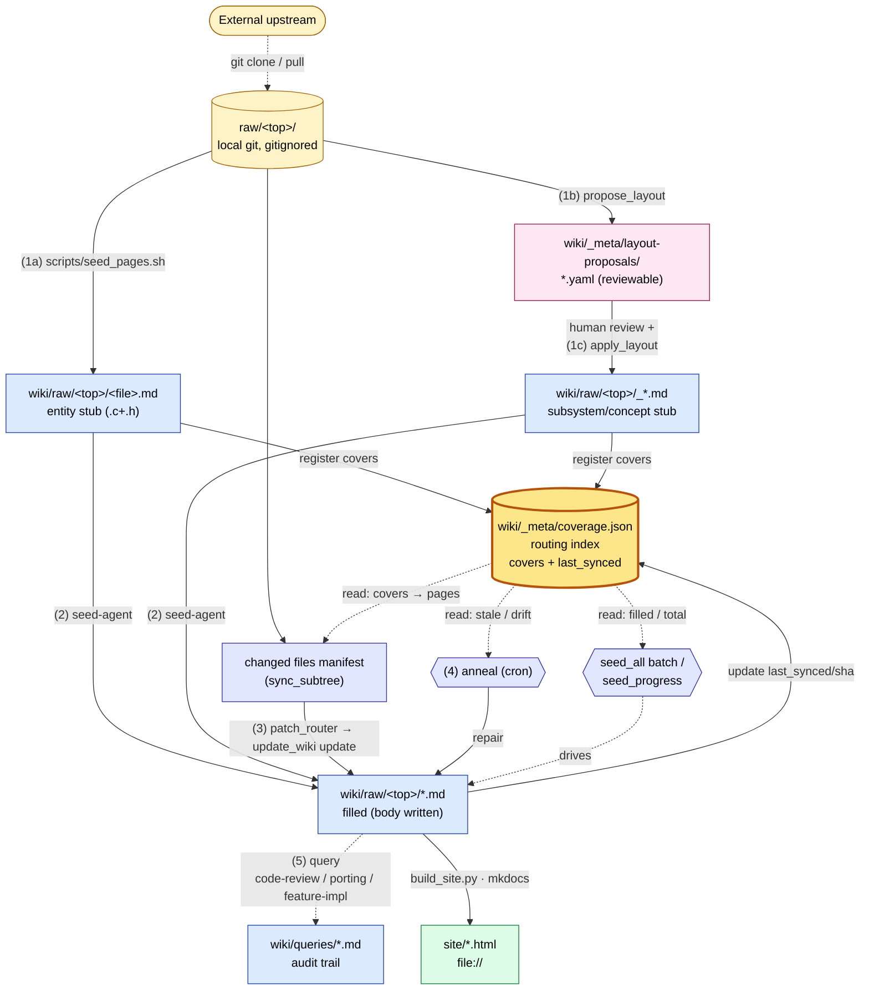
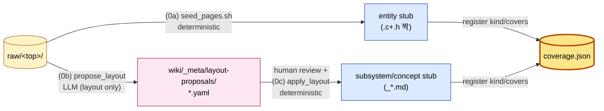
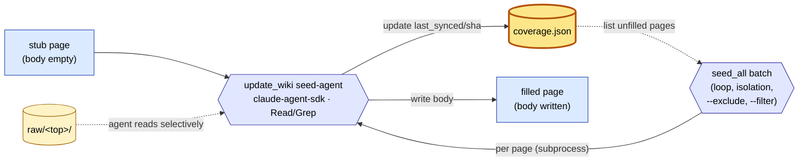
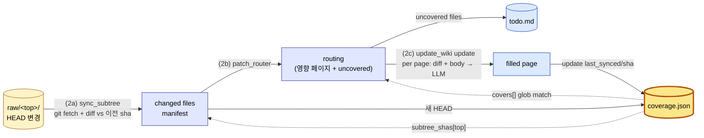
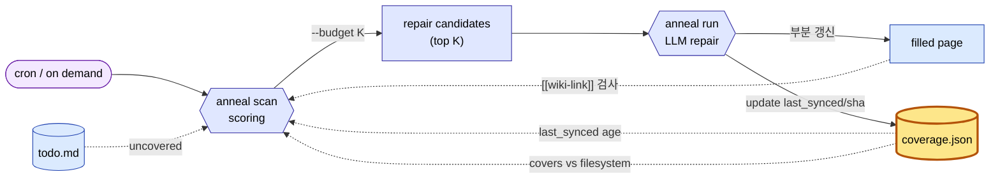
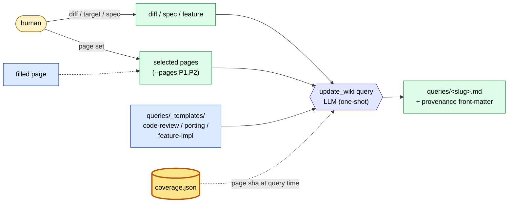

# code-llm-wiki

소스 트리(들)를 동기화하면서 LLM이 자동으로 유지·보수하는 코드 위키.
[Karpathy의 LLM Wiki](https://gist.github.com/karpathy/442a6bf555914893e9891c11519de94f)
패턴을 코드 도메인에 적용했고, 리눅스 커널 외 임의의 소스 sub-tree에도 동작합니다.

핵심 발상:
- **raw/<top>/** (불변, 사용자 소유) ↔ **wiki/raw/<top>/** (LLM 소유, 1:1 미러링)
- 큰 그림은 사람이 정함 (어떤 페이지가 존재할지). 페이지 **내용**은 LLM이 채우고 갱신
- 모든 LLM 호출은 결과의 **provenance** (sha, 시각, 모델, 본 파일들)를 페이지 front-matter에 남김
- "신선해 보임"을 자동 표시하지 않음 — 출처가 안 움직였다고 결론이 맞다는 보장이 아니라서

---

## 아키텍처



- **진노랑 (굵은 테두리)** — `coverage.json`. 페이지 ↔ 소스 파일 매핑의 단일 진실 + 신선도 ledger. 거의 모든 도구가 여기를 읽거나 씀.
- **노란색** — 사용자 소유, 불변.
- **분홍색** — LLM 제안, 사람 리뷰 게이트 (apply 전 편집 가능).
- **파란색** — LLM이 만들고 유지하는 페이지.
- **연보라** — 중간 산출물 / 도구 노드 (manifest, annealer, batch).
- **초록색** — 빌드 산출물 (gitignored).
- 점선 = 읽기, 실선 = 쓰기 / 데이터 흐름. cov로 들어오는 실선이 라우팅 인덱스를 채우고, 나가는 점선이 그걸 소비.

**페이지 stub 두 갈래** (1a vs 1b+1c)
- `entity` — 한 translation unit (`.c`+`.h`)에 1:1 대응. 결정적이므로 `seed_pages.sh`가 바로 만든다.
- `subsystem` / `concept` — 여러 파일에 걸친 아키텍처 단위. 코드 구조를 봐야 잘 묶이므로 LLM이 **YAML 제안**을 만들고 (`propose_layout`), 사람이 리뷰·수정 후 `apply_layout`이 결정적으로 stub을 쓴다. 일반 LLM 호출과 달리 layout 결정은 retroactive 수정 비용이 크므로 — 한 페이지가 잘못 묶이면 그 위에 쌓인 본문, sources, query 흔적 모두 헛것이 된다 — 이 한 단계만 사람 게이트를 둔다.

| 레이어 | 소유 | 역할 |
|---|---|---|
| `raw/<top>/` | 사용자 | 소스 sub-tree. 각자 별도 local git. `raw/*`는 wiki repo에서 gitignore. **LLM은 읽기만**. |
| `wiki/` | LLM | 모든 markdown 페이지. `wiki/raw/<top>/`이 raw/ 미러. |
| `wiki/_meta/coverage.json` | 도구 | 페이지 → covers 글로브 매핑. 라우팅의 단일 진실. |
| `wiki/_meta/todo.md` | 도구 | 커버되지 않은 raw 파일 누적 — annealer가 surface. |
| `CLAUDE.md` | 사람 | LLM 에이전트 SOP. PR로만 변경. |

`KERNEL_ROOT`는 `raw/`. covers 글로브 (`pcie_scsc/mlme.c` 등)는 모두 이 기준.

---

## Quickstart

**전제**: `raw/<top>/`에 소스 sub-tree가 이미 클론/배치되어 있다고 가정합니다 (예: `raw/pcie_scsc/`). 클론 자체는 이 wiki repo의 일이 아니므로 — `git clone <upstream> raw/<top>` 든, 압축 풀어 `cp -r ... raw/<top>/` 든 사용자가 미리 처리.

### 0. 일회 셋업

```bash
# Python deps
pip install claude-agent-sdk                   # seed-agent용
pip install -r requirements-docs.txt           # mkdocs 빌드용 (선택)

# LLM 프로필 설정
cp config/llm.example.json config/llm.local.json
${EDITOR:-vi} config/llm.local.json            # default_profile, model 조정
```

LLM 백엔드는 `config/llm.local.json`의 프로필로 선택합니다 — 셸 env vars로 강제하지 않음. 둘 중 하나만 활성화하면 됩니다:

| 백엔드 | 프로필 (`provider`) | 필요한 셸 env | 모델 예 |
|---|---|---|---|
| **Anthropic 클라우드** | `claude` (`anthropic`) | `ANTHROPIC_API_KEY=sk-ant-...` (auth_env로 지정한 변수) | `claude-sonnet-4-5`, `claude-opus-4-7` |
| **로컬 ollama** (v0.14+) | `ollama` (`openai`) | 없음 (`auth_optional: true`) | `qwen3.6:27b-q4_K_M` 등 — `ollama pull` 한 모델 |

기본 프로필은 `config/llm.local.json`의 `default_profile` 한 줄로 정합니다:
```json
{ "default_profile": "ollama", "profiles": { ... } }
```

`update_wiki seed-agent` 호출 시 활성 프로필에서 SDK가 요구하는 env vars(`ANTHROPIC_BASE_URL` / `ANTHROPIC_AUTH_TOKEN` / `ANTHROPIC_API_KEY`)를 자동 유도해 설정합니다 — wiki repo 설정이 셸 env를 덮어씁니다.

연결 검증:
```bash
python -m scripts.llm_client --probe                       # default_profile
python -m scripts.llm_client --probe --profile ollama      # 특정 프로필
python -m scripts.llm_client --selftest                    # 오프라인 검증 (키 불요)
```

### 1. sub-tree git 확인

`raw/<top>/`이 자체 git 저장소여야 페이지의 `last_synced_sha`가 sub-tree HEAD로 기록됩니다 (없으면 sha는 `null` — 오류 아니지만 변경 추적이 약해짐).

```bash
# upstream에서 git clone 했으면 자동으로 OK. 아니라면:
[ -d raw/<top>/.git ] || (cd raw/<top> && git init && git add . && git commit -m "initial import")
```

### 2. Stub 페이지 일괄 생성

```bash
bash scripts/seed_pages.sh --dry-run            # 먼저 미리보기
bash scripts/seed_pages.sh                      # 실제 생성
```

`.c`/`.h` 짝 단위로 `wiki/raw/<top>/*.md` 스텁 생성 + `coverage.json`에 등록. idempotent (재실행해도 기존 페이지 보존). 다른 확장자(`.py`/`.go` 등) sub-tree로 쓸 일이 있으면 `seed_pages.sh`의 `find` 패턴 손보면 됩니다.

### 2b. (선택) Subsystem / concept 페이지 제안

`seed_pages.sh`는 `.c`/`.h` 짝마다 `entity` 페이지만 만듭니다. **여러 파일에 걸친 subsystem이나 cross-cutting concept** 페이지가 필요하면 LLM에 layout 제안을 받아 사람이 리뷰 후 적용합니다:

```bash
# (1) LLM에게 sub-tree를 읽고 YAML 제안을 작성하라고 시킴
python -m scripts.propose_layout \
    --tree raw/pcie_scsc --model claude-sonnet-4-5
# → wiki/_meta/layout-proposals/pcie_scsc-<timestamp>.yaml

# (2) 파일을 열어 리뷰. title / basename / covers / rationale 직접 수정 OK.
${EDITOR:-vi} wiki/_meta/layout-proposals/pcie_scsc-*.yaml

# (3) 결정적 runner가 stub을 쓰고 coverage.json에 등록
python -m scripts.apply_layout wiki/_meta/layout-proposals/pcie_scsc-*.yaml \
    --dry-run                                  # 먼저 미리보기
python -m scripts.apply_layout wiki/_meta/layout-proposals/pcie_scsc-*.yaml
```

`basename`은 보통 `_mlme_overview`처럼 `_` prefix를 둬서 entity 페이지와 정렬상 구분합니다. 적용된 stub은 다음 단계의 `seed-agent`가 다른 stub과 똑같이 채웁니다.

> 단계 1과 3을 분리한 이유: layout 결정은 한 번 잘못되면 그 위에 쌓이는 본문·sources·query 흔적이 모두 헛것이 되므로 사람 게이트가 가장 큰 이득. YAML 제안은 diff-friendly·재현 가능하고, apply 쪽은 LLM 호출이 없어 결정적·테스트 가능.

### 3. 페이지 채우기 (agentic seed)

먼저 작은 페이지 한 장으로 워크플로 검증 권장:

```bash
# default_profile 사용 (config/llm.local.json)
python -m scripts.update_wiki seed-agent \
    --page raw/<top>/<small_file>.md --model claude-sonnet-4-5

# 또는 특정 프로필
python -m scripts.update_wiki seed-agent --profile ollama \
    --page raw/<top>/<small_file>.md --model qwen3.6:27b-q4_K_M
```

내부 동작: Claude Agent SDK가 `Read`/`Grep` 도구로 raw/<top>/을 탐색하면서 SOP 형식의 페이지 한 장을 작성 → 마지막 ```` ```markdown ``` ```` 블록을 추출해 페이지에 씀 + `coverage.json` 갱신.

옵션:
- `--max-turns N` (기본 25) — agent loop 상한
- `--overwrite` — 이미 채워진 페이지(`last_synced` 존재) 재시도

### 4. 결과 보기

```bash
python -m scripts.build_site --clean
open site/raw/<top>/<small_file>.html        # macOS
xdg-open site/raw/<top>/<small_file>.html    # Linux
```

검색 기능까지 쓰려면 (file:// 정책상 검색 동작 안 함):
```bash
python -m scripts.build_site --serve --bind 127.0.0.1:8000
```

### 5. 나머지 페이지로 확장 (batch)

워크플로가 잘 도는 것 확인했으면 `scripts/seed_all.py`로 일괄 처리:

```bash
# 미채움 페이지 전체 (mlme.md 등 last_synced가 이미 set된 것은 skip)
python -m scripts.seed_all --model qwen3.6:27b-q4_K_M

# 좁혀서: 한 디렉토리만
python -m scripts.seed_all --model qwen3.6:27b-q4_K_M --filter 'raw/pcie_scsc/osal/*'

# 특정 디렉토리(들) 제외
python -m scripts.seed_all --model qwen3.6:27b-q4_K_M \
    --exclude 'raw/pcie_scsc/kunit/*' --exclude 'raw/pcie_scsc/test/*'

# 명령만 미리보기 (실제 호출 안 함)
python -m scripts.seed_all --model qwen3.6:27b-q4_K_M --dry-run

# prompt 바뀌어서 전부 재시드
python -m scripts.seed_all --model claude-sonnet-4-5 --force --continue
```

옵션:
- `--filter GLOB` — coverage.json key 글로브로 좁히기 (`fnmatch`)
- `--exclude GLOB` — 글로브 매칭되는 페이지 제외 (여러 번 누적). `--filter` 적용 후 추가로 거름
- `--force` — 이미 채워진 페이지도 재시드 (`--overwrite` 전달)
- `--continue` — 한 페이지 실패 시 중단 대신 다음으로
- `--dry-run` — 호출할 명령만 stdout 출력
- 백엔드 / `--profile` 은 `config/llm.local.json`의 `default_profile`에서 가져옴 — seed_all은 env vars를 건드리지 않음
- Ctrl+C로 깔끔하게 중단되며 누적 통계 출력

ollama BF16/q4로는 페이지당 수십 분 ~ 1시간 — 200+ 페이지 batch는 야간 실행 전제. Anthropic Sonnet은 페이지당 ~2분, 비용 ≈ 페이지당 $0.30 수준 (mlme.c 같은 큰 파일 기준).

---

## Workflow 상세

각 단계는 위 메인 다이어그램의 한 조각을 확대한 것입니다 — 노드 이름·색상은 같음. 비용·결정론·트리거가 모두 달라서 별 섹션:

| § | 단계 | 결정론 | LLM | 트리거 | cov 작용 |
|---|---|---|---|---|---|
| 0 | 초기화 (구조) | ✅ (layout만 LLM) | 1회 (선택) | 사람 | write: pages 등록 |
| 1 | 최초 시드 (본문) | ❌ | per-page | 사람 / batch | write: last_synced/sha |
| 2 | 패치 업데이트 | ❌ | per-page | cron | read+write |
| 3 | Annealing | ❌ | budget-cap | cron | read+write |
| 4 | 쿼리 / 응용 | ❌ | per-query | 사람 | **read-only** |

---

### 0. 초기화 (구조: stub + coverage)

위키의 "골격"을 만드는 단계. **본문은 아직 빈 스텁** — 어떤 페이지가 어떤 raw 파일을 cover하는지만 결정. 비용 거의 0 (subsystem/concept layout 결정에만 LLM 1회).



- **entity 경로 (0a)**: `seed_pages.sh`가 `.c`+`.h` 짝마다 자동 등록. 결정적·재실행 안전.
- **architectural 경로 (0b → 0c)**: 여러 파일에 걸친 subsystem / cross-cutting concept만. LLM은 *어떻게 묶을지*만 결정하고 사람이 YAML 리뷰 후 `apply_layout`이 결정적으로 stub을 씀.
- 출력: `cov.pages[*]` 등록, `last_synced: null`. 다음 단계가 채울 자리.

→ 이 단계만 끝나면 위키의 페이지 목록·매핑·_index.md가 완성됨. 본문 비용 들이기 전에 layout만 사람이 검수 가능.

### 1. 최초 시드 (본문 채우기)

각 stub 페이지의 본문을 LLM이 한 번에 작성. **여기서 본격적으로 비용이 발생**.



- **단일 페이지**: `update_wiki seed-agent --page raw/<top>/X.md --model M` — agent가 stub을 읽고 `raw/<top>/`을 Read/Grep으로 탐색해 SOP 형식의 본문을 한 번에 작성.
- **배치**: `seed_all --model M [--exclude raw/<top>/kunit/*]` — `cov`의 unfilled 페이지 목록을 enumerate, 페이지마다 subprocess로 isolation (단일 페이지 hang이 배치 전체를 죽이지 않음). 진행 상황은 `bash scripts/seed_progress.sh`.

**비용/시간 가늠** (mlme.c 8114줄 페이지 1장 기준):
- Anthropic Sonnet 4.6: ~2분, ~89K 토큰, ~$0.30
- 로컬 ollama qwen3.6:27b-q4_K_M: ~60분, 비용 0

→ 200+ 페이지 batch는 ollama로는 야간 실행 전제. Sonnet은 한두 시간이면 끝남.

### 2. 패치 업데이트 (이후 자동 사이클)

`raw/<top>/`이 upstream에서 움직였을 때 영향 페이지만 골라 **부분 갱신**. 트리거는 cron.



```bash
python -m scripts.sync_subtree --tree raw/pcie_scsc --record --out /tmp/m.json
python -m scripts.patch_router --manifest /tmp/m.json --apply --out /tmp/r.json
python -m scripts.update_wiki update --routing /tmp/r.json
```

- `sync_subtree`는 `cov.subtree_shas[<top>]`를 last sha로 보고 그 이후 변경 파일만 추출. **첫 실행은 빈 매니페스트 (`from: null`)** — 위키를 retroactive로 다시 만들지 않음, sha만 기록하고 다음부터 진짜 diff.
- `patch_router`가 manifest 파일들을 `cov.covers` 글로브에 매치 → 영향 페이지 목록. 미매치 파일은 `todo.md`에 누적 (annealer가 surface).
- 각 영향 페이지마다 LLM이 diff hunk + 인접 파일을 보고 **부분 갱신**. 전면 재작성 금지 (CLAUDE.md §5).

cron 예시 (매일 저녁):
```cron
0 22 * * * cd /path/to/code-llm-wiki && \
  python -m scripts.sync_subtree --tree raw/pcie_scsc --record --out /tmp/m.json && \
  python -m scripts.patch_router --manifest /tmp/m.json --apply --out /tmp/r.json && \
  python -m scripts.update_wiki update --routing /tmp/r.json
```

### 3. Annealing (주기 수리)

패치 사이클이 못 잡는 drift를 주기적으로 수리. 우선순위 점수 + budget 상한.



```bash
python -m scripts.anneal scan                                  # 후보 점검 (읽기만)
python -m scripts.anneal run --budget 3                        # 상위 3개 수리
python -m scripts.anneal run --budget 3 --mock-llm --dry-run   # 안전 시연
```

수리 카테고리:
- `stale_page` — `last_synced`가 N일 이상 오래된 페이지
- `coverage_drift` — `covers` 글로브가 매칭하는 파일이 없어진 경우 (rename/삭제)
- `broken_link` — `[[wiki-link]]`가 존재하지 않는 페이지를 가리킴
- `uncovered` — `coverage.json`에 잡히지 않는 raw 파일 (정보용만, 자동 수리 안 함)

budget이 있는 이유: annealer는 cron으로 도는데, 비용·시간 상한 없이 두면 한 번에 위키 전체를 재작성할 수 있음. 한 회 K개로 제한해 점진적 정상화.

### 4. 쿼리 / 응용 (templated queries)

코드 리뷰 / 포팅 / 기능 구현 등에 위키를 grounding 자료로 활용. **유일하게 `cov`를 mutate 안 하는 단계 — read-only audit**.



```bash
python -m scripts.update_wiki query \
    --template code-review \
    --input /tmp/patch.diff \
    --pages raw/pcie_scsc/mlme.md,raw/pcie_scsc/hip.md \
    --out queries/2026-05-15-mlme-review.md \
    --title "mlme: scan timing rework"
```

산출물은 `wiki/queries/<slug>.md`에 저장. front-matter에 **provenance** 자동 기록 (템플릿, 참조 페이지의 sha at query time, sub-tree sha, 모델, 시각, `reuse_policy`).

**재사용 규칙** (CLAUDE.md §3.4):

| 템플릿 | 정책 |
|---|---|
| `code-review` | 일회용. 다른 패치/PR에 절대 재활용 금지 |
| `porting-guide` | 연구 출발점만. 실제 작업 시 재실행 필수 |
| `feature-impl` | 머지 전까지만 유효. 머지 후 archive 또는 폐기 |

> 🚨 freshness 배지 / auto-refresh는 의도적으로 만들지 않았습니다. "출처가 안 움직였다"가
> "결론이 맞다"로 오해되면 더 위험합니다. 의심되면 재실행.

---

## CLI 참조 (cheat sheet)

| 목적 | 명령 |
|---|---|
| LLM 연결 검증 | `python -m scripts.llm_client --probe [--all]` |
| LLM 오프라인 검증 | `python -m scripts.llm_client --selftest` |
| Stub 페이지 일괄 생성 (entity) | `bash scripts/seed_pages.sh [--dry-run] [--force] [--per-file]` |
| **Layout 제안** (subsystem/concept) | `python -m scripts.propose_layout --tree raw/<top> --model M [--max-turns N]` |
| **Layout 적용** (YAML → stub) | `python -m scripts.apply_layout PROPOSAL.yaml [--dry-run] [--force]` |
| **페이지 시드 (agentic)** | `python -m scripts.update_wiki seed-agent --page P --model M [--max-turns N] [--overwrite]` |
| **페이지 시드 batch** | `python -m scripts.seed_all --model M [--filter GLOB] [--exclude GLOB ...] [--force] [--continue] [--dry-run]` |
| **Sub-tree 매니페스트** | `python -m scripts.sync_subtree --tree raw/<top> [--remote R] [--branch B] [--no-fetch] [--record] [--out r.json]` |
| 영향 페이지 라우팅 | `python -m scripts.patch_router --files F1 F2 [--apply] --out r.json` |
| 패치 → 페이지 갱신 | `python -m scripts.update_wiki update --routing r.json` |
| 코드 리뷰 쿼리 | `python -m scripts.update_wiki query --template code-review --input P.diff --pages P1,P2 --out queries/X.md` |
| 포팅 가이드 | `python -m scripts.update_wiki query --template porting-guide --target-os "FreeBSD 14" --feature "..." --pages P1 --out ...` |
| 기능 구현 가이드 | `python -m scripts.update_wiki query --template feature-impl --feature "..." --pages P1 --out ...` |
| Annealing 점검 | `python -m scripts.anneal scan` |
| Annealing 수리 | `python -m scripts.anneal run --budget N` |
| 빌드 preflight | `python -m scripts.build_site --preflight` |
| 정적 사이트 빌드 | `python -m scripts.build_site [--clean] [--strict]` |
| 로컬 미리보기 (검색 동작) | `python -m scripts.build_site --serve --bind 127.0.0.1:8000` |
| 단위 테스트 | `python -m pytest tests/ -q` |

공통 플래그:
- `--profile NAME` — `config/llm.json`의 다른 프로필 사용
- `--mock-llm` — 결정적 stub 응답 (update/query에 한해 동작)
- `--dry-run` — 결과 stdout, 파일 안 씀

---

## 페이지 구조 (front-matter)

```yaml
---
title: <사람이 읽는 이름>
kind: subsystem | concept | entity | query
covers:                          # KERNEL_ROOT (= raw/) 기준 상대 경로, glob 허용
  - pcie_scsc/mlme.c
  - pcie_scsc/mlme.h
last_synced_sha: <covers 첫 세그먼트의 raw/<top>/ HEAD sha>
last_synced: <ISO-8601 UTC>
sources:                          # 페이지 작성 시 실제로 본 파일들 (line range 가능)
  - pcie_scsc/mlme.c#L1-L400
  - pcie_scsc/dev.h
---
```

상호 링크는 Obsidian 스타일 `[[raw/<top>/<basename>|표시명]]`. wiki/ 기준 상대 경로가 link target. 끊긴 링크는 annealer가 감지.

---

## 디자인 노트 (놓치지 말 것)

- **raw/<top>/ 별도 git**: 각 sub-tree의 HEAD가 `last_synced_sha`로 기록됨. raw/<top>/이 git이 아니면 sha는 `null` (오류 아님).
- **seed-agent는 stub을 전제**로 함. covers는 stub에서 읽고 LLM이 수정하지 않음. `seed_pages.sh` → `seed-agent` 순서 유지.
- **agent SDK는 백엔드 무관**: `ANTHROPIC_BASE_URL`을 ollama로 가리키면 같은 코드 그대로 동작 (ollama v0.14+의 Anthropic Messages API 호환 덕분).
- **wiki layout 미러링**: `wiki/raw/<top>/<basename>.md` 형태 고정. agent에게 명시적으로 알려줘야 wiki-link가 정확함 (`AGENT_SUFFIX`에 박혀 있음).
- **공통 plumbing**: front-matter parser/serializer, glob → regex 변환, coverage I/O는 모두 `scripts/_meta_io.py`. 새 도구 추가 시 거기를 거치도록.
- **테스트**: 47개. SDK 통합 테스트는 없음 (live agent 호출 비용 때문) — `_resolve_subtree`, `_git_head`, `extract_markdown_block` 같은 순수 함수는 다 커버.

---

## 디렉토리 레이아웃

```
raw/<top>/              # 사용자 소스 sub-tree (각자 local git, gitignored)
wiki/                   # LLM 페이지
  index.md
  raw/<top>/            # 1:1 미러
  queries/              # 사람의 질의 산출물 + _templates/
  _meta/                # coverage.json, todo.md
scripts/                # 도구
  seed_pages.sh         # entity stub 일괄 생성 (.c+.h 짝)
  propose_layout.py     # subsystem/concept YAML 제안 (LLM)
  apply_layout.py       # 제안 YAML → stub + coverage 병합 (결정적)
  update_wiki.py        # seed-agent / update / query
  anneal.py             # 주기 수리
  patch_router.py       # diff → 영향 페이지
  sync_subtree.py       # raw/<top>/ git fetch + 변경 파일 매니페스트
  llm_client.py         # one-shot HTTP 클라이언트
  build_site.py         # mkdocs 래퍼
  _meta_io.py           # 공통 I/O (front-matter, coverage, glob)
config/                 # LLM 프로필
tests/                  # pytest
CLAUDE.md               # LLM 에이전트 SOP
mkdocs.yml              # 정적 사이트 설정
requirements-docs.txt   # mkdocs 빌드 deps
site/                   # 빌드 산출물 (gitignored)
```

운영 규칙 / 페이지 구조 / 워크플로 세부는 [`CLAUDE.md`](./CLAUDE.md) 참조.
