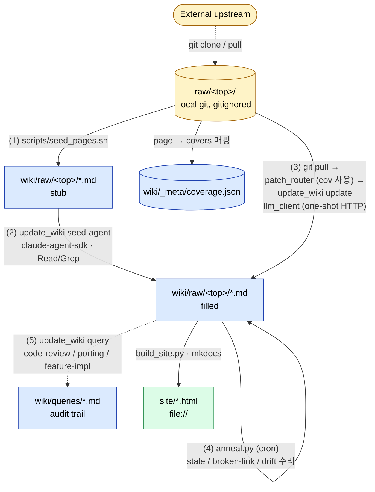

# code-llm-wiki

소스 트리(들)를 동기화하면서 LLM이 자동으로 유지·보수하는 코드 위키.
[Karpathy의 LLM Wiki](https://gist.github.com/karpathy/442a6bf555914893e9891c11519de94f)
패턴을 코드 도메인에 적용했고, 리눅스 커널 외 임의의 소스 sub-tree에도 동작합니다.

핵심 발상:
- **raw/<top>/** (불변, 사용자 소유) ↔ **wiki/raw/<top>/** (LLM 소유, 1:1 미러링)
- 큰 그림은 사람이 정함 (어떤 페이지가 존재할지). 페이지 **내용**은 LLM이 채우고 갱신
- 모든 LLM 호출은 결과의 **provenance** (sha, 시각, 모델, 본 파일들)를 페이지 front-matter에 남김
- "신선해 보임"을 자동 표시하지 않음 — 출처가 안 움직였다고 결론이 맞다는 보장이 아니라서

---

## 아키텍처



- **노란색** — 사용자 소유, 불변.
- **파란색** — LLM이 만들고 유지하는 파일들. wiki repo의 일부.
- **초록색** — 빌드 산출물 (gitignored).
- 점선 — 1회성 / 비주기 이벤트 (clone, query). 실선 — 자동화에 자주 등장하는 흐름.

| 레이어 | 소유 | 역할 |
|---|---|---|
| `raw/<top>/` | 사용자 | 소스 sub-tree. 각자 별도 local git. `raw/*`는 wiki repo에서 gitignore. **LLM은 읽기만**. |
| `wiki/` | LLM | 모든 markdown 페이지. `wiki/raw/<top>/`이 raw/ 미러. |
| `wiki/_meta/coverage.json` | 도구 | 페이지 → covers 글로브 매핑. 라우팅의 단일 진실. |
| `wiki/_meta/todo.md` | 도구 | 커버되지 않은 raw 파일 누적 — annealer가 surface. |
| `CLAUDE.md` | 사람 | LLM 에이전트 SOP. PR로만 변경. |

`KERNEL_ROOT`는 `raw/`. covers 글로브 (`pcie_scsc/mlme.c` 등)는 모두 이 기준.

---

## Quickstart

**전제**: `raw/<top>/`에 소스 sub-tree가 이미 클론/배치되어 있다고 가정합니다 (예: `raw/pcie_scsc/`). 클론 자체는 이 wiki repo의 일이 아니므로 — `git clone <upstream> raw/<top>` 든, 압축 풀어 `cp -r ... raw/<top>/` 든 사용자가 미리 처리.

### 0. 일회 셋업

```bash
# Python deps
pip install claude-agent-sdk                   # seed-agent용
pip install -r requirements-docs.txt           # mkdocs 빌드용 (선택)

# LLM 프로필 설정
cp config/llm.example.json config/llm.local.json
${EDITOR:-vi} config/llm.local.json            # default_profile, model 조정
```

LLM 백엔드는 `config/llm.local.json`의 프로필로 선택합니다 — 셸 env vars로 강제하지 않음. 둘 중 하나만 활성화하면 됩니다:

| 백엔드 | 프로필 (`provider`) | 필요한 셸 env | 모델 예 |
|---|---|---|---|
| **Anthropic 클라우드** | `claude` (`anthropic`) | `ANTHROPIC_API_KEY=sk-ant-...` (auth_env로 지정한 변수) | `claude-sonnet-4-5`, `claude-opus-4-7` |
| **로컬 ollama** (v0.14+) | `ollama` (`openai`) | 없음 (`auth_optional: true`) | `qwen3.6:27b-q4_K_M` 등 — `ollama pull` 한 모델 |

기본 프로필은 `config/llm.local.json`의 `default_profile` 한 줄로 정합니다:
```json
{ "default_profile": "ollama", "profiles": { ... } }
```

`update_wiki seed-agent` 호출 시 활성 프로필에서 SDK가 요구하는 env vars(`ANTHROPIC_BASE_URL` / `ANTHROPIC_AUTH_TOKEN` / `ANTHROPIC_API_KEY`)를 자동 유도해 설정합니다 — wiki repo 설정이 셸 env를 덮어씁니다.

연결 검증:
```bash
python -m scripts.llm_client --probe                       # default_profile
python -m scripts.llm_client --probe --profile ollama      # 특정 프로필
python -m scripts.llm_client --selftest                    # 오프라인 검증 (키 불요)
```

### 1. sub-tree git 확인

`raw/<top>/`이 자체 git 저장소여야 페이지의 `last_synced_sha`가 sub-tree HEAD로 기록됩니다 (없으면 sha는 `null` — 오류 아니지만 변경 추적이 약해짐).

```bash
# upstream에서 git clone 했으면 자동으로 OK. 아니라면:
[ -d raw/<top>/.git ] || (cd raw/<top> && git init && git add . && git commit -m "initial import")
```

### 2. Stub 페이지 일괄 생성

```bash
bash scripts/seed_pages.sh --dry-run            # 먼저 미리보기
bash scripts/seed_pages.sh                      # 실제 생성
```

`.c`/`.h` 짝 단위로 `wiki/raw/<top>/*.md` 스텁 생성 + `coverage.json`에 등록. idempotent (재실행해도 기존 페이지 보존). 다른 확장자(`.py`/`.go` 등) sub-tree로 쓸 일이 있으면 `seed_pages.sh`의 `find` 패턴 손보면 됩니다.

### 3. 페이지 채우기 (agentic seed)

먼저 작은 페이지 한 장으로 워크플로 검증 권장:

```bash
# default_profile 사용 (config/llm.local.json)
python -m scripts.update_wiki seed-agent \
    --page raw/<top>/<small_file>.md --model claude-sonnet-4-5

# 또는 특정 프로필
python -m scripts.update_wiki seed-agent --profile ollama \
    --page raw/<top>/<small_file>.md --model qwen3.6:27b-q4_K_M
```

내부 동작: Claude Agent SDK가 `Read`/`Grep` 도구로 raw/<top>/을 탐색하면서 SOP 형식의 페이지 한 장을 작성 → 마지막 ```` ```markdown ``` ```` 블록을 추출해 페이지에 씀 + `coverage.json` 갱신.

옵션:
- `--max-turns N` (기본 25) — agent loop 상한
- `--overwrite` — 이미 채워진 페이지(`last_synced` 존재) 재시도

### 4. 결과 보기

```bash
python -m scripts.build_site --clean
open site/raw/<top>/<small_file>.html        # macOS
xdg-open site/raw/<top>/<small_file>.html    # Linux
```

검색 기능까지 쓰려면 (file:// 정책상 검색 동작 안 함):
```bash
python -m scripts.build_site --serve --bind 127.0.0.1:8000
```

### 5. 나머지 페이지로 확장 (batch)

워크플로가 잘 도는 것 확인했으면 `scripts/seed_all.py`로 일괄 처리:

```bash
# 미채움 페이지 전체 (mlme.md 등 last_synced가 이미 set된 것은 skip)
python -m scripts.seed_all --model qwen3.6:27b-q4_K_M

# 좁혀서: 한 디렉토리만
python -m scripts.seed_all --model qwen3.6:27b-q4_K_M --filter 'raw/pcie_scsc/osal/*'

# 명령만 미리보기 (실제 호출 안 함)
python -m scripts.seed_all --model qwen3.6:27b-q4_K_M --dry-run

# prompt 바뀌어서 전부 재시드
python -m scripts.seed_all --model claude-sonnet-4-5 --force --continue
```

옵션:
- `--filter GLOB` — coverage.json key 글로브 (`fnmatch`)
- `--force` — 이미 채워진 페이지도 재시드 (`--overwrite` 전달)
- `--continue` — 한 페이지 실패 시 중단 대신 다음으로
- `--dry-run` — 호출할 명령만 stdout 출력
- 백엔드 / `--profile` 은 `config/llm.local.json`의 `default_profile`에서 가져옴 — seed_all은 env vars를 건드리지 않음
- Ctrl+C로 깔끔하게 중단되며 누적 통계 출력

ollama BF16/q4로는 페이지당 수십 분 ~ 1시간 — 200+ 페이지 batch는 야간 실행 전제. Anthropic Sonnet은 페이지당 ~2분, 비용 ≈ 페이지당 $0.30 수준 (mlme.c 같은 큰 파일 기준).

---

## Workflow 상세

### 초기 시드 (위의 1~3단계)

**비용/시간 가늠** (mlme.c 8114줄 페이지 1장 기준):
- Anthropic Sonnet 4.6: ~2분, ~89K 토큰
- 로컬 ollama qwen3.6:27b-q4_K_M: ~60분, 비용 0

페이지 단위(translation unit, `.c`+`.h` 짝)가 너무 잘다 싶으면 covers를 합쳐 더 큰 페이지로 묶거나, `seed_pages.sh --per-file`로 분리도 가능.

### 패치 트리거 업데이트 (이후 자동 사이클)

```bash
# raw/<top>/에서 fetch + 마지막 동기화 이후 변경된 파일 매니페스트 생성
python -m scripts.sync_subtree --tree raw/pcie_scsc --record --out /tmp/m.json

# 매니페스트 → 영향 페이지 라우팅
python -m scripts.patch_router --manifest /tmp/m.json --apply --out /tmp/r.json

# 각 페이지 부분 갱신
python -m scripts.update_wiki update --routing /tmp/r.json
```

`sync_subtree`는 sub-tree HEAD를 `coverage.subtree_shas[<top>]`에 기록해 다음 실행 때 거기서부터 diff를 계산. 첫 실행은 빈 매니페스트(`from: null`)를 emit해 sha만 기록 — 전체 위키를 retroactive로 만들지 않음.

각 영향 페이지마다 LLM이 diff hunk + 인접 파일 일부를 보고 **부분 갱신**. 전면 재작성은 안 함 (CLAUDE.md §5).

cron 예시 (매일 저녁):
```cron
0 22 * * * cd /path/to/code-llm-wiki && \
  python -m scripts.sync_subtree --tree raw/pcie_scsc --record --out /tmp/m.json && \
  python -m scripts.patch_router --manifest /tmp/m.json --apply --out /tmp/r.json && \
  python -m scripts.update_wiki update --routing /tmp/r.json
```

### Annealing (주기 수리)

```bash
python -m scripts.anneal scan                          # 후보 점검 (읽기만)
python -m scripts.anneal run --budget 3                # 상위 3개 수리
python -m scripts.anneal run --budget 3 --mock-llm --dry-run   # 안전 시연
```

수리 카테고리:
- `stale_page` — `last_synced`가 N일 이상 오래된 페이지
- `coverage_drift` — covers 글로브가 매칭하는 파일이 없어진 경우 (rename/삭제)
- `broken_link` — `[[wiki-link]]`가 존재하지 않는 페이지를 가리킴
- `uncovered` — `coverage.json`에 잡히지 않는 raw 파일 (정보용만, 자동 수리 안 함)

### 사람의 질의 (templated queries)

코드 리뷰 / 포팅 / 기능 구현 시 위키를 grounding 자료로 활용:

```bash
python -m scripts.update_wiki query \
    --template code-review \
    --input /tmp/patch.diff \
    --pages raw/pcie_scsc/mlme.md,raw/pcie_scsc/hip.md \
    --out queries/2026-05-15-mlme-review.md \
    --title "mlme: scan timing rework"
```

산출물은 `wiki/queries/<slug>.md`에 저장. front-matter에 **provenance** 자동 기록 (템플릿, 참조 페이지의 sha at query time, kernel sha, 모델, 시각, `reuse_policy`).

**재사용 규칙** (CLAUDE.md §3.4):

| 템플릿 | 정책 |
|---|---|
| `code-review` | 일회용. 다른 패치/PR에 절대 재활용 금지 |
| `porting-guide` | 연구 출발점만. 실제 작업 시 재실행 필수 |
| `feature-impl` | 머지 전까지만 유효. 머지 후 archive 또는 폐기 |

> 🚨 freshness 배지 / auto-refresh는 의도적으로 만들지 않았습니다. "출처가 안 움직였다"가
> "결론이 맞다"로 오해되면 더 위험합니다. 의심되면 재실행.

---

## CLI 참조 (cheat sheet)

| 목적 | 명령 |
|---|---|
| LLM 연결 검증 | `python -m scripts.llm_client --probe [--all]` |
| LLM 오프라인 검증 | `python -m scripts.llm_client --selftest` |
| Stub 페이지 일괄 생성 | `bash scripts/seed_pages.sh [--dry-run] [--force] [--per-file]` |
| **페이지 시드 (agentic)** | `python -m scripts.update_wiki seed-agent --page P --model M [--max-turns N] [--overwrite]` |
| **페이지 시드 batch** | `python -m scripts.seed_all --model M [--filter GLOB] [--force] [--continue] [--dry-run]` |
| **Sub-tree 매니페스트** | `python -m scripts.sync_subtree --tree raw/<top> [--remote R] [--branch B] [--no-fetch] [--record] [--out r.json]` |
| 영향 페이지 라우팅 | `python -m scripts.patch_router --files F1 F2 [--apply] --out r.json` |
| 패치 → 페이지 갱신 | `python -m scripts.update_wiki update --routing r.json` |
| 코드 리뷰 쿼리 | `python -m scripts.update_wiki query --template code-review --input P.diff --pages P1,P2 --out queries/X.md` |
| 포팅 가이드 | `python -m scripts.update_wiki query --template porting-guide --target-os "FreeBSD 14" --feature "..." --pages P1 --out ...` |
| 기능 구현 가이드 | `python -m scripts.update_wiki query --template feature-impl --feature "..." --pages P1 --out ...` |
| Annealing 점검 | `python -m scripts.anneal scan` |
| Annealing 수리 | `python -m scripts.anneal run --budget N` |
| 빌드 preflight | `python -m scripts.build_site --preflight` |
| 정적 사이트 빌드 | `python -m scripts.build_site [--clean] [--strict]` |
| 로컬 미리보기 (검색 동작) | `python -m scripts.build_site --serve --bind 127.0.0.1:8000` |
| 단위 테스트 | `python -m pytest tests/ -q` |

공통 플래그:
- `--profile NAME` — `config/llm.json`의 다른 프로필 사용
- `--mock-llm` — 결정적 stub 응답 (update/query에 한해 동작)
- `--dry-run` — 결과 stdout, 파일 안 씀

---

## 페이지 구조 (front-matter)

```yaml
---
title: <사람이 읽는 이름>
kind: subsystem | concept | entity | query
covers:                          # KERNEL_ROOT (= raw/) 기준 상대 경로, glob 허용
  - pcie_scsc/mlme.c
  - pcie_scsc/mlme.h
last_synced_sha: <covers 첫 세그먼트의 raw/<top>/ HEAD sha>
last_synced: <ISO-8601 UTC>
sources:                          # 페이지 작성 시 실제로 본 파일들 (line range 가능)
  - pcie_scsc/mlme.c#L1-L400
  - pcie_scsc/dev.h
---
```

상호 링크는 Obsidian 스타일 `[[raw/<top>/<basename>|표시명]]`. wiki/ 기준 상대 경로가 link target. 끊긴 링크는 annealer가 감지.

---

## 디자인 노트 (놓치지 말 것)

- **raw/<top>/ 별도 git**: 각 sub-tree의 HEAD가 `last_synced_sha`로 기록됨. raw/<top>/이 git이 아니면 sha는 `null` (오류 아님).
- **seed-agent는 stub을 전제**로 함. covers는 stub에서 읽고 LLM이 수정하지 않음. `seed_pages.sh` → `seed-agent` 순서 유지.
- **agent SDK는 백엔드 무관**: `ANTHROPIC_BASE_URL`을 ollama로 가리키면 같은 코드 그대로 동작 (ollama v0.14+의 Anthropic Messages API 호환 덕분).
- **wiki layout 미러링**: `wiki/raw/<top>/<basename>.md` 형태 고정. agent에게 명시적으로 알려줘야 wiki-link가 정확함 (`AGENT_SUFFIX`에 박혀 있음).
- **공통 plumbing**: front-matter parser/serializer, glob → regex 변환, coverage I/O는 모두 `scripts/_meta_io.py`. 새 도구 추가 시 거기를 거치도록.
- **테스트**: 47개. SDK 통합 테스트는 없음 (live agent 호출 비용 때문) — `_resolve_subtree`, `_git_head`, `extract_markdown_block` 같은 순수 함수는 다 커버.

---

## 디렉토리 레이아웃

```
raw/<top>/              # 사용자 소스 sub-tree (각자 local git, gitignored)
wiki/                   # LLM 페이지
  index.md
  raw/<top>/            # 1:1 미러
  queries/              # 사람의 질의 산출물 + _templates/
  _meta/                # coverage.json, todo.md
scripts/                # 도구
  seed_pages.sh         # stub 일괄 생성
  update_wiki.py        # seed-agent / update / query
  anneal.py             # 주기 수리
  patch_router.py       # diff → 영향 페이지
  sync_subtree.py       # raw/<top>/ git fetch + 변경 파일 매니페스트
  llm_client.py         # one-shot HTTP 클라이언트
  build_site.py         # mkdocs 래퍼
  _meta_io.py           # 공통 I/O (front-matter, coverage, glob)
config/                 # LLM 프로필
tests/                  # pytest
CLAUDE.md               # LLM 에이전트 SOP
mkdocs.yml              # 정적 사이트 설정
requirements-docs.txt   # mkdocs 빌드 deps
site/                   # 빌드 산출물 (gitignored)
```

운영 규칙 / 페이지 구조 / 워크플로 세부는 [`CLAUDE.md`](./CLAUDE.md) 참조.
