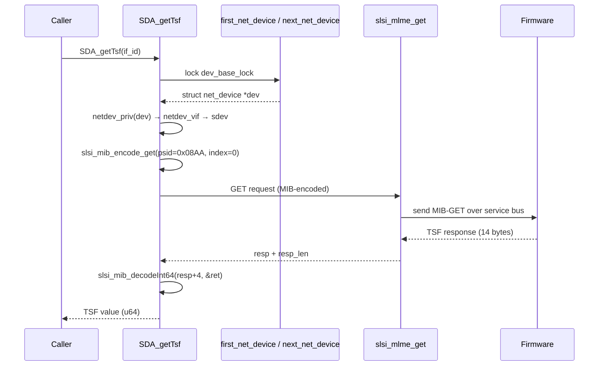

# acm_api

Single-function module that exposes the firmware **TSF (Timing Synchronization Function)** timer to external callers via the MIB query protocol. The TSF timer is the 802.11 BSS clock, critical for power-save mechanisms (DTIM, null-data-frame delivery), mesh synchronization, and beacon interval tracking.

## Purpose

Provides `SDA_getTsf()`, a thin convenience wrapper that:
1. Resolves an interface ID (`if_id`) to a Linux `struct net_device`.
2. Walks the driver device hierarchy (`net_device` → `netdev_vif` → `slsi_dev`) to obtain the SCSC device context.
3. Issues a MIB **GET** request for PSID `0x08AA` (`SLSI_PSID_UNIFI_CURRENT_TSF_TIME`) through `slsi_mlme_get()`.
4. Decodes the 64-bit unsigned result from the MIB response buffer and returns it.

The name "ACM" references the 802.11 **Auto-CAM (Automatic Power-Save Delivery Mode)** mechanism — TSF timing is used by ACM to compute delivery traffic indication message (DTIM) windows.

## Public API

```c
unsigned long long SDA_getTsf(const unsigned char if_id)
```

| Parameter | Meaning |
|-----------|---------|
| `if_id` | Interface selector: `0` → `wlan0`, `1` → `p2p0` |

**Return:** Current TSF timer value as a 64-bit unsigned integer (microseconds since BSS formation). Returns `0` on any failure path (missing device, null vif, null sdev, MIB read error, zero-length response).

> **Note:** `SDA_getTsf` is not declared in any header within this subtree — it is exported at file scope and linked by the external build system, consumed by firmware-side or userspace consumers outside `pcie_scsc/`.

## Internal flow



### Key steps

1. **Device lookup** — Iterates all network devices under `init_net` while holding `dev_base_lock` (read lock). Matches `wlan0` for `if_id == 0` or `p2p0` for `if_id == 1` via `memcmp` on `dev->name`.

2. **Hierarchy walk** — Extracts `struct netdev_vif *` via `netdev_priv(dev)`, then obtains `struct slsi_dev *sdev` from `ndev_vif->sdev`. Three null checks gate each hop.

3. **MIB encode** — Calls `slsi_mib_encode_get(&mibreq, SLSI_PSID_UNIFI_CURRENT_TSF_TIME, 0)` to build a binary MIB-GET payload for the current TSF time (PSID `0x08AA`, no sub-index).

4. **MIB transaction** — Invokes `slsi_mlme_get(sdev, dev, mibreq.data, mibreq.dataLength, mibrsp.data, mibrsp.dataLength, &rx_length)`. This sends the encoded request to the firmware over the SCSC service bus and waits for the response.

5. **Decode** — The response format is: PSID header (4 bytes) + value length/data header (1 byte) + TSF value (8 bytes) + optional padding (1 byte) = 14 bytes total (`TSF_RESP_SIZE`). The TSF value starts at offset 4, decoded via `slsi_mib_decodeInt64()`.

### Response buffer layout

```
Offset  Size  Content
------  ----  -------
0       4     PSID header (0x08AA encoded)
4       1     Value type/length tag
5       8     TSF timestamp (big-endian u64)
13      1     Padding
```

## Dependencies

| Dependency | Source | Role |
|---|---|---|
| `slsi_mlme_get()` | `mlme.h` / `mlme.c` | MIB GET transport to firmware |
| `slsi_mib_encode_get()` | `mib.h` / `mib.c` | Encode a single PSID into binary MIB request |
| `slsi_mib_decodeInt64()` | `mib.h` / `mib.c` | Decode signed/unsigned 64-bit value from MIB response |
| `SLSI_PSID_UNIFI_CURRENT_TSF_TIME` | `mib.h` | PSID constant (`0x08AA`) identifying the TSF time MIB attribute |
| `SLSI_ERR()` | `debug.h` | Error logging macro |
| `SLSI_DBG3()` | `debug.h` | Debug-level-3 tracing macro |
| `struct netdev_vif` | `dev.h` | Per-interface private data (holds `sdev` pointer) |
| `struct slsi_dev` | `dev.h` | Top-level device context (HIP, wiphy, netdev array) |
| `first_net_device()` / `next_net_device()` | kernel `netdevice.h` | Standard Linux network device iteration APIs |

## Related

- [[raw/pcie_scsc/mlme|mlme]] — MLME request/response transport layer
- [[raw/pcie_scsc/mib|mib]] — MIB encoding/decoding library and PSID definitions
- [[raw/pcie_scsc/dev|dev]] — Device context structures (`slsi_dev`, `netdev_vif`)

## Recent changes

- Initial seed page.
