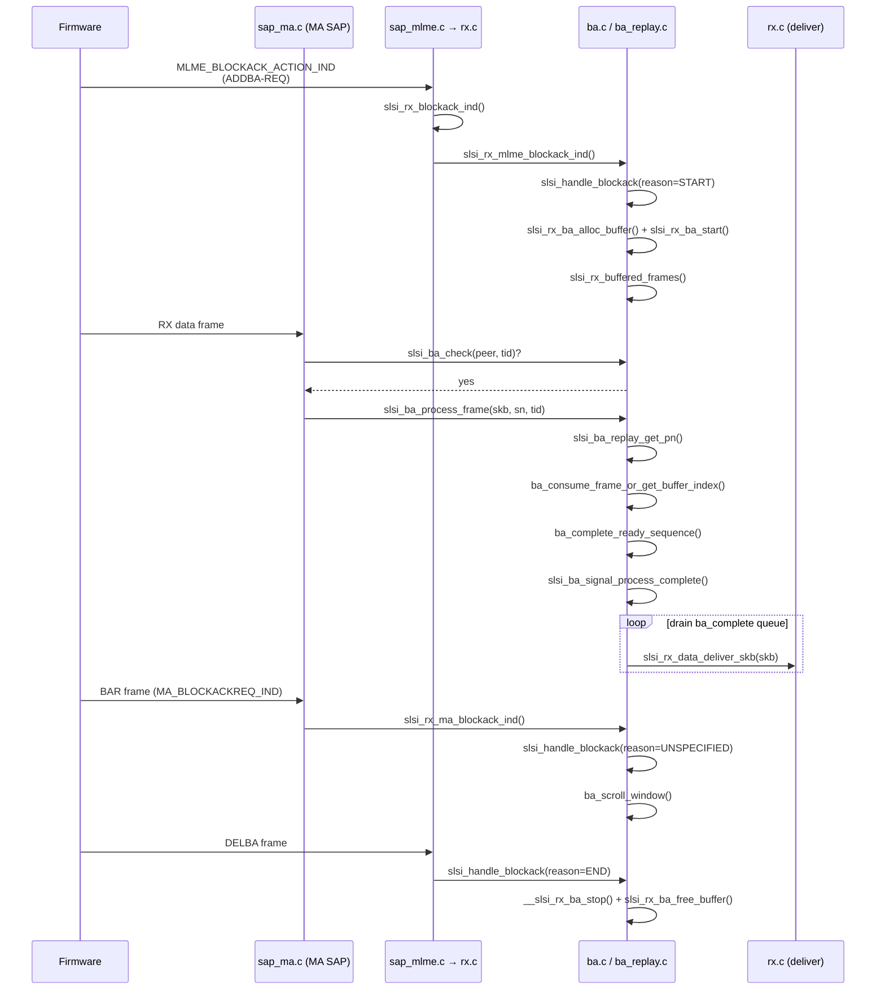

# Block Ack (BA) Receiver Reordering Engine

> Implements the IEEE 802.11 Block Acknowledgement (BlockAck) receiver-side
> MPDU reorder buffer and replay-detection logic for the Samsung SCSC WLAN
> PCIe driver. Manages per-peer, per-TID BA sessions that buffer out-of-order
> AMPDU frames, reorder them by sequence number, and deliver them in-order to
> upper network layers.

## Purpose

The 802.11 Block Ack mechanism allows a transmitter to send multiple MPDUs
(AMPDU) and receive a single block acknowledgement. On the receiver side, frames
may arrive out of order — the BA engine buffers these frames in a reorder ring
buffer (`buffer[SLSI_BA_BUFFER_SIZE_MAX]`), tracks the expected sequence number
(`expected_sn`), and delivers frames to the network stack only when the in-order
sequence is complete. A configurable aging timer
(`slsi_ba_aging_timeout_handler`) flushes frames that exceed the reorder
timeout, filling sequence-number holes.

Replay detection is provided via [[raw/pcie_scsc/ba_replay|ba_replay]], which tracks per-TID
packet numbers (PN) to reject frames whose PN does not monotonically increase.

## Module Parameters

Three tunable module parameters expose runtime knobs:

| Parameter | Type | Default | Description |
|---|---|---|---|
| `ba_mpdu_reorder_age_timeout` | uint | 100 | Single-VIF reorder buffer timeout (ms) |
| `ba_mpdu_reorder_age_timeout_mvif` | uint | 300 | Multi-VIF reorder buffer timeout (ms) |
| `ba_out_of_range_delba_enable` | bool | 1 | Trigger automatic DELBA on out-of-range frame |

## Key data structures

### `struct slsi_ba_frame_desc` (`dev.h` L507-515)

Per-frame metadata stored in the reorder ring buffer:

```c
struct slsi_ba_frame_desc {
    bool           active;             // slot is occupied
    struct sk_buff *signal;            // the frame itself
    u16            tid;               // Traffic ID (0-7)
    u16            sn;                // sequence number
    bool           flag_old_sn;        // frame arrived before SSN
    bool           flag_old_tdls;      // old-frame flag for TDLS compatibility
    u8             pn[SLSI_RX_PN_LEN]; // packet number for replay detection
};
```

### `struct slsi_ba_session_rx` (`dev.h` L517-544)

One instance per active (peer, TID) pair, allocated from a device-wide
vmalloc pool of `SLSI_MAX_RX_BA_SESSIONS` (32) entries:

```c
struct slsi_ba_session_rx {
    bool                        active;
    bool                        used;                       // pool slot in use
    void                       *vif;
    struct slsi_ba_window_entry ba_window[SLSI_BA_BUFFER_SIZE_MAX]; // 1024 entries for replay-opt-2
    struct slsi_ba_frame_desc  buffer[SLSI_BA_BUFFER_SIZE_MAX];  // reorder ring buffer
    u16                         buffer_size;
    u16                         occupied_slots;
    u16                         expected_sn;    // next SN expected in-order
    u16                         start_sn;       // SSN from AddBA
    u16                         highest_received_sn;
    bool                        closing;        // DELBA in progress
    bool                        last_sn_check;  // guard for last-delivered-SN tracking
    bool                        trigger_ba_after_ssn;
    u8                          tid;
    bool                        timer_on;
    struct timer_list           ba_age_timer;
    struct net_device          *dev;
    struct slsi_peer           *peer;
    u32                         ba_timeouts;
    u32                         ba_drops_old;
    u32                         ba_drops_replay;
};
```

### `struct slsi_ba_window_entry` (`dev.h` L502-505)

Track whether a particular SN was already forwarded (used by replay-check option 2):

```c
struct slsi_ba_window_entry {
    bool   sent;
    u16    sn;
};
```

### Peer-side arrays (`struct slsi_peer`, `dev.h` L719-721)

Each peer carries per-TID BA state indexed by TID (0–7):

```c
struct slsi_peer {
    ...
    u16                          last_sn[NUM_BA_SESSIONS_PER_PEER];   // last delivered SN per TID
    u8                           rx_pn[NUM_BA_SESSIONS_PER_PEER][SLSI_RX_PN_LEN];
    struct slsi_ba_session_rx   *ba_session_rx[NUM_BA_SESSIONS_PER_PEER];
    struct sk_buff_head          buffered_frames[NUM_BA_SESSIONS_PER_PEER]; // pre-connection buffering
    ...
};
```

### VIF-side BA state (`struct netdev_vif`, `dev.h` L1452-1458)

Per-virtual-interface reordering context:

```c
struct netdev_vif {
    ...
    struct slsi_spinlock        ba_lock;       // protects BA session access
    struct sk_buff_head         ba_complete;   // queue of in-order frames ready for delivery
    atomic_t                    ba_flush;      // flush signal
    u32                         timeout_in_ms; // current reorder timeout
    ...
};
```

### Device-wide pool (`struct slsi_dev`, `dev.h` L2032-2034)

```c
struct slsi_dev {
    ...
    DECLARE_BITMAP(rx_ba_bitmap, CONFIG_SCSC_WLAN_MAX_INTERFACES); // active-VIF tracking
    struct slsi_ba_session_rx *rx_ba_buffer_pool;                   // vmalloc'd array
    struct slsi_spinlock       rx_ba_buffer_pool_lock;
    ...
};
```

## Key entry points

### Initialization / teardown

- **`int slsi_rx_ba_init(struct slsi_dev *sdev)`** — vmallocs the pool of 32 `slsi_ba_session_rx` entries and creates the pool spinlock.
- **`void slsi_rx_ba_deinit(struct slsi_dev *sdev)`** — frees the pool.

### Frame processing (data path)

- **`int slsi_ba_process_frame(struct net_device *dev, struct slsi_peer *peer, struct sk_buff *skb, u16 sequence_number, u16 tid)`** — Core reordering entry point. Called from [[raw/pcie_scsc/sap_ma|sap_ma]] data-path for every RX data frame when a BA session is active for the (peer, TID). Routes frames into the ring buffer, advances `expected_sn`, starts/stops the aging timer, and enqueues in-order frames to `ba_complete`.
- **`void slsi_ba_store_sn(struct net_device *dev, struct slsi_peer *peer, struct sk_buff *skb)`** — Records the last-delivered SN per TID in `peer->last_sn[tid]`. Used as a guard rail for detecting frames that fell through a reorder window gap.
- **`bool slsi_ba_check(struct slsi_peer *peer, u16 tid)`** — Quick predicate: is there an active BA session for this (peer, TID)?

### BA session lifecycle

- **`void slsi_handle_blockack(struct net_device *dev, struct slsi_peer *peer, u16 reason_code, u16 user_priority, u16 buffer_size, u16 sequence_number)`** — Central dispatcher.
  - `FAPI_REASONCODE_START` → allocates buffer, starts session, flushes pre-buffered frames.
  - `FAPI_REASONCODE_END` → stops session, frees buffer.
  - `FAPI_REASONCODE_UNSPECIFIED_REASON` → BAR arrived; updates `highest_received_sn` and scrolls the window.
- **`void slsi_rx_ba_stop_all(struct net_device *dev, struct slsi_peer *peer)`** — Tears down all 8 per-TID BA sessions for a peer (flush, free, stop timers).
- **`void slsi_ba_update_window(struct net_device *dev, struct slsi_ba_session_rx *ba_session_rx, u16 sequence_number)`** — Advances the BA window in response to a BAR.

### MLME / MA ingress

- **`void slsi_rx_mlme_blockack_ind(struct slsi_dev *sdev, struct net_device *dev, struct sk_buff *skb)`** — Parses 802.11 management ADDBA-REQ and DELBA action frames. Called indirectly via `slsi_rx_blockack_ind()` in [[raw/pcie_scsc/rx|rx]], which is dispatched from [[raw/pcie_scsc/sap_mlme|sap_mlme]] on `MLME_BLOCKACK_ACTION_IND`.
- **`void slsi_rx_ma_blockack_ind(struct slsi_dev *sdev, struct net_device *dev, struct sk_buff *skb)`** — Parses firmware BAR (Block Ack Request) indications from the MAC-agent path in [[raw/pcie_scsc/sap_ma|sap_ma]].

### Completion delivery

- **`void slsi_ba_process_complete(struct net_device *dev, bool ctx_napi)`** — Drains `ba_complete` queue and delivers each frame via `slsi_rx_data_deliver_skb()`. Called after reordering or timer expiry.

### Timer / VIF lifecycle

- **`void slsi_rx_ba_update_timer(struct slsi_dev *sdev, struct net_device *dev, enum slsi_rx_ba_event ba_event)`** — Maintains `rx_ba_bitmap` to count active VIFs; selects single-VIF (100 ms) or multi-VIF (300 ms) timeout and broadcasts it to all VIFs.

### Replay detection (in `ba_replay.c`)

- **`void slsi_ba_replay_reset_pn(struct net_device *dev, struct slsi_peer *peer)`** — Zeros per-TID PN tracking on session reset.
- **`void slsi_ba_replay_get_pn(struct net_device *dev, struct slsi_peer *peer, struct sk_buff *skb, struct slsi_ba_frame_desc *frame_desc)`** — Extracts PN from `skb_cb->keyrsc` of a ciphertext frame.
- **`void slsi_ba_replay_store_pn(struct net_device *dev, struct slsi_peer *peer, struct sk_buff *skb)`** — Persists the highest-accepted PN to `peer->rx_pn[tid]`.
- **`bool slsi_ba_replay_check_pn(struct net_device *dev, struct slsi_ba_session_rx *ba_session_rx, struct slsi_ba_frame_desc *frame_desc)`** — Dispatches to option-1 or option-2 replay check based on `ba_replay_check_option`. Returns `true` if the frame is a replay (and should be dropped).

## Internal flow



### Reorder buffer algorithm

The ring buffer has `buffer_size` slots. The macro `SN_TO_INDEX(ba_session_rx, sn)` maps a 12-bit sequence number to a ring index. When `slsi_ba_process_frame()` receives a frame:

1. If SN equals `expected_sn`, the frame is immediately added to `ba_complete` and `expected_sn` advances.
2. Otherwise the frame is stored at `buffer[SN_TO_INDEX(sn)]` if the slot is free, or dropped if a duplicate already occupies it.
3. `ba_complete_ready_sequence()` walks forward from `expected_sn`, delivering contiguous buffered frames and advancing the window.
4. If holes remain (`occupied_slots > 0`), an aging timer fires after `timeout_in_ms` milliseconds. The handler searches for the next available frame, delivers it and all contiguous successors, then re-arms if holes persist.

### Replay detection options

Configured by module parameter `ba_replay_check_option` (1 or 2):

- **Option 1**: Every candidate-for-delivery frame is checked — its PN must be strictly greater than the highest PN already passed to upper layers. Simpler; more conservative.
- **Option 2**: More nuanced. Tracks which SNs were already sent via `ba_window[]`. Frames with SN higher than the highest forwarded SN must have PN higher than the highest forwarded PN. Frames with lower SN must have PN lower than the highest forwarded PN. Handles the case where a gap was timed out and older frames still arrive.

## Related

- [[raw/pcie_scsc/dev|dev]] — Core device/peer/VIF data structures
- [[raw/pcie_scsc/rx|rx]] — RX data path and delivery (`slsi_rx_data_deliver_skb`)
- [[raw/pcie_scsc/sap_ma|sap_ma]] — MAC-agent SAP; data-frame dispatcher and BAR handler
- [[raw/pcie_scsc/sap_mlme|sap_mlme]] — MLME SAP; AddBA/DELBA management frame dispatcher
- [[raw/pcie_scsc/ba_replay|ba_replay]] — Replay detection implementation (separate translation unit)

## Recent changes

- Initial seed page.
