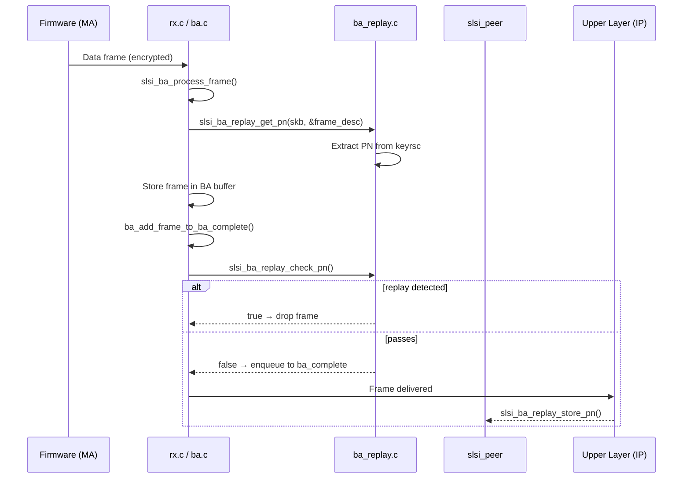

# ba_replay

Replay-detection module for encrypted frames within 802.11 Block Acknowledgement (BA) reordering windows. Extracts the 48-bit Packet Number (PN) from the per-packet key RSC (KeyReplayCounter) stored in `struct slsi_skb_cb`, compares it against the highest PN previously accepted per-TID per-peer, and drops frames whose PN violates the monotonicity policy. Two algorithms (Option 1, Option 2) are selectable at load time; Option 1 is the default and simpler, while Option 2 adds sequence-number-window awareness for out-of-order frames.

## Module parameters

| Parameter | Type | Default | Description |
|---|---|---|-|
| `ba_replay_check_enable` | `bool` | `true` | Master on/off switch. When `false`, only old-SN frames (`flag_old_sn`) are dropped; PN comparison is skipped. |
| `ba_replay_check_option` | `uint` | `1` | Selects algorithm 1 (simple PN monotonicity) or 2 (SN-window-aware). |

## Key data structures

### `struct ba_replay_check_type`

Dispatch table entry mapping an option number to its replay-check function:

```c
struct ba_replay_check_type {
    const u8   option_num;
    bool       (*replay_check_fn)(struct net_device *dev,
                                  struct slsi_ba_session_rx *ba_session_rx,
                                  struct slsi_ba_frame_desc *frame_desc);
};
```

The static array `replay_check_types[]` holds two entries: `{1, ba_replay_check_option_1}` and `{2, ba_replay_check_option_2}`.

### PN storage

The PN is a 6-byte value (`SLSI_RX_PN_LEN == 6`) defined in `dev.h`. Per-peer PN state lives in:

- **`struct slsi_peer.rx_pn[NUM_BA_SESSIONS_PER_PEER][SLSI_RX_PN_LEN]`** — highest-accepted PN per TID (one entry per BA session slot; `NUM_BA_SESSIONS_PER_PEER` = 8).
- **`struct slsi_ba_frame_desc.pn[SLSI_RX_PN_LEN]`** — PN extracted from the current incoming frame.
- **`struct slsi_skb_cb.keyrsc[8]`** (in `utils.h`) — the full 8-byte key RSC carried in the skb control block; the 6-byte PN is reconstructed from `keyrsc[7:4]` and `keyrsc[1:0]`.
- **`struct slsi_skb_cb.is_ciphered`** — gate flag; replay checks only apply to encrypted frames.

## Public API

All four functions are declared in `ba.h`.

### `slsi_ba_replay_reset_pn(struct net_device *dev, struct slsi_peer *peer)`

Zeros the 6-byte PN for every TID slot (`0` through `FAPI_PRIORITY_QOS_UP7`). Called when the peer is torn down or keys are rotated — in `cfg80211_ops.c` during key set and in `mgt.c` during peer cleanup.

### `slsi_ba_replay_get_pn(struct net_device *dev, struct slsi_peer *peer, struct sk_buff *skb, struct slsi_ba_frame_desc *frame_desc)`

Extracts the PN from `skb_cb->keyrsc` into `frame_desc->pn`. Skips extraction when `ba_replay_check_enable` is `false` or when `skb_cb->is_ciphered` is clear. Called from `slsi_ba_process_frame()` in `ba.c` right after the `frame_desc` is populated, before the frame enters the BA buffer.

### `slsi_ba_replay_store_pn(struct net_device *dev, struct slsi_peer *peer, struct sk_buff *skb)`

Copies the 6-byte PN from `skb_cb->keyrsc` into `peer->rx_pn[tid]`, updating the "highest accepted PN" watermark for that TID. Called from `sap_ma.c` (line 1218) after a frame has passed all checks and is about to be delivered upward. Only writes when `tid <= FAPI_PRIORITY_QOS_UP7` (QoS UP0–UP7).

### `slsi_ba_replay_check_pn(struct net_device *dev, struct slsi_ba_session_rx *ba_session_rx, struct slsi_ba_frame_desc *frame_desc) → bool`

**Primary entry point.** Returns `true` if the frame should be dropped (replay detected), `false` if it passes.

Flow:
1. If `ba_replay_check_enable` is `false`: drops frames with `flag_old_sn` set (increments `ba_drops_old`), otherwise passes.
2. If `frame_desc->flag_old_tdls` is set: bypasses replay check entirely (returns `false`). TDLS frames get a pass here to handle reordering differences in direct-link scenarios.
3. Dispatches to the algorithm selected by `ba_replay_check_option` via the `replay_check_types[]` table.

Called from `ba_add_frame_to_ba_complete()` in `ba.c` — the final gate before an in-order or timeout-evicted frame is queued to `ndev_vif->ba_complete`.

## Replay-check algorithms

### Option 1 (`ba_replay_check_option_1`)

Simple monotonic-PN check, invoked for in-order and timeout-evicted frames alike:

1. If `frame_desc->flag_old_sn` → drop immediately (`ba_drops_old++`).
2. If the frame is unencrypted → pass (`false`).
3. If `current_pn <= stored_pn` (via `memcmp`), **and** at least one side is all-zeros → **replay detected** (`ba_drops_replay++`, return `true`). The all-zeros exception avoids rejecting the very first frame or a frame after key rotation where both PNs happen to be zero.
4. Otherwise → update `peer->rx_pn[tid]` with the new PN and pass.

### Option 2 (`ba_replay_check_option_2`)

Adds SN-window awareness for frames whose SN is not yet the highest received — useful when the BA reorder window has advanced past this frame's position:

1. **Non-old frames** (`!flag_old_sn`): same PN comparison as Option 1. Updates `ba_window[i].sn` and `ba_window[i].sent` on pass.
2. **Old frames** (`flag_old_sn`): first checks whether the SN was already seen in `ba_window` (duplicate → drop). Then:
   - If `highest_received_sn < current_sn` (SN is still "higher" within the 4096-modulo window): PN must be **strictly greater** than stored PN, else replay.
   - If `highest_received_sn >= current_sn` (SN has been surpassed): PN must be **strictly less** than stored PN, else replay.
3. On pass, updates `ba_window[i]` and returns `false`.

Both algorithms use `memcmp` on raw 6-byte PN arrays — this works because 802.11 PNs are monotonically increasing unsigned integers in big-endian byte order (as reconstructed from `keyrsc`).

## Integration points



### Callers of replay functions

| Function | Caller | Location |
|---|---|---|
| `slsi_ba_replay_get_pn` | `slsi_ba_process_frame()` | `ba.c` |
| `slsi_ba_replay_check_pn` | `ba_add_frame_to_ba_complete()` | `ba.c` |
| `slsi_ba_replay_store_pn` | SAP/MA processing path | `sap_ma.c` |
| `slsi_ba_replay_reset_pn` | Key set / peer teardown | `cfg80211_ops.c`, `mgt.c` |

### Drop counters

Both algorithms increment `ba_session_rx->ba_drops_replay` on replay detection and `ba_session_rx->ba_drops_old` on stale-frame drops. These counters are part of `struct slsi_ba_session_rx` (see `dev.h`) and expose per-session BA drop statistics.

## Related

- [[raw/pcie_scsc/ba|ba]] — Block Ack session management, reordering buffer, and window advance logic.
- [[raw/pcie_scsc/dev|dev]] — Core data structures (`slsi_peer`, `slsi_ba_session_rx`, `slsi_ba_frame_desc`).
- [[raw/pcie_scsc/utils|utils]] — `slsi_skb_cb` with `keyrsc` and `is_ciphered` fields.

## Recent changes

- Initial seed: documented purpose, module parameters, public API, both replay-check algorithms, integration flow, and cross-module call sites.
