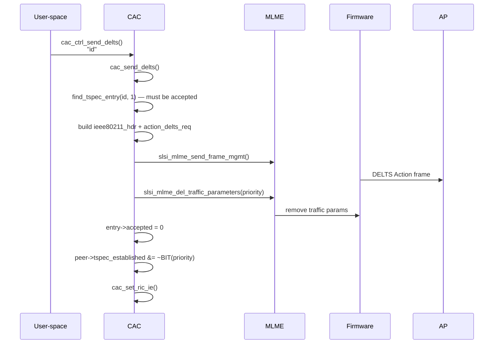

# CAC — WMM TSPEC Management

> CAC ("Code for AddTS / Clear TSPEC") implements the **WMM TSPEC** (Traffic Specification) lifecycle — creating, configuring, transmitting, and tearing down QoS traffic streams to/from the connected AP. It also restores TSPEC state after roaming.

## Purpose

The module manages the full ADDTS/DELTS (Add / Delete Traffic Stream) state machine defined by the WMM (Wi-Fi Multimedia) Power Save Multi-Poll extension to 802.11e. A TSPEC describes the bandwidth, latency, and priority requirements of a traffic stream. The driver holds a global linked list of `struct cac_tspec` entries, each representing a pending or accepted stream. When the AP accepts a stream via an ADDTS response, the driver programs the firmware with the allocated *medium time* through [[raw/pcie_scsc/mlme|MLME]] primitives.

Key responsibilities:

1. **TSPEC creation & configuration** — allocate a `cac_tspec` entry and set fields (TSID, direction, data rates, medium time, etc.) via procfs/ioctl.
2. **ADDTS / DELTS frame exchange** — build IEEE 802.11 Action frames and send them; process AP responses.
3. **Roaming recovery** — after re-association, extract admitted TSPECs from the AP's association response (RIC Data IEs) and reprogram firmware.
4. **RIC IE bookkeeping** — maintain the RIC (Resource Information Container) Information Elements used in association requests.

## Key data structures

### `struct wmm_tspec_element`

The 802.11 WMM TSPEC element (Element ID 0xDD = vendor-specific, OUI = Microsoft 00:50:F2, subtype = 2). Contains a 3-byte `ts_info` header followed by service-level fields:

```c
struct wmm_tspec_element {
    char eid;                 // 0xDD (vendor-specific)
    u8   length;              // 61
    u8   oui[3];              // 00:50:F2 (Microsoft)
    u8   oui_type;            // 2 (WMM)
    u8   oui_subtype;         // 2 (TSPEC element)
    u8   version;             // 1
    // 55-octet WMM TSPEC body:
    u8   ts_info[3];          // traffic_type, TSID, direction, access_policy,
                              // aggregation, PSB, user_priority, ack_policy, schedule
    u16  nominal_msdu_size;
    u16  maximum_msdu_size;
    u32  minimum_service_interval;
    u32  maximum_service_interval;
    u32  inactivity_interval;
    u32  suspension_interval;
    u32  service_start_time;
    u32  minimum_data_rate;
    u32  mean_data_rate;
    u32  peak_data_rate;
    u32  maximum_burst_size;
    u32  delay_bound;
    u32  minimum_phy_rate;
    u16  surplus_bandwidth_allowance;
    u16  medium_time;         // allocated air-time (key QoS metric)
} __packed;
```

### `struct cac_tspec`

Internal per-stream bookkeeping node in the global linked list:

```c
struct cac_tspec {
    struct cac_tspec         *next;
    int                      id;             // TSID (0-7)
    struct wmm_tspec_element tspec;
    u8                       psb_specified;  // PSB field explicitly set?
    int                      ebw;            // EBW IE requested
    int                      accepted;       // 0 = pending, 1 = AP accepted
    u8                       dialog_token;   // matches ADDTS request <-> response
};
```

### `struct tspec_field`

Metadata table mapping human-readable field names to their location within a TSPEC:

```c
struct tspec_field {
    const char *name;       // e.g. "traffic_type", "min_data_rate"
    int        read_only;
    int        is_tsinfo_field;  // 1 = packed into ts_info[0..2], 0 = body field
    u8         size;        // 1, 2, 3 (ts_info bits), 4
    u32        offset;      // bit offset (ts_info) or byte offset (body)
};
```

The static `tspec_fields[]` array defines 23 named fields including `traffic_type`, `tsid`, `direction`, `access_policy`, `psb`, `user_priority`, `min_data_rate`, `max_burst_size`, `delay_bound`, `medium_time`, etc.

### `struct cac_activated_tspec`

Compact output structure returned by `cac_get_active_tspecs()`:

```c
struct cac_activated_tspec {
    struct wmm_tspec_element tspec;
    int                      ebw;
};
```

### Global state

| Variable | Type | Role |
|---|---|---|
| `tspec_list` | `struct cac_tspec *` | Head of the global TSPEC linked list |
| `tspec_list_next_id` | `int` | Auto-incrementing TSID (0-7) allocator |
| `dialog_token_next` | `u8` | Monotonically increasing dialog token for ADDTS correlation |
| `previous_msdu_lifetime` | `u32` | Cached MSDU lifetime value (CCX mode) |
| `ccx_status` | `u8` | CCX (Cisco Centralized CCX) enable/disable flag |

## Public API

All public functions take a `struct slsi_dev *sdev` as first argument.

| Function | Description |
|---|---|
| `int cac_ctrl_create_tspec(sdev, args)` | Allocate a new TSPEC entry; returns TSID. `args` may specify TID or `NULL` for auto-assign. |
| `int cac_ctrl_config_tspec(sdev, args)` | Set a TSPEC field. `args` = `"id field value"` (space-separated). |
| `int cac_ctrl_send_addts(sdev, args)` | Build and transmit ADDTS Action frame. `args` = `"id"` or `"id ebw"`. |
| `int cac_ctrl_send_delts(sdev, args)` | Build and transmit DELTS Action frame. `args` = `"id"`. |
| `void cac_rx_wmm_action(sdev, netdev, data, len)` | Incoming WMM Action handler — dispatches to ADDTS-RESP or DELTS processor. |
| `void cac_update_roam_traffic_params(sdev, dev)` | After roaming: extract TSPECs from AP's association response and reprogram FW. |
| `int cac_get_active_tspecs(tspecs)` | Export all accepted TSPECs to caller-allocated array; returns count. |
| `void cac_delete_tspec_list(sdev)` | Tear down all TSPEC entries (called on disconnect). |
| `void cac_deactivate_tspecs(sdev)` | Mark all TSPECs as unaccepted without freeing them (roaming precursor). |
| `int cac_update_local_tspec(sdev, msdu_lifetime, tspec)` | Declared in header but **not implemented** in the current source. |

## Internal flow

### ADDTS (Add Traffic Stream) lifecycle

```mermaid
sequenceDiagram
    participant U as User-space<br/>(procfs/ioctl)
    participant C as CAC module
    participant M as MLME
    participant F as Firmware
    participant A as AP

    U->>C: cac_ctrl_create_tspec()
    C->>C: kzalloc(cac_tspec), add to tspec_list
    C-->>U: returns TSID

    U->>C: cac_ctrl_config_tspec()<br/>"id field value" xN
    C->>C: cac_config_tspec() — set fields

    U->>C: cac_ctrl_send_addts()<br/>"id [ebw]"
    C->>C: cac_send_addts()
    C->>C: find_tspec_entry(id, 0)
    C->>C: build ieee80211_hdr + action_addts_req
    opt ebw requested
        C->>C: add_ebw_ie() — EBW vendor IE
    end
    opt CCX enabled
        C->>C: add_tsrs_ie() — TSRS vendor IE
    end
    C->>M: slsi_mlme_send_frame_mgmt()
    M->>F: TX management frame
    F->>A: ADDTS Action frame

    A-->>F: ADDTS Response
    F->>M: rx callback
    M->>C: cac_rx_wmm_action()
    C->>C: cac_process_addts_rsp()
    alt accepted
        C->>M: slsi_mlme_set_traffic_parameters()
        M->>F: program medium_time, data_rate
        C->>C: entry->accepted = 1
        C->>C: peer->tspec_established |= BIT(priority)
        C->>C: cac_set_ric_ie()
        CCX mode
            C->>M: slsi_send_max_transmit_msdu_lifetime()
    else rejected
        C->>C: cac_delete_tspec_by_state()
    end
```

### DELTS (Delete Traffic Stream) lifecycle



### Incoming DELTS from AP

When the AP initiates a stream deletion, `cac_rx_wmm_action()` dispatches to `cac_process_delts_req()`, which looks up the TSPEC by TID, removes firmware traffic parameters via `slsi_mlme_del_traffic_parameters()`, and clears the peer's `tspec_established` bit.

### Roaming recovery (`cac_update_roam_traffic_params`)

Called from [[raw/pcie_scsc/rx|rx]] at two roam completion points:

1. After normal roam (`rx.c:3414`)
2. After temporal-key roam (`rx.c:6093`)

Steps:
1. `cac_deactivate_tspecs()` — mark all TSPECs unaccepted
2. `cac_get_rde_tspec_ie()` — parse RIC Data IEs from the AP's association response to find admitted WMM TSPECs
3. For each admitted TSPEC: update `medium_time` and `minimum_data_rate`, mark accepted, set `peer->tspec_established` bit, call `slsi_mlme_set_traffic_parameters()` to reprogram FW

### RIC IE maintenance (`cac_set_ric_ie`)

Called after ADDTS acceptance, DELTS completion, or incoming DELTS. Builds the RIC Data Information Element (WLAN_EID_RIC_DATA) by iterating the global `tspec_list` and appending accepted TSPECs. Stored via `slsi_mlme_add_info_elements()` with purpose `FAPI_PURPOSE_ASSOCIATION_REQUEST` so it's included in future association requests.

### CCX (Cisco Centralized CCX) support

When the BSS has Cisco CCX enabled (`ccx_status == BSS_CCX_ENABLED`):

- **ADDTS request**: Adds a TSRS (Transmit Stream Rate Selection) vendor IE with the best supported rate ≤ 48 Mbps index.
- **ADDTS response**: Parses Cisco EDCA vendor IE to extract `msdu_lifetime` and programs it via `slsi_send_max_transmit_msdu_lifetime()`.
- **DELTS**: Restores `previous_msdu_lifetime` (read before ADDTS via `slsi_read_max_transmit_msdu_lifetime()`).

## Call graph

### Outgoing calls (CAC → other modules)

| Target | Function | Purpose |
|---|---|---|
| [[raw/pcie_scsc/mlme|MLME]] | `slsi_mlme_send_frame_mgmt()` | Transmit ADDTS/DELTS Action frames |
| [[raw/pcie_scsc/mlme|MLME]] | `slsi_mlme_set_traffic_parameters()` | Program admitted stream parameters into FW |
| [[raw/pcie_scsc/mlme|MLME]] | `slsi_mlme_del_traffic_parameters()` | Remove stream parameters from FW |
| [[raw/pcie_scsc/mlme|MLME]] | `slsi_mlme_add_info_elements()` | Store RIC IEs for future association requests |
| [[raw/pcie_scsc/mgt|MGT]] | `slsi_send_max_transmit_msdu_lifetime()` | Set MSDU lifetime (CCX) |
| [[raw/pcie_scsc/mgt|MGT]] | `slsi_read_max_transmit_msdu_lifetime()` | Read current MSDU lifetime (CCX) |
| [[raw/pcie_scsc/dev|dev]] | `slsi_get_netdev_locked()` | Find station net_device |
| [[raw/pcie_scsc/dev|dev]] | `slsi_get_peer_from_qs()` | Lookup peer for the station queueset |
| [[raw/pcie_scsc/dev|dev]] | `slsi_tx_mgmt_host_tag()` | Get host tag for management TX |
| [[raw/pcie_scsc/dev|dev]] | `slsi_str2int()` | Parse string arguments |
| [[raw/pcie_scsc/debug|debug]] | `SLSI_ERR`, `SLSI_DBG1`, `SLSI_DBG3` | Logging |

### Incoming calls (other modules → CAC)

| Caller | Function | Context |
|---|---|---|
| [[raw/pcie_scsc/procfs|procfs]] | `cac_ctrl_create_tspec` | `/proc/.../create_tspec` write |
| [[raw/pcie_scsc/procfs|procfs]] | `cac_ctrl_config_tspec` | `/proc/.../confg_tspec` write |
| [[raw/pcie_scsc/procfs|procfs]] | `cac_ctrl_send_addts` | `/proc/.../send_addts` write |
| [[raw/pcie_scsc/procfs|procfs]] | `cac_ctrl_send_delts` | `/proc/.../send_delts` write |
| [[raw/pcie_scsc/rx|rx]] | `cac_rx_wmm_action` | WMM Action frame received (category = `WLAN_CATEGORY_WMM`) |
| [[raw/pcie_scsc/rx|rx]] | `cac_update_roam_traffic_params` | Roaming completion (two call sites) |
| [[raw/pcie_scsc/ioctl|ioctl]] | `cac_delete_tspec_list` | Disconnect path cleanup |
| [[raw/pcie_scsc/netif|netif]] | (indirectly via `peer->tspec_established`) | TX path QoS decision |

## Thread safety

The global `tspec_list` is protected by `sdev->tspec_mutex`. The procfs entry points acquire this mutex before calling the internal helpers. The RX path acquires both `ndev_vif->vif_mutex` and `sdev->tspec_mutex` before dispatching.

## Related

- [[raw/pcie_scsc/mlme|MLME]] — management layer primitives for frame TX and traffic parameter programming
- [[raw/pcie_scsc/rx|rx]] — receives WMM Action frames and triggers CAC processing
- [[raw/pcie_scsc/procfs|procfs]] — user-space interface for TSPEC control
- [[raw/pcie_scsc/ioctl|ioctl]] — cleanup hook on disconnect
- [[raw/pcie_scsc/dev|dev]] — device and peer data structures (`tspec_established`, `tspec_mutex`)

## Recent changes

- Initial seed page.
