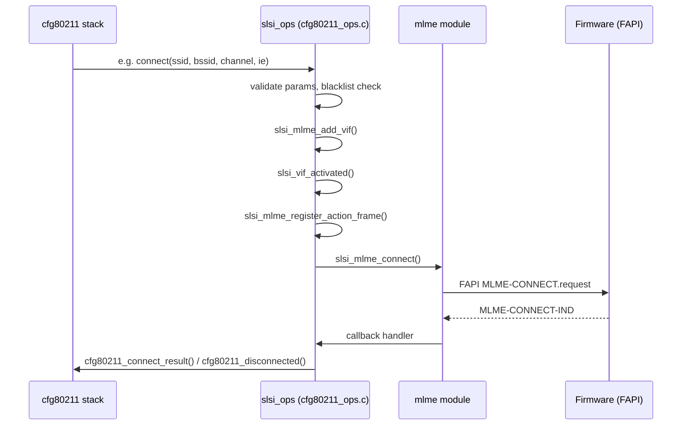

# cfg80211_ops

> Samsung SCSC WLAN driver's implementation of the Linux `cfg80211` mac80211 configuration interface. This module constructs the `struct cfg80211_ops slsi_ops` table, registers the `wiphy` object, and provides every callback the kernel cfg80211 stack invokes for station, AP, P2P, and management operations. Firmware interaction is delegated to [[raw/pcie_scsc/mlme|mlme]] routines.

## Purpose

`cfg80211_ops.c` (~6100 lines) is the **cfg80211 operations veneer** between the kernel wireless configuration API and the Samsung SCSC firmware. Its responsibilities are:

1. **wiphy lifecycle** — `slsi_cfg80211_new()` allocates a `wiphy` with `wiphy_new(&slsi_ops, sizeof(struct slsi_dev))`; `slsi_cfg80211_register()` / `slsi_cfg80211_unregister()` / `slsi_cfg80211_free()` wrap the kernel registration functions.
2. **Operations table** — The static `struct cfg80211_ops slsi_ops` (line 5083) holds ~40 function pointers. Each callback performs parameter validation, mutex acquisition, then delegates to [[raw/pcie_scsc/mlme|mlme]] functions (e.g. `slsi_mlme_add_vif`, `slsi_mlme_connect`, `slsi_mlme_add_scan`).
3. **wiphy capability advertisement** — Channel tables (`slsi_2ghz_channels`, `slsi_5ghz_channels`, `slsi_6ghz_channels`), rate tables (`slsi_11g_rates`, `wifi_11a_rates`), band structs (`slsi_band_2ghz`, `slsi_band_5ghz`, `slsi_band_6ghz`), HT/VHT/HE capability structs, cipher/AKM suites, extended capabilities, interface combinations, and regulatory domain.
4. **Dynamic capability update** — `slsi_cfg80211_update_wiphy()` rewrites wiphy bands, HT/VHT flags from firmware-provided capability bytes (`sdev->fw_ht_cap`, `sdev->fw_vht_cap`, `sdev->fw_he_cap`).

The `wiphy->priv` pointer holds a `struct slsi_dev`, accessed everywhere via the `SDEV_FROM_WIPHY(wiphy)` macro (defined in `cfg80211_ops.h`).

## Key data structures

### cfg80211_ops table (line 5083)

```c
static struct cfg80211_ops slsi_ops = {
    .add_virtual_intf     = slsi_add_virtual_intf,
    .del_virtual_intf     = slsi_del_virtual_intf,
    .change_virtual_intf  = slsi_change_virtual_intf,
    .scan                 = slsi_scan,
    .abort_scan           = slsi_abort_scan,
    .sched_scan_start     = slsi_sched_scan_start,
    .sched_scan_stop      = slsi_sched_scan_stop,
    .connect              = slsi_connect,
    .disconnect           = slsi_disconnect,
    .add_key              = slsi_add_key,
    .del_key              = slsi_del_key,
    .get_key              = slsi_get_key,
    .set_default_key      = slsi_set_default_key,
    .set_default_mgmt_key = slsi_config_default_mgmt_key,
    .change_station       = slsi_change_station,
    .del_station          = slsi_del_station,
    .get_station          = slsi_get_station,
    .set_tx_power         = slsi_set_tx_power,
    .get_tx_power         = slsi_get_tx_power,
    .get_channel          = slsi_get_channel,
    .set_power_mgmt       = slsi_set_power_mgmt,
    .set_wiphy_params     = slsi_set_wiphy_params,
    .suspend              = slsi_suspend,
    .resume               = slsi_resume,
    .set_pmksa            = slsi_set_pmksa,
    .del_pmksa            = slsi_del_pmksa,
    .flush_pmksa          = slsi_flush_pmksa,
    .remain_on_channel    = slsi_remain_on_channel,
    .cancel_remain_on_channel = slsi_cancel_remain_on_channel,
    .change_bss           = slsi_change_bss,
    .start_ap             = slsi_start_ap,
    .change_beacon        = slsi_change_beacon,
    .stop_ap              = slsi_stop_ap,
    .update_owe_info      = slsi_update_owe_info,
    .update_connect_params = slsi_update_connect_params,
    .mgmt_tx              = slsi_mgmt_tx,
    .mgmt_tx_cancel_wait  = slsi_mgmt_tx_cancel_wait,
    .set_txq_params       = slsi_set_txq_params,
    .external_auth        = slsi_synchronised_response,
    .set_mac_acl          = slsi_set_mac_acl | slsi_set_mac_acl_per_mac,
    .channel_switch       = slsi_channel_switch,
    .update_ft_ies        = slsi_update_ft_ies,
    .tdls_oper            = slsi_tdls_manager_oper,
    .set_monitor_channel  = slsi_set_monitor_channel,
    .set_qos_map          = slsi_set_qos_map,
    .add_intf_link        = slsi_set_intf_link,  // CONFIG_SCSC_WLAN_EHT only
    .update_owe_info      = slsi_update_owe_info,  // kernel < 5.2 only
};
```

### wiphy initialization (`slsi_cfg80211_new`, line 5776)

Sets:
- **Flags**: `WIPHY_FLAG_NETNS_OK`, `WIPHY_FLAG_PS_ON_BY_DEFAULT`, `WIPHY_FLAG_CONTROL_PORT_PROTOCOL`, `WIPHY_FLAG_SUPPORTS_FW_ROAM`, `WIPHY_FLAG_HAS_CHANNEL_SWITCH`, `WIPHY_FLAG_HAVE_AP_SME`, `WIPHY_FLAG_AP_PROBE_RESP_OFFLOAD`, `WIPHY_FLAG_AP_UAPSD`, `WIPHY_FLAG_OFFCHAN_TX`, `WIPHY_FLAG_SUPPORTS_TDLS`, `WIPHY_FLAG_SUPPORTS_MLO` (EHT-only).
- **Interface modes**: STATION, AP, P2P_GO, P2P_CLIENT, MONITOR, ADHOC, AP_VLAN (or STATION-only under `CONFIG_SCSC_WLAN_STA_ONLY`).
- **Bands**: `slsi_band_2ghz`, `slsi_band_5ghz`, optionally `slsi_band_6ghz`.
- **CSA**: `max_num_csa_counters = 2`.
- **Scan limits**: `max_scan_ssids = 10`, `max_scan_ie_len = 2048`, `max_sched_scan_ssids = 16`, `max_match_sets = 16`.
- **Ciphers**: `slsi_cipher_suites` (WEP40, WEP104, TKIP, CCMP, AES-CMAC, SMS4, PMK, GCMP, GCMP-256, CCMP-256, BIP-GMAC-128, BIP-GMAC-256).
- **AKM suites**: 802.1X, PSK, FT-802.1X, FT-PSK, SHA256 variants, SAE, FT-over-SAE, Suite-B, OWE, PASN, SAE-Ext-Key, and FT variants.
- **Regulatory**: Self-managed (`REGULATORY_WIPHY_SELF_MANAGED` on kernel ≥ 5.10; `REGULATORY_STRICT_REG | REGULATORY_CUSTOM_REG | REGULATORY_DISABLE_BEACON_HINTS` on older kernels).
- **WoWLAN**: `slsi_wowlan_config` with `any = true`.

### Scan parameters

```c
struct slsi_scan_params {
    struct ieee80211_channel *channels[SLSI_DEFAULT_CH_MAX];
    int chan_count;
    int scan_type;        // FAPI_SCANTYPE_FULL_SCAN, SINGLE_CHANNEL_SCAN, INITIAL_SCAN, P2P_SCAN_SOCIAL, P2P_SCAN_FULL
    u8 *scan_ie;
    size_t scan_ie_len;
    int strip_wsc;
    int strip_p2p;
};
```

### Channel and band definitions

| Symbol | Band | Channels |
|---|---|---|
| `slsi_2ghz_channels` | 2.4 GHz | 14 channels (2412–2484 MHz) |
| `slsi_5ghz_channels` | 5 GHz | 28 channels (UNII 1/2a/2c/3/4, 5180–5885 MHz) |
| `slsi_6ghz_channels` | 6 GHz | 59 channels (U-NII 5/6/7/8, 5935–7115 MHz, under `CONFIG_SCSC_WLAN_SUPPORT_6G`) |
| `slsi_band_2ghz` | `ieee80211_supported_band` | 2.4 GHz + 11g rates + HT cap |
| `slsi_band_5ghz` | `ieee80211_supported_band` | 5 GHz + 11a rates + HT/VHT cap |
| `slsi_band_6ghz` | `ieee80211_supported_band` | 6 GHz + 11a rates (no HT/VHT, under 6G config) |
| `slsi_ht_cap` | `ieee80211_sta_ht_cap` | 20/40 MHz, LDPC, STBC, green field, SGI |
| `slsi_vht_cap` | `ieee80211_sta_vht_cap` | SU beamformee, MCS 0-9 all streams |

### Interface combinations (`iface_comb`)

One combination entry: up to `CONFIG_SCSC_WLAN_MAX_INTERFACES` interfaces across 2 channels. Limits: 1 AP, N stations, 1 P2P, 1 adhoc.

### Interface type management (`ieee80211_default_mgmt_stypes`)

Per-interface-type TX/RX management frame subtype masks for AP, STATION, P2P_GO, P2P_CLIENT.

## Public API (declared in `cfg80211_ops.h`)

| Function | Purpose |
|---|---|
| `slsi_cfg80211_new(struct device *dev)` | Allocate `wiphy`, populate capabilities, return `slsi_dev*` |
| `slsi_cfg80211_register(struct slsi_dev *sdev)` | Call `wiphy_register()` |
| `slsi_cfg80211_unregister(struct slsi_dev *sdev)` | Clear WoWLAN pointers, call `wiphy_unregister()` |
| `slsi_cfg80211_free(struct slsi_dev *sdev)` | Call `wiphy_free()` |
| `slsi_cfg80211_update_wiphy(struct slsi_dev *sdev)` | Rewrite bands, HT/VHT from FW capability bytes |
| `slsi_wlan_mgmt_tx(struct slsi_dev *sdev, struct net_device *dev, struct ieee80211_channel *chan, unsigned int wait, const u8 *buf, size_t len, bool dont_wait_for_ack, u64 *cookie)` | Exposed helper for mgmt TX; called by `slsi_mgmt_tx` and internally by P2P group mgmt TX |

## Callback categories

### Virtual Interface Management

- `slsi_add_virtual_intf` (line 100/107/115) — Creates netdev via `slsi_dynamic_interface_create()`. Handles AP_VLAN specially: validates MHS active, increments `sdev->num_ap_vlan`, links `ndev_vif->netdev_ap`. All types acquire `sdev->netdev_add_remove_mutex`.
- `slsi_del_virtual_intf` (line 176) — Calls `slsi_stop_net_dev()`, then `slsi_netif_remove_locked()`. Clears `sdev->netdev_ap` or `sdev->netdev_p2p` pointers. P2P interfaces reset `drv_in_p2p_procedure`.
- `slsi_change_virtual_intf` (line 230/236) — Changes interface type on deactivated VIFs. Supports UNSPECIFIED, ADHOC, STATION, AP, P2P_CLIENT, P2P_GO, MONITOR.

### Scanning

- `slsi_scan` (line 1056) — Rejects if P2P action frame TX/RX in progress or prior scan pending. Builds `slsi_scan_params`, strips WPS/P2P IEs when needed, calls `slsi_mlme_add_scan()`. Arms `scan_timeout_work` delayed work (`SLSI_FW_SCAN_DONE_TIMEOUT_MSEC`).
- `slsi_abort_scan` (line 1043) — Calls `slsi_mlme_del_scan()` + `slsi_scan_complete()`.
- `slsi_sched_scan_start` (line 1175) — Only allowed on `SLSI_NET_INDEX_WLAN`. Rejects during P2P group formation.
- `slsi_sched_scan_stop` (line 1247/1250) — Calls `slsi_mlme_del_scan()` for `SLSI_SCAN_HW_ID`.

### Station Connect/Disconnect

- `slsi_connect` (line 2092) — Blacklist check → roam/reassoc detection (`slsi_set_roam_reassoc`) → `slsi_mlme_add_vif()` → `slsi_vif_activated()` → action frame registration → probe IE injection → RSSI boost → `slsi_mlme_connect()`. FILS auth types are rejected. Sets `ndev_vif->sta.vif_status = SLSI_VIF_STATUS_CONNECTING`.
- `slsi_disconnect` (line 2385) — Sets `SLSI_VIF_STATUS_DISCONNECTING`, calls `slsi_mlme_disconnect()` then `slsi_handle_disconnect()`. EHT variant passes `mlo_vif`.

### Key Management

- `slsi_add_key` (line 283/287) — PMK cipher handled via `slsi_mlme_set_key()`. Pairwise keys look up peer by MAC; station group keys use `SLSI_STA_PEER_QUEUESET` peer. AP VLAN group keys derive `group_key_index` from interface name, delegate to AP netdev. WEP treated as pairwise. IGTK/BIGTK detection by cipher/key index. After key set: resets BA replay PN, marks `pairwise_key_set`/`group_key_set`, triggers connection completion for FILS/SMS4.
- `slsi_del_key` (line 480/483) — No-op (FW does not support `MLME_DELETEKEYS.request`).
- `slsi_get_key` (line 632/637) — AP-only group key sequence retrieval via `slsi_mlme_get_key()`.
- `slsi_set_default_key` / `slsi_config_default_mgmt_key` — No-op; keys are set in `add_key`.

### Station Operations

- `slsi_change_station` (line 503) — VLAN association: maps `group_key_index` from VLAN interface name, stores in peer.
- `slsi_del_station` (line 2681) — Removes station/AP client.
- `slsi_get_station` (line 2816) — Returns station info including throughput stats.

### AP Management

- `slsi_start_ap` (line 3969) — Validates device state, aborts WLAN scan, handles WiFi sharing channel switch, configures country code, checks indoor channel, validates settings, sets up P2P GO, configures MLO links, sets VIF type, calls `slsi_mlme_add_vif()` → `slsi_vif_activated()` → beacon IE modification → `slsi_mlme_start()`. Notifies cfg80211 of channel switch.
- `slsi_change_beacon` (line 4200) — Returns `-EOPNOTSUPP` (not supported).
- `slsi_stop_ap` (line 4209/4212) — Resets throughput stats.

### PMKSA Cache

- `slsi_set_pmksa` (line 3027) — Adds PMKSA cache entry via `slsi_mlme_set_key()` with PMK cipher.
- `slsi_del_pmksa` (line 3068) — Deletes PMKSA entry via `slsi_mlme_del_key()`.
- `slsi_flush_pmksa` (line 3086) — Flushes all PMKSA entries.

### Channel and Power

- `slsi_set_tx_power` (line 2542) — Returns `-EOPNOTSUPP`.
- `slsi_get_tx_power` (line 2667) — Returns current TX power.
- `slsi_get_channel` (line 2577/2581) — Returns current channel/width via `slsi_bw_to_nl80211_bw()`.
- `slsi_channel_switch` (line 568) — AP CSA: validates MHS index, calls `slsi_mlme_channel_switch()`.
- `slsi_set_monitor_channel` (line 2960) — Sets channel for monitor interface.
- `slsi_remain_on_channel` (line 3093) — ROC for P2P/GAS: manages P2P state machine, ROC timers.
- `slsi_cancel_remain_on_channel` (line 3207) — Cancels ROC, restores channel.

### Power Management

- `slsi_set_power_mgmt` (line 2888) — Delegates to `slsi_mlme_powermgt()`.
- `slsi_suspend` / `slsi_resume` (line 3009/3016) — PM callbacks; pause TX queues, clear scan state.
- `slsi_set_wiphy_params` (line 2515) — Sets fragmentation/RTS threshold via `slsi_set_uint_mib()`.

### Management Frame TX

- `slsi_mgmt_tx` (line 4641) — Entry point for cfg80211 mgmt TX. Delegates to `slsi_p2p_group_mgmt_tx` (P2P group on P2PX_SWLAN), `slsi_wlan_mgmt_tx` (wlan/P2P), or `slsi_mgmt_tx_on_channel` (unsync VIF).
- `slsi_wlan_mgmt_tx` (line 4519, declared in header) — Internal mgmt TX with unsync VIF handling for GAS frames. Activates VIF via `slsi_wlan_unsync_vif_activate()`, sends frame via `slsi_mlme_send_frame_mgmt()`.
- `slsi_mgmt_tx_cancel_wait` (line 4450) — Cancels pending mgmt TX.
- `slsi_mgmt_frame_register` (line 4503) — No-op (kernel ≤ 5.7 only).

### Miscellaneous

- `slsi_set_mac_acl` / `slsi_set_mac_acl_per_mac` (line 5057/4949) — MAC address access control. Per-MAC variant supports up to 255 addresses.
- `slsi_set_txq_params` (line 4769) — Configures TX queue parameters.
- `slsi_synchronised_response` (line 4815) — External authentication callback (`external_auth`).
- `slsi_update_ft_ies` (line 4869) — FT IEs update via `slsi_mlme_add_info_elements()`.
- `slsi_tdls_manager_oper` (from [[raw/pcie_scsc/tdls_manager|tdls_manager]]) — TDLS operation handler.
- `slsi_set_intf_link` (line 4841) — MLO link management (EHT only).
- `slsi_set_qos_map` (line 2923) — Sets QoS mapping.
- `slsi_change_bss` (line 3258) — BSS change for preferred network.
- `slsi_update_owe_info` (line 2224) — OWE info update for AP (kernel < 5.2).

### Module parameters

| Parameter | Default | Description |
|---|---|---|
| `keep_alive_period` | `SLSI_P2PGO_KEEP_ALIVE_PERIOD_SEC` (10) | P2P GO keep-alive interval in seconds |
| `monitor_vif_set` | 1 | Enable monitor VIF |

## Internal flow



Each ops callback follows a consistent pattern:
1. Acquire `sdev->start_stop_mutex` (device state) and `ndev_vif->vif_mutex` (VIF state).
2. Validate device is in `SLSI_DEVICE_STATE_STARTED`.
3. Delegate to `mlme` module for firmware communication.
4. On success, update VIF state; on failure, unwind via `slsi_mlme_del_vif()` + `slsi_vif_deactivated()`.
5. Notify cfg80211 stack of results.

## Related

- [[raw/pcie_scsc/dev|dev]] — `struct slsi_dev` and device lifecycle
- [[raw/pcie_scsc/mlme|mlme]] — Firmware management entity communication (MLME API)
- [[raw/pcie_scsc/netif|netif]] — Virtual interface and netdev management
- [[raw/pcie_scsc/mgt|mgt]] — Management frame handling
- [[raw/pcie_scsc/tdls_manager|tdls_manager]] — TDLS (Tunneled Direct Link Setup) operations

## Recent changes

- Initial seed page created from scratch.
