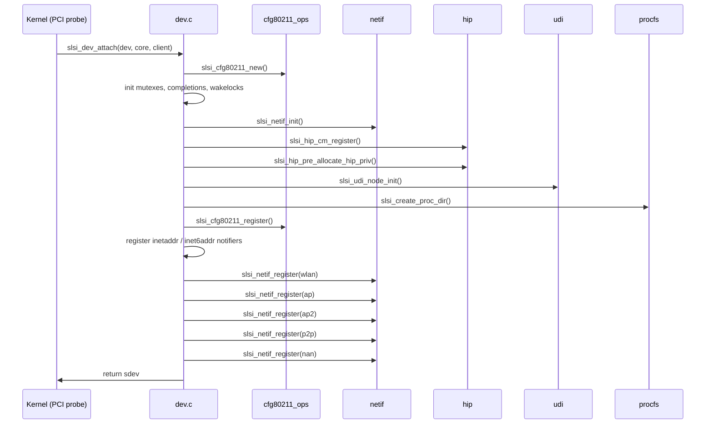
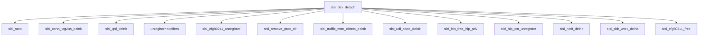

# dev

> Core device-management module for the **Samsung SLSI Maxwell Wi-Fi** driver (`MODULE_DESCRIPTION("mx140 Wi-Fi Driver")`). Owns the top-level `struct slsi_dev` lifecycle (attach → start → stop → detach), aggregates all sub-system initialisation, and exposes the module-load / unload entry points.

## Purpose

`dev.c` / `dev.h` is the **central hub** of the SLSI Wi-Fi driver. It is responsible for:

1. **Module lifecycle** — `module_init(slsi_dev_load)` / `module_exit(slsi_dev_unload)`.
2. **Device attach / detach** — `slsi_dev_attach()` allocates and wires up `struct slsi_dev`; `slsi_dev_detach()` tears down every sub-system in reverse order.
3. **Configuration aggregation** — 20+ `module_param` knobs (MIB filenames, feature enables/disables, timeouts, NAN settings, 6 GHz scan behaviour, etc.).
4. **Feature-probe helpers** — Functions like `slsi_dev_gscan_supported()`, `slsi_dev_lls_supported()`, `slsi_dev_nan_supported()` let other modules query whether a feature is compiled-in and run-time enabled.
5. **Network notification registration** — IPv4 (`slsi_dev_inetaddr_changed`) and IPv6 (`slsi_dev_inet6addr_changed`) address-change notifiers.
6. **System-error bookkeeping** — `slsi_add_log_to_system_error_buffer()` / `slsi_dump_system_error_buffer()` for crash diagnostics.
7. **Work-struct initialisation** — Recovery (`recovery_work`, `recovery_work_on_start`, `recovery_work_on_stop`), logging, and resume workers are created here.

The driver operates over a **Maxwell (SCSC) PCIe co-processor**. The host driver delegates actual MAC/PHY work to firmware via the HIP (Host-Interface Protocol) and CM_IF (Command Management Interface). `dev.c` wires those pieces together but does not implement the protocol itself — that lives in [[raw/pcie_scsc/hip|HIP]], [[raw/pcie_scsc/cm_if|CM_IF]], and [[raw/pcie_scsc/mgt|mgt]].

## Key data structures

### `struct slsi_dev` (dev.h:1889-2200)

The single device-context object. Every sub-system pointer lives here:

| Field group | Representative members |
|---|---|
| Bus / Wiphy | `dev`, `wiphy` |
| Maxwell IPC | `maxwell_core`, `mx_wlan_client`, `service`, `cm_if`, `hip` |
| Netdev array | `netdev[CONFIG_SCSC_WLAN_MAX_INTERFACES + 1]` — indexed by `SLSI_NET_INDEX_*` (WLAN=1, P2P=2, AP=4, AP2=5, AP_VLAN=6, AP_VLAN2=7, NAN=8, DETECT=max+1) |
| Mutexes | `netdev_add_remove_mutex`, `start_stop_mutex`, `device_config_mutex`, `logger_mutex`, `tspec_mutex` |
| Wakelocks (Android) | `wlan_wl`, `wlan_wl_mlme_evt`, `wlan_wl_mlme`, `wlan_wl_ma`, `wlan_wl_roam`, `wlan_wl_init`, `wlan_wl_tx_sched`, `wlan_wl_resume` |
| Signal synchronisation | `sig_wait` — `struct slsi_sig_send` for MLME req→cfm round-trip |
| Work items | `recovery_work`, `recovery_work_on_start`, `recovery_work_on_stop`, `trigger_wlan_fail_work`, `system_error_user_fail_work`, `sablelog_logging_work`, `chipset_logging_work`, `wakeup_time_work`, `resume_work` |
| Config | `device_config` (`struct slsi_dev_config`), `mib[3]`, `local_mib` |
| Firmware capabilities | `fw_ht_enabled`, `fw_vht_enabled`, `fw_he_cap[]`, `fw_sta_eht_supported`, `fw_mlo_supported` |
| Regulatory | `regdb` (`struct reg_database`) |
| Band support | `band_5g_supported`, `band_6g_supported`, `supported_2g_channels[]`, `supported_5g_channels[]` |
| Traffic monitoring | `traffic_mon_clients`, per-device aggregate TX/RX throughput |
| Logging | `log_clients`, `conn_log2us_ctx`, `sys_error_log_buf` |
| RX BA pool | `rx_ba_buffer_pool`, `rx_ba_bitmap` |
| P2P / WLAN state | `p2p_state` (`enum slsi_p2p_states`), `wlan_unsync_vif_state` (`enum slsi_wlan_state`) |

### `struct netdev_vif` (dev.h:1365-1548)

Per-virtual-interface context, embedded as `netdev_priv` of each `struct net_device`:

| Field group | Members |
|---|---|
| Identity | `sdev` back-pointer, `ifnum`, `vifnum`, `iftype` |
| Channel | `chan`, `chandef`, `chandef_saved`, `driver_channel` |
| Mode-specific | `sta` (`struct slsi_vif_sta`), `ap` (`struct slsi_vif_ap`), `nan` (`struct slsi_vif_nan`), `unsync` (`struct slsi_vif_unsync`) |
| Scan | `scan[SLSI_SCAN_MAX]` (`struct slsi_scan`) |
| Peers | `peer_lock`, `peer_sta_records`, `peer_sta_record[]` |
| BA reorder | `ba_lock`, `ba_complete`, `ba_flush`, `timeout_in_ms` |
| TCP ACK suppression | `tcp_ack_lock`, `ack_suppression[TCP_ACK_SUPPRESSION_RECORDS_MAX]`, `tcp_ack_stats` |
| Traffic mon | `num_bytes_tx_per_timer`, `num_bytes_rx_per_timer`, `throughput_tx`, `throughput_rx` |
| IP | `ipaddress` (`__be32`), `ipv6address` (when `CONFIG_IPV6`) |

### `struct slsi_vif_sta` (dev.h:905-1042)

STA-mode sub-state: connection status (`vif_status` — CONNECTING/CONNECTED/DISCONNECTING), roaming, TDLS, PMKSA cache, WPA3 auth state, FILS, MLO links (up to `MAX_NUM_MLD_LINKS` = 15), and per-link channel/bandwidth info.

### `struct slsi_vif_ap` (dev.h:1127-1156)

AP-mode sub-state: WMM IE, cached WPA IE, last-disconnected STA info, ACL data, beacon interval, cipher, VLAN support.

### `struct slsi_peer` (dev.h:668-733)

Per-associated-station record: MAC address, AID, capabilities, QoS (ACM bitmask, TSPEC, UPSPD), buffered-frames queues (`NUM_BA_SESSIONS_PER_PEER` = 8), RX PN, BA session pointers, and per-peer `sinfo` (`struct station_info`).

### `struct slsi_ba_session_rx` (dev.h:517-544)

RX Block-Ack session: up to `SLSI_BA_BUFFER_SIZE_MAX` (1024) window entries, frame descriptors (with PN replay-check), aging timer, drop/replay statistics.

### `struct slsi_sig_send` (dev.h:472-490)

MLME request→confirmation synchronisation: spinlock + mutex + `completion` + process/req/cfm/ind IDs + SKB holders. `slsi_sig_send_init()` seeds the process-ID counter at `SLSI_TX_PROCESS_ID_MIN` (`0xC001`).

### `struct slsi_dev_config` (dev.h:1590-1665)

Runtime configuration: supported band, user-suspend mode, RX filter rules, roaming scan channels, regulatory domain, SAR/host-state, RSSI boost per band, TX antenna config, custom TX power back-off, latency mode, and (for EHT) ETP/MLO boost values.

### Rate tables

Three `static const` lookup tables in the header for translating FW API rate fields to throughput:

- `slsi_rates_table[4][2][12]` — HT (BW20/BW40/BW80/BW160 × no-SGI/SGI × MCS0-11)
- `slsi_he_rates_table_2x2[4][12][3]` — HE (2×2)
- `slsi_eht_rates_table_2x2[5][16][3]` — EHT (2×2, including 320 MHz)

Values are in **100 kbps** units.

## Key entry points

### Module lifecycle

| Function | File | Description |
|---|---|---|
| `int __init slsi_dev_load(void)` | dev.c:941 | `module_init` — registers SAPs (`sap_mlme`, `sap_ma`, `sap_dbg`, `sap_test`), creates sysfs entries, mmap regions, UDI, SM service driver. |
| `void __exit slsi_dev_unload(void)` | dev.c:983 | `module_exit` — reverses load in strict order (SAPs → sysfs → mmap → SM service → UDI). |

### Device attach / detach

| Function | File | Description |
|---|---|---|
| `struct slsi_dev *slsi_dev_attach(struct device *dev, struct scsc_mx *core, struct scsc_service_client *mx_wlan_client)` | dev.c:458 | Allocates `sdev` via `slsi_cfg80211_new()`, initialises all mutexes/completions/wakelocks, calls `slsi_netif_init()`, `slsi_hip_cm_register()`, `slsi_udi_node_init()`, registers cfg80211, creates work items, registers netdevs (WLAN, AP, AP2, P2P, NAN). Returns `NULL` on any failure (unwinds in reverse). |
| `void slsi_dev_detach(struct slsi_dev *sdev)` | dev.c:798 | Calls `slsi_stop()`, deinitialises every sub-system in reverse order of attach, frees cfg80211. |

### Feature-probe functions

All return `bool` or `int` and are used by other modules to guard feature usage:

- `slsi_dev_gscan_supported()` — gscan enabled
- `slsi_dev_lls_supported()` — LLS (Lightweight LAN Scan) enabled
- `slsi_dev_llslogs_supported()` — LLS logging enabled
- `slsi_dev_epno_supported()` — enhanced PNO enabled
- `slsi_dev_vo_vi_block_ack()` — VO/VI Block Ack logic
- `slsi_dev_get_scan_result_count()` — max scan results
- `slsi_dev_nan_supported(struct slsi_dev *)` — NAN enabled at device level
- `slsi_dev_rtt_supported()` — RTT (Fine Timing Measurement) enabled
- `slsi_dev_6ghz_split_scan_enabled()` / `slsi_dev_6ghz_skip_acs()` — 6 GHz tuning
- `slsi_dev_silent_recovery_supported()` — silent recovery (conditional)
- `slsi_ioctl_mib_linkid_supported()` — MIB on link ID (EHT)

### Notification callbacks

| Function | File | Description |
|---|---|---|
| `slsi_dev_inetaddr_changed()` | dev.c:338 | IPv4 address change — releases roaming wakelock, calls `slsi_ip_address_changed()`. |
| `slsi_dev_inet6addr_changed()` | dev.c:378 | IPv6 address change — stores address in `ndev_vif->ipv6address`. |

### Helpers

| Function | File | Description |
|---|---|---|
| `slsi_dev_resume_work()` | dev.c:448 | Work item: calls `slsi_hip_resume_wrapper()` and `sap_mlme_resume()`. |
| `slsi_collect_sablelog()` | dev.c:429 | Work item: triggers SCSC log collector. |
| `slsi_dump_system_error_buffer()` | dev.c:405 | Dumps buffered error log to kernel log. |
| `slsi_add_log_to_system_error_buffer()` | dev.c:412 | Appends timestamped entry to error buffer. |
| `slsi_get_vifidx_frm_linkid()` | dev.c:312 | Translates MLO link-ID to VIF index (EHT). |
| `slsi_get_netdev_rcu()` / `slsi_get_netdev()` / `slsi_get_netdev_by_mac_addr()` / `slsi_get_netdev_by_ifname()` | dev.h:2414-2493 | Inline helpers to look up netdev from `ifnum`, MAC, or name, with or without RCU / mutex protection. |
| `slsi_tx_host_tag()` | dev.h:2291 | Generates 16-bit host tag for TX packets (bits 0-1: traffic queue, bits 2-12: incrementing counter, bits 13-14: VLAN ID, bit 15: ARP flow control). |

## Internal flow

### Attach sequence

### Detach sequence

### Device state machine

`device_state` field in `struct slsi_dev` cycles through:

| State | Value | Meaning |
|---|---|---|
| `SLSI_DEVICE_STATE_ATTACHING` | 0 | Mid-attach |
| `SLSI_DEVICE_STATE_STOPPED` | 1 | Attached but FW not running |
| `SLSI_DEVICE_STATE_STARTING` | 2 | `slsi_start()` in progress |
| `SLSI_DEVICE_STATE_STARTED` | 3 | FW running, interfaces usable |
| `SLSI_DEVICE_STATE_STOPPING` | 4 | `slsi_stop()` in progress |

### Recovery

The driver maintains four recovery work items and five completions to orchestrate firmware panic recovery:

- `recovery_work_on_stop` → `slsi_failure_reset()` — recover when stopped
- `recovery_work` → `slsi_subsystem_reset()` — subsystem-level reset
- `recovery_work_on_start` → `slsi_chip_recovery()` — chip-level recovery when already running
- `system_error_user_fail_work` → `slsi_system_error_recovery()` — system-error trigger
- `trigger_wlan_fail_work` → `slsi_trigger_service_failure()` — deliberate FW panic (debug)

## Module parameters

| Parameter | Type | Default | Description |
|---|---|---|---|
| `mib_file` | `charp` | `"wlan.hcf"` | Primary MIB data file |
| `mib_file2` | `charp` | `"wlan_sw.hcf"` | SW MIB data file |
| `local_mib_file` | `charp` | `"localmib.hcf"` | Optional extra MIB |
| `maddr_file` | `charp` | `"mac.txt"` | MAC address file |
| `term_udi_users` | `bool` | `true` | Terminate UDI user-space connections on unload |
| `sig_wait_cfm_timeout` | `int` | `6000` | MLME confirmation wait timeout (ms) |
| `lls_disabled` | `bool` | — | Disable Lightweight LAN Scan |
| `gscan_disabled` | `bool` | (platform-dep.) | Disable gscan |
| `llslogs_disabled` | `bool` | — | Disable LLS logging |
| `epno_disabled` | `bool` | — | Disable enhanced PNO |
| `vo_vi_block_ack_disabled` | `bool` | — | Disable VO/VI Block Ack |
| `max_scan_result_count` | `int` | `10000` | Max reported scan results |
| `rtt_disabled` | `bool` | (config-dep.) | Disable RTT |
| `nan_disabled` | `bool` | — | Disable NAN |
| `disable_6ghz_split_scan` | `bool` | `true` | Disable 6 GHz split scan |
| `skip_6ghz_acs` | `bool` | — | Skip 6 GHz ACS |
| `silent_recovery_disabled` | `bool` | `1` | Disable silent recovery |
| `ioctl_mib_linkid_supported` | `bool` | `0` | Enable MIB on link ID (EHT) |

## Related

- [[raw/pcie_scsc/cfg80211_ops|cfg80211_ops]] — cfg80211 registration, interface create/destroy, connect/disconnect, scan, key management
- [[raw/pcie_scsc/netif|netif]] — Network interface registration, open/close, TX/RX path, NAPI poll
- [[raw/pcie_scsc/hip|hip]] — Host-Interface Protocol: firmware command/response transport
- [[raw/pcie_scsc/mgt|mgt]] — Start/stop, chip control, recovery, TWT, regulatory domain
- [[raw/pcie_scsc/udi|udi]] — User-space Debug Interface (character device for firmware test)
- [[raw/pcie_scsc/procfs|procfs]] — Runtime configuration via `/proc` entries
- [[raw/pcie_scsc/ba|ba]] — Block Ack session management
- [[raw/pcie_scsc/cm_if|cm_if]] — Command Management Interface bookkeeping
- [[raw/pcie_scsc/nl80211_vendor|nl80211_vendor]] — Vendor-specific nl80211 commands (GScan, logging, keepalive, etc.)
- [[raw/pcie_scsc/mlme|mlme]] — MLME state machine, TAS integration
- [[raw/pcie_scsc/traffic_monitor|traffic_monitor]] — Per-interface throughput and byte-count monitoring
- [[raw/pcie_scsc/hip_bh|hip_bh]] — HIP bottom-half processing
- [[raw/pcie_scsc/channels|channels]] — Channel/frequency band definitions
- [[raw/pcie_scsc/fapi|fapi]] — Firmware API packet accessors

## Recent changes

- Initial seed page.
