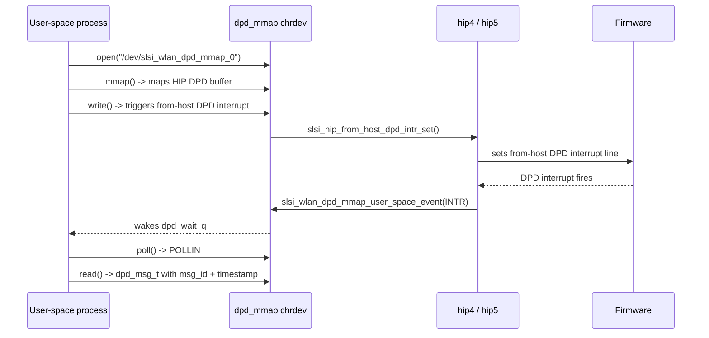

# dpd_mmap

DPD (**D**igital **P**re-**D**istortion) user-space notification channel. Exposes a character device (`/dev/slsi_wlan_dpd_mmap_0`) that lets a user-space process monitor DPD-related firmware state transitions via `read` and `poll`, and map a shared-DPD buffer via `mmap`. Entirely guarded by the kernel config symbol `CONFIG_SCSC_WLAN_HOST_DPD`.

## Purpose

Power-amplifier DPD requires a tight feedback loop between the firmware-side DP (data path) buffer and a user-space DPD controller. This module provides:

1. **Shared-memory mapping** — `mmap()` exposes a vmalloc'ed DPD buffer (up to 512 KiB, or 2 MiB on `CONFIG_SCSC_BB_REDWOOD`) with `pgprot_writecombine` cache attributes, so user-space reads/writes the same HIP (Hardware Interface Point) buffer the firmware uses.
2. **Event notification queue** — The driver pushes `dpd_msg_t` records into an `sk_buff` queue whenever the WLAN state changes (`WLAN_ON`, `WLAN_OFF`, `WLAN_INTR`). User-space drains the queue via `read()` and knows when data is available via `poll()`.
3. **User → firmware trigger** — `write()` asks the HIP layer to set a "from-host DPD interrupt" line so the firmware knows user-space is ready to receive DPD data.

## Key data structures

### `struct dpd_msg_t`

Packed message pushed into the user-space notification queue.

```c
struct dpd_msg_t {
    char magic[4];     // Always "MDPD"
    s64  timestamp;    // ktime_to_ms(ktime_get()) at enqueue time
    u32  msg_id;       // One of SLSI_WLAN_DPD_DRV_MSG_ID_*
} __packed;
```

`msg_id` values (defined in `dpd_mmap.h`):

| Constant | Value | Meaning |
|---|---|---|
| `SLSI_WLAN_DPD_DRV_MSG_ID_WLAN_ON` | 1 | WLAN radio turned on |
| `SLSI_WLAN_DPD_DRV_MSG_ID_WLAN_OFF` | 2 | WLAN radio turned off |
| `SLSI_WLAN_DPD_DRV_MSG_ID_WLAN_INTR` | 3 | DPD interrupt fired from firmware |

### `struct slsi_dpd_client`

Per-open-file-state container (there is a single global instance, `dpd_client`):

```c
struct slsi_dpd_client {
    struct mutex        dpd_mutex;    // Serializes all access
    struct sk_buff_head msg_list;     // Queue of dpd_msg_t messages
    wait_queue_head_t   dpd_wait_q;   // Woken when messages arrive
    struct slsi_dev     *sdev;        // Back-pointer to the device (set by set_buffer)
};
```

The maximum queued messages is controlled by the module parameter `slsi_dpd_msg_num_max` (default 16). When the queue is full, the **oldest** SKB is dropped to make room.

## Key entry points

All four functions are declared in `dpd_mmap.h`:

### `int slsi_wlan_dpd_mmap_create(void)`

Allocates a character-device region, creates the sysfs class `slsi_wlan_dpd_mmap_class`, registers a `cdev`, and creates `/dev/slsi_wlan_dpd_mmap_0`. Initializes `dpd_client` fields. Called from `[[raw/pcie_scsc/dev|dev]]` during driver probe.

### `int slsi_wlan_dpd_mmap_destroy(void)`

Tear-down: removes cdev, destroys the sysfs class, unregisters the chrdev region. Called from `dev` during driver remove.

### `int slsi_wlan_dpd_mmap_set_buffer(struct slsi_dev *sdev, void *buf, size_t sz)`

Stores `buf` and `sz` as the global mmap target and records `sdev`. Size must not exceed `SLSI_WLAN_DPD_MAX_SIZE` (512 KiB / 2 MiB). Called during HIP setup:

- `hip4.c` → after HIP4 DMA mapping: passes `hip_ptr + HIP4_WLAN_DPD_BUF_OFFSET` and `HIP4_WLAN_DPD_BUF_SIZE`.
- `hip5.c` → after HIP5 DMA mapping: uses either `HIP5_WLAN_ZERO_COPY_DPD_BUF_OFFSET` (if `hip5_tx_zero_copy`) or `HIP5_WLAN_DPD_BUF_OFFSET`.
- During teardown (`slsi_hip4_deinit`, `slsi_hip5_deinit`): called with `NULL, NULL, 0` to invalidate.

### `void slsi_wlan_dpd_mmap_user_space_event(int msg_id)`

**Interrupt-context entry point.** Allocates an SKB, fills in a `dpd_msg_t` with the current timestamp and `msg_id`, enqueues it, and wakes the wait queue. Callers:

- `hip4.c` / `hip5.c` — DPD interrupt handler (`SLSI_WLAN_DPD_DRV_MSG_ID_WLAN_INTR`).
- `hip4.c` / `hip5.c` — HIP setup complete (`SLSI_WLAN_DPD_DRV_MSG_ID_WLAN_ON`).
- `hip4.c` / `hip5.c` — HIP teardown / deinit (`SLSI_WLAN_DPD_DRV_MSG_ID_WLAN_OFF`).

## Character-device file operations

The `file_operations` table (`slsi_wlan_dpd_mmap_fops`) provides:

| Operation | Handler | Behavior |
|---|---|---|
| `open` | `slsi_wlan_dpd_mmap_open` | Sets `filp->private_data = &dpd_client` |
| `release` | `slsi_wlan_dpd_mmap_release` | Purges pending messages, nulls `private_data` |
| `read` | `slsi_wlan_dpd_mmap_read` | Dequeues one `sk_buff`, `copy_to_user`, returns `len` (or 0 if queue empty) |
| `write` | `slsi_wlan_dpd_mmap_write` | Calls `slsi_hip_from_host_dpd_intr_set(sdev->service, &sdev->hip)` — no data is copied from user |
| `poll` | `slsi_wlan_dpd_mmap_poll` | Returns `POLLIN \| POLLRDNORM` if queue is non-empty; otherwise sleeps on `dpd_wait_q` |
| `mmap` | `slsi_wlan_dpd_mmap` | Page-by-page `remap_pfn_range` over the stored buffer with `pgprot_writecombine` |

## Internal flow



## Module parameter

| Parameter | Type | Default | Description |
|---|---|---|---|
| `slsi_dpd_msg_num_max` | `uint` | 16 | Max SKBs queued before oldest is dropped |

## Related

- [[raw/pcie_scsc/hip4|hip4]] — calls `slsi_wlan_dpd_mmap_set_buffer()` during setup, pushes events during DPD interrupts and teardown.
- [[raw/pcie_scsc/hip5|hip5]] — same integration pattern as hip4; additionally supports zero-copy DPD buffer offset.
- [[raw/pcie_scsc/dev|dev]] — calls `slsi_wlan_dpd_mmap_create()` / `slsi_wlan_dpd_mmap_destroy()` during probe/remove.
- [[raw/pcie_scsc/scsc_wlan_mmap|scsc_wlan_mmap]] — sibling mmap-based user-space channel with a different purpose (general WLAN buffer mapping).

## Recent changes

- Initial seed: documented character-device interface, `dpd_msg_t` wire format, HIP4/HIP5 integration points, and file-operation table.
