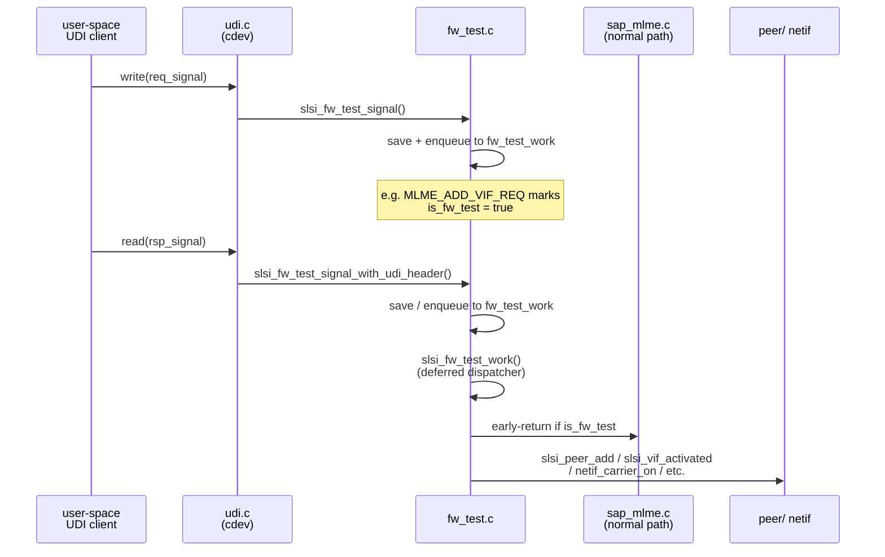

# fw_test

> Firmware-test-mode subsystem. When a user-space UDI client opens the character
> device, `fw_test` intercepts MLME signals flowing through the UDI channel,
> caches per-VIF frames, and uses them to directly drive NetDevice activation,
> peer management, and station/AP lifecycle — bypassing the normal MLME
> state-machine path. The entire subsystem is gated on the per-VIF flag
> `is_fw_test`, which `sap_mlme.c` checks to short-circuit the standard MLME
> work-queue when fw_test mode is active.

## Key data structures

### `struct slsi_fw_test` (`fw_test.h:12-21`)

Embedded inside `struct slsi_cdev_client` (`udi.c:86`) — one instance per open
UDI fd.

| Member | Type | Purpose |
|---|---|---|
| `sdev` | `struct slsi_dev *` | Back-reference to the device |
| `fw_test_enabled` | `bool` | Set `true` on first UDI write; guards `slsi_fw_test_signal_with_udi_header` |
| `fw_test_work` | `struct slsi_skb_work` | Deferred work-queue for processed frames |
| `fw_test_lock` | `struct slsi_spinlock` | Protects the four saved-skb arrays below |
| `mlme_add_vif_req[]` | `struct sk_buff *[N]` | Saved `MLME_ADD_VIF_REQ` per-VIF |
| `mlme_connect_req[]` | `struct sk_buff *[N]` | Saved `MLME_CONNECT_REQ` per-VIF |
| `mlme_connect_cfm[]` | `struct sk_buff *[N]` | Saved `MLME_CONNECT_CFM` per-VIF |
| `mlme_procedure_started_ind[]` | `struct sk_buff *[N]` | Saved `MLME_PROCEDURE_STARTED_IND` per-VIF |

`N` is `CONFIG_SCSC_WLAN_MAX_INTERFACES + 1`.

### `struct netdev_vif.is_fw_test` (`dev.h:1370`)

A `bool` flag on every virtual interface. Set to `true` when
`slsi_fw_test_add_vif_req` processes `MLME_ADD_VIF_REQ`, cleared on
`MLME_DEL_VIF_REQ`. The normal MLME receive path in `sap_mlme.c` drops the skb
early when this flag is set, routing all MLME traffic through fw_test instead.

## Key entry points

### `slsi_fw_test_init()` / `slsi_fw_test_deinit()`

Called from `udi.c` during `slsi_cdev_open` (L236) and `slsi_cdev_release`
(L290) respectively. `init` zeroes the struct, creates the spinlock, and
registers a delayed work item named `"slsi_wlan_fw_test"` whose handler is
`slsi_fw_test_work`. `deinit` flushes the work queue and frees every slot in
the four saved-skb arrays.

### `slsi_fw_test_signal()` — host-to-firmware path

Invoked from `slsi_cdev_write` (`udi.c:432`) when a UDI client writes an
MLME **request** (`fapi_is_req()` or test-mode signal). Handles three signal
IDs:

- **`MLME_ADD_VIF_REQ`** — calls `slsi_mlme_assign_vif`, saves the frame, then
  enqueues it to the work queue.
- **`MLME_CONNECT_REQ`** — saves the frame only.
- **`MLME_DEL_VIF_REQ`** — enqueues first, then calls `slsi_mlme_clear_vif`.

### `slsi_fw_test_signal_with_udi_header()` — firmware-to-host path

Invoked from `slsi_cdev_read` (`udi.c:341`) when a UDI client reads an incoming
firmware message. Guards on `fw_test_enabled` and on
`udi_msg->direction == SLSI_LOG_DIRECTION_TO_HOST`. Dispatches to `save_frame`
or `process_frame` for ten signal IDs including `MLME_CONNECT_CFM`,
`MLME_PROCEDURE_STARTED_IND`, `MLME_DISCONNECTED_IND`, `MLME_CONNECT_IND`,
`MLME_CONNECTED_IND`, `MLME_ROAMED_IND`, `MLME_TDLS_PEER_IND`,
`MLME_START_CFM`, and `MA_BLOCKACKREQ_IND`.

### `slsi_fw_test_work()` — deferred dispatcher

The work-queue handler (`fw_test.c:927-1005`). Loops over queued skbs, looks up
the `struct net_device` for each VIF, and dispatches by signal ID to one of
the static handlers:

| Signal | Handler | Mode |
|---|---|---|
| `MLME_PROCEDURE_STARTED_IND` | `slsi_fw_test_procedure_started_ind` | STA/AP |
| `MLME_CONNECT_IND` | `slsi_fw_test_connect_ind` | STA only |
| `MLME_ROAMED_IND` | `slsi_fw_test_roamed_ind` | STA only |
| `MLME_CONNECTED_IND` | `slsi_fw_test_connected_ind` | AP only |
| `MLME_DISCONNECTED_IND` | `slsi_fw_test_disconnected_ind` | STA/AP |
| `MLME_TDLS_PEER_IND` | `slsi_fw_test_tdls_peer_ind` | STA only |
| `MLME_START_CFM` | `slsi_fw_test_start_cfm` | AP only |
| `MLME_ADD_VIF_REQ` | `slsi_fw_test_add_vif_req` | marks `is_fw_test = true` |
| `MLME_DEL_VIF_REQ` | `slsi_fw_test_del_vif_req` | cleanup + unmark |
| `MA_BLOCKACKREQ_IND` | `slsi_fw_test_ma_blockackreq_ind` | calls `slsi_rx_ma_blockack_ind` |

Under `CONFIG_SCSC_WLAN_TX_API` two additional signals
(`MLME_FRAME_TRANSMISSION_IND`, `MLME_SEND_FRAME_CFM`) are dispatched to the
TX API path (`slsi_tx_mlme_ind` / `slsi_tx_mlme_cfm`).

## Internal flow

The critical pattern: `MLME_ADD_VIF_REQ` sets `is_fw_test = true` on the
`netdev_vif`. After that, every MLME skb arriving through the normal
`slsi_mlme_rx_data()` path in `sap_mlme.c` is immediately freed (L485-488),
and all state transitions go through the fw_test dispatcher instead.

## Related

- [[raw/pcie_scsc/udi|udi]] — character-device interface; embeds `struct slsi_fw_test` and calls its public API
- [[raw/pcie_scsc/dev|dev]] — `struct slsi_dev`, `struct netdev_vif`, and the `is_fw_test` flag
- [[raw/pcie_scsc/mlme|mlme]] — normal MLME path that fw_test bypasses
- [[raw/pcie_scsc/fapi|fapi]] — signal parsing helpers (`fapi_get_sigid`, `fapi_get_vif`, `fapi_get_mgmt`, etc.)
- [[raw/pcie_scsc/ba|ba]] — called via `slsi_rx_ba_stop_all` during roam
- [[raw/pcie_scsc/sap_mlme|sap_mlme]] — early-exit guard on `is_fw_test`

## Recent changes

- Initial seed page created.
