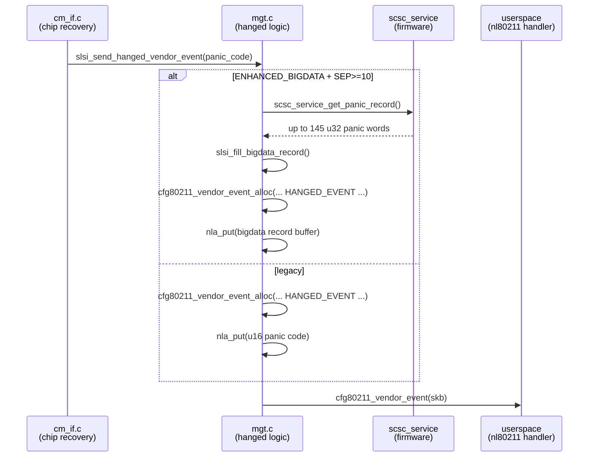

# hanged_record

> Firmware-hang diagnostic record structure for the Samsung SCSC Wi-Fi driver.
> Collects firmware panic codes, version strings, and a ring of firmware-recorded
> words whenever the SCSC firmware panics or the host-side recovery path fires.

## Purpose

`struct scsc_hanged_record` is the binary payload packaged and sent to userspace
when the firmware crashes or the host triggers a chip-level recovery. It bundles
the firmware panic code, firmware and host version strings, and up to 145 `u32`
words from the firmware's internal panic record buffer. The record is emitted as
a cfg80211 vendor netlink event (`SLSI_NL80211_VENDOR_HANGED_EVENT`) so that
userspace crash-collectors and analytics pipelines can consume it.

The entire mechanism is compiled only when `CONFIG_SCSC_WLAN_ENHANCED_BIGDATA`
is set and the firmware interface version (`SCSC_SEP_VERSION`) is 10 or higher.

## Key data structures

### `struct scsc_hanged_record` (packed)

Defined in `hanged_record.h`, this `__packed` struct is approximately 736 bytes
total (`sizeof` depends on the 145-record panic buffer).

| Field | Type | Size | Description |
|---|---|---|---|
| `hang_type` | `char[5]` | 5 | Panic code encoded as hex string (e.g. `"0a"`) |
| `ver` | `char[8]` | 8 | Record schema version (`"0000"`) |
| `cook` | `char[16]` | 16 | Reserved / metadata |
| `hg01`–`hg06` | `char[8]` each | 48 | Reserved placeholders (six fields) |
| `version` | `char[4]` | 4 | Panic-record version, copied from `HANGED_PANIC_VERSION` (`"0000"`) |
| `fw_version` | `char[70]` | 70 | Firmware build string from `mxman_get_fw_version()` |
| `host_version` | `char[64]` | 64 | Host driver version (`%u.%u.%u.%u.%u` from release macros) |
| `fw_panic` | `char[4]` | 4 | FW panic indicator, formatted as `%04X` |
| `offset_data` | `char[5]` | 5 | Always `"011C"` (constant `HANGED_OFFSET_DATA`) |
| `reserved` | `char[3]` | 3 | Padding |
| `panic_record` | `char[...]` | 1160 | Hex-dumped panic records (`HANGED_PANIC_RECORD_COUNT` × 8 hex chars) |

Key constants:

```c
#define HANGED_PANIC_RECORD_COUNT   (145)       // entries in panic ring
#define HANGED_PANIC_RECORD_SIZE    (145 * sizeof(scsc_fw_record_t)) // 580 bytes
#define scsc_fw_record_t            unsigned int  // each record entry is u32
```

Formatting macros for hex conversion:

```c
#define HANGED_VERSION_FORMATTING    "%04X"
#define HANGED_FW_PANIC_FORMATTING   "%04X"
#define HANGED_PANIC_REC_FORMATTING  "%08X"     // each record as 8-char hex
```

## Key entry points

### `slsi_send_hanged_vendor_event(struct slsi_dev *sdev, u16 scsc_panic_code)`

Declared in `mgt.h`, implemented in `mgt.c`. Top-level sender:

1. If `ENHANCED_BIGDATA` + SEP ≥ 10: calls `slsi_fill_bigdata_record()` to build
   a `struct scsc_hanged_record` with firmware version, host version, panic code,
   and up to 145 `u32` panic words fetched via `scsc_service_get_panic_record()`.
2. Allocates an SKB via `cfg80211_vendor_event_alloc()` with the event ID
   `SLSI_NL80211_VENDOR_HANGED_EVENT` (registered in `nl80211_vendor.c` under
   `OUI_SAMSUNG`).
3. Puts the panic code (or the full bigdata record buffer) as a netlink attribute
   (`SLSI_WLAN_VENDOR_ATTR_HANGED_EVENT_PANIC_CODE`).
4. Dispatches the event with `cfg80211_vendor_event()`.
5. Increments the global counter `slsi_hanged_event_count` (visible via
   `slsi_dump_stats()`).

Without `ENHANCED_BIGDATA`, only the raw `u16` panic code is sent.

### `slsi_fill_bigdata_record(struct slsi_dev *sdev, struct scsc_hanged_record *hr, char *result, u16 scsc_panic_code, size_t resultsz)`

Static helper in `mgt.c` that populates the record:

- `memset(hr, ' ', ...)` — blanks the struct with spaces
- Copies `HANGED_PANIC_VERSION` into `hr->version`
- Fetches firmware version via `mxman_get_fw_version()`; replaces spaces with `_`
  via `slsi_substitute_null()` to avoid separator confusion
- Formats host version from `SCSC_RELEASE_PRODUCT`, `SCSC_RELEASE_ITERATION`,
  `SCSC_RELEASE_CANDIDATE`, `SCSC_RELEASE_POINT`, `SCSC_RELEASE_CUSTOMER`
- Copies `"011C"` into `hr->offset_data`
- Converts `scsc_panic_code` to hex into `hr->hang_type`
- Reads panic records via `scsc_service_get_panic_record(sdev->service, ...)`,
  converting each `u32` to an 8-char hex string appended to `hr->panic_record`
- Builds the final pipe-delimited result string

### `slsi_test_send_hanged_vendor_event(struct net_device *dev)`

Gated behind `CONFIG_SCSC_WLAN_HANG_TEST`. Exposed through `ioctl.c`
(`CMD_TESTFORCEHANG`). Sends a forced hang vendor event with panic code
`SCSC_PANIC_CODE_HOST << 15` — used for QA and regression testing of the
crash-reporting pipeline.

### `slsi_dump_stats(struct net_device *dev)`

Logs the cumulative `slsi_hanged_event_count` counter to the kernel log.

## Call chain



The primary trigger is `slsi_send_full_reset_event_to_frwk()` in
`cm_if.c`, called during firmware crash recovery paths. A secondary trigger
is the test ioctl (`CMD_TESTFORCEHANG` → `slsi_test_send_hanged_vendor_event`).

## Related

- [[raw/pcie_scsc/mgt|mgt]] — device management module that owns `slsi_send_hanged_vendor_event()`
- [[raw/pcie_scsc/cm_if|cm_if]] — chip management interface that calls the hanged event during recovery
- [[raw/pcie_scsc/nl80211_vendor|nl80211_vendor]] — vendor command/event registration including `SLSI_NL80211_VENDOR_HANGED_EVENT`

## Recent changes

- Initial seed page created from `hanged_record.h` with full cross-reference mapping to `mgt.c` and `cm_if.c`.
