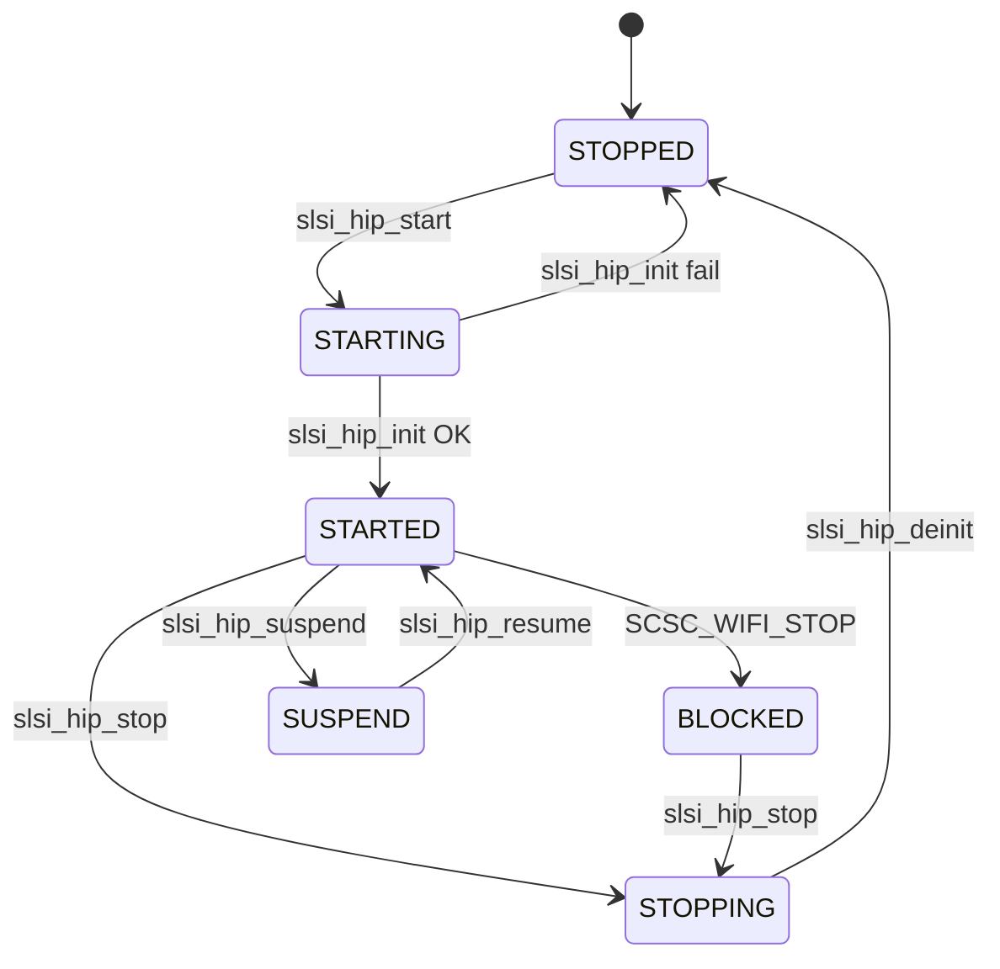
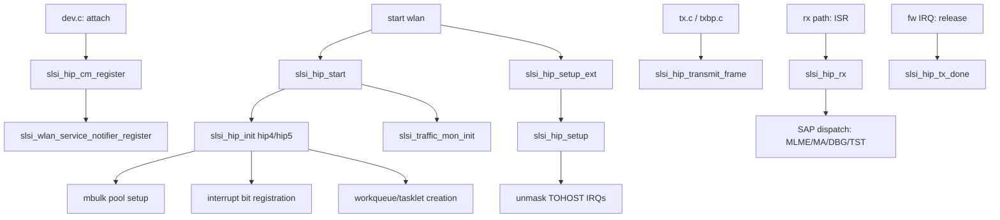

# HIP (Host Interface Protocol)

> HIP is the host-side orchestration layer for communication between the Linux kernel driver and the Wi-Fi firmware (FW) running on the Samsung Exynos SoC. It manages the **shared memory** layout, **mbulk pools**, **TOHOST/FROMHOST interrupts**, the **SAP dispatch system**, and the **RX/TX workqueue** lifecycle. `hip.c`/`hip.h` provide the version-agnostic public API; the actual init/deinit/transmit logic lives in [[raw/pcie_scsc/hip4|HIP4]] (`hip4.c`/`hip4.h`) and [[raw/pcie_scsc/hip5|HIP5]] (`hip5.c`/`hip5.h`), selected by `CONFIG_SCSC_WLAN_HIP5`.

## Purpose

HIP sits between the upper-mac logic ([[raw/pcie_scsc/mlme|MLME]], [[raw/pcie_scsc/sap_ma|SAP_MA]]) and the [[raw/pcie_scsc/dev|device core]]. Its responsibilities:

1. **Shared memory management** — allocate and configure the regions the FW sees: CONFIG, MIB, TX data/control pools, RX pool, and (optionally) DPD buffers.
2. **mbulk pool lifecycle** — create, add, and remove memory zones via the [[raw/pcie_scsc/mbulk|mbulk]] API so FW can enqueue/dequeue frames.
3. **Interrupt handling** — register TOHOST (FW→host) and FROMHOST (host→FW) interrupt bits via `scsc_service_mifintrbit_*` helpers.
4. **RX dispatch** — classify incoming FW frames by SAP class (MLME, MA, debug, test) and deliver to the registered [[raw/pcie_scsc/sap|SAP]] handler.
5. **TX enqueue** — queue outgoing SKBs into the appropriate mbulk pool (data or control).
6. **Lifecycle** — power-managed state transitions (START → SETUP → STARTED, SUSPEND, RESUME, FREEZE, DEINIT).
7. **Service notifier** — react to async FW events (stop, failure, reset, suspend, resume).

## Key data structures

### `struct slsi_hip` (hip.h, embedded in `sdev->hip`)

The top-level HIP handle, embedded as a field in `struct slsi_dev`:

```c
struct slsi_hip {
    struct slsi_dev         *sdev;           // back-pointer to device context
    struct slsi_card_info   card_info;       // chip_id, fw_build, fw_hip_version, sdio_block_size
    struct mutex            hip_mutex;       // serializes HIP operations
    atomic_t                hip_state;       // STOPPED | STARTING | STARTED | STOPPING | BLOCKED
    struct hip_priv        *hip_priv;        // version-specific private state
    scsc_mifram_ref         hip_ref;         // shared-memory reference anchor
    atomic_t                is_hip_priv_invalid;
    // Version-variant control structure:
    struct hip4_hip_control *hip_control;    // when !CONFIG_SCSC_WLAN_HIP5
    // or:
    struct hip5_hip_control *hip_control;    // when CONFIG_SCSC_WLAN_HIP5
};
```

### `enum slsi_hip_state`

Five-state machine controlling whether HIP cycles may run:

| State | Meaning |
|---|---|
| `SLSI_HIP_STATE_STOPPED` | Default; HIP inactive |
| `SLSI_HIP_STATE_STARTING` | Resources being allocated; cycles blocked |
| `SLSI_HIP_STATE_STARTED` | Operational; TX/RX active |
| `SLSI_HIP_STATE_STOPPING` | Resources being freed; cycles blocked |
| `SLSI_HIP_STATE_BLOCKED` | TX CMD53 failure or FW crash detected |

### `struct hip_priv`

Version-specific private state declared in `hip4.h` (HIP4) or `hip5.h` (HIP5). Shared fields include:

- Interrupt caches: `intr_tohost`, `intr_fromhost`, per-queue TOHOST bits
- Workqueues: `intr_wq` (HIP4) or `intr_wq_napi_cpu_switch`/`intr_wq_ctrl` (HIP4-NAPI)
- Pool IDs: `host_pool_id_dat`, `host_pool_id_ctl`
- Locks: `rx_lock`, `tx_lock`, `rw_scoreboard`, `watchdog_lock`
- Watchdog: `timer_list watchdog`, `atomic_t watchdog_timer_active`
- BoT (Budget of Time) QoS: `gactive`, `gmod`, `gcod`, `saturated`, `guard`
- Wake locks: `slsi_wake_lock` (HIP4) or per-queue wakelocks (HIP5)
- SMAPPER banks (if `CONFIG_SCSC_SMAPPER`)
- Workqueue: `workqueue_struct *hip4_workq` (HIP4) / `hip_workq` (HIP5)
- Profiling: `stats` sub-struct with IRQ counters, per-Q frame counts, procfs dir

### `struct hip4_hip_control` / `struct hip5_hip_control`

Shared-memory control tables the FW reads/writes:

```
struct hip4_hip_control {
    struct hip4_hip_init             init;       // magic 0xcaaa0400, config pointers
    struct hip4_hip_config_version_5 config_v5;  // or version_4
    u32                              scoreboard[256];
    struct hip4_hip_q               q[6];        // MIF_HIP_CFG_Q_NUM = 6
};
```

HIP5 control table is analogous but with 24 queues (`MIF_HIP_CFG_Q_NUM = 24`) and TLV-format queues.

### `struct hip_sap` (static in hip.c)

```c
static struct hip_sap {
    struct sap_api *sap[SAP_TOTAL];  // SAP_TOTAL = 4: MLME, MA, DBG, TST
} hip_sap_cont;
```

Container that maps each SAP class index to its `struct sap_api` handler table.

### SAP classes (`sap.h`)

| Index | Constant | Handler (`sap_mlme.c`, `sap_ma.c`, etc.) |
|---|---|---|
| 0 | `SAP_MLME` | Management frame processing |
| 1 | `SAP_MA` | MAC-layer data frames |
| 2 | `SAP_DBG` | Debug signals |
| 3 | `SAP_TST` | Test-mode frames |

Each `struct sap_api` provides `sap_class`, `sap_versions[]`, `sap_version_supported()`, `sap_handler()`, `sap_txdone()`, and `sap_notifier()`.

## Shared memory layout

```mermaid
graph TD
    A[Shared DRAM (~2 MB for HIP4, ~3.8 MB for HIP5)] --> B[CONFIG Pool]
    A --> C[MIB Pool]
    A --> D[TX DAT Pool]
    A --> E[TX CTL Pool]
    A --> F[RX Pool]
    G[Optional DPD Buf] -.-> A

    style B fill:#d4edda
    style C fill:#d4edda
    style D fill:#cce5ff
    style E fill:#cce5ff
    style F fill:#fff3cd
    style G fill:#f8d7da
```

**HIP4 sizes**: CONFIG 8 KB, MIB 32 KB, TX_DAT 1 MB, TX_CTL 64 KB, RX 1 MB (≈2 MB total, +512 KB if DPD enabled).

**HIP5 sizes**: CONFIG 764 KB, MIB 32 KB, TX_CTRL 64 KB, TX_DATA 2–3.25 MB, RX 128–512 KB, zero-copy variants up to 3.8 MB total.

## Queue configuration

**HIP4** (`enum hip4_hip_q_conf`, 6 queues):

| Queue | Direction | Purpose |
|---|---|---|
| `HIP4_MIF_Q_FH_CTRL` | From-Host | Control commands to FW |
| `HIP4_MIF_Q_FH_DAT` | From-Host | Data frames to FW |
| `HIP4_MIF_Q_FH_RFB` | From-Host | Release-free-buffer notifications |
| `HIP4_MIF_Q_TH_CTRL` | To-Host | Control confirmations from FW |
| `HIP4_MIF_Q_TH_DAT` | To-Host | Received data from FW |
| `HIP4_MIF_Q_TH_RFB` | To-Host | TX completion (release-buffer) |

**HIP5** (`enum hip5_hip_q_conf`, 24 queues) adds per-UCPU queues (FH/TH for CPU0 and CPU1), per-VIF data queues (FH_DAT0–9), and dedicated RFBD/RFBC queues.

## Public API

### Registration and lifecycle

```c
int slsi_hip_cm_register(struct slsi_dev *sdev, struct device *dev);
void slsi_hip_cm_unregister(struct slsi_dev *sdev);
int slsi_hip_start(struct slsi_dev *sdev);
int slsi_hip_setup_ext(struct slsi_dev *sdev);
int slsi_hip_stop(struct slsi_dev *sdev);
```

`slsi_hip_cm_register` initializes `hip_state` to STOPPED, creates `hip_mutex`, and registers the service notifier block. `slsi_hip_start` transitions STOPPED → STARTING → calls `slsi_hip_init` (delegated to HIP4/HIP5) → STARTED. `slsi_hip_setup_ext` wraps `slsi_hip_setup` + LBM setup. `slsi_hip_stop` transitions to STOPPING, calls `slsi_hip_deinit`, then STOPPED.

### Internal init/deinit

```c
int slsi_hip_init(struct slsi_hip *hip);        // in hip4.c or hip5.c
int slsi_hip_setup(struct slsi_hip *hip);       // in hip4.c or hip5.c
void slsi_hip_deinit(struct slsi_hip *hip);     // in hip4.c or hip5.c
```

`slsi_hip_init` populates `hip_priv`, adds mbulk pools, registers interrupt bits, creates workqueues/tasklets, and sets up the scoreboard. `slsi_hip_setup` configures queues with FW-provided values and unmasks TOHOST interrupts. `slsi_hip_deinit` tears down in reverse: unregisters traffic monitor, masks interrupts, removes workqueues, frees `hip_priv`, removes mbulk pools.

### Power management

```c
void slsi_hip_suspend(struct slsi_hip *hip);   // set in_suspend, ensure TH unmasked
void slsi_hip_resume(struct slsi_hip *hip);    // clear in_suspend if STARTED
void slsi_hip_freeze(struct slsi_hip *hip);    // mask interrupts, set closing = 1
```

### Frame I/O

```c
int slsi_hip_rx(struct slsi_dev *sdev, struct sk_buff *skb);
int slsi_hip_transmit_frame(struct slsi_hip *hip, struct sk_buff *skb,
                            bool ctrl_packet, u8 vif_index,
                            u8 peer_index, u8 priority);
int slsi_hip_tx_done(struct slsi_dev *sdev, ...);
```

`slsi_hip_rx` is the RX proxy (called from softirq context under `hip_priv->rx_lock`). It classifies the frame by FAPI SAP class (`fapi_is_ma`, `fapi_is_mlme`, `fapi_is_debug`, `fapi_is_test`) and dispatches to the corresponding `sap_handler`. UDI-range PIDs are dropped early.

`slsi_hip_transmit_frame` enqueues the SKB into the control or data mbulk pool (implementation in HIP4/HIP5). Called from [[raw/pcie_scsc/tx|tx.c]] and [[raw/pcie_scsc/txbp|txbp.c]]. Takes ownership of the SKB on success.

```c
int slsi_hip_free_control_slots_count(struct slsi_hip *hip);
```

Returns available control-slot count in the mbulk pool, used for flow control before MLME transmissions.

### SAP registration

```c
int slsi_hip_sap_register(struct sap_api *sap_api);
int slsi_hip_sap_unregister(struct sap_api *sap_api);
int slsi_hip_sap_setup(struct slsi_dev *sdev);
```

`slsi_hip_sap_setup` enforces that all four SAPs are registered and version-compatible with the FW-reported config.

### Interrupt signaling

```c
void slsi_hip_from_host_intr_set(struct scsc_service *service, struct slsi_hip *hip);
```

Sets the FROMHOST interrupt bit to notify FW that new data/commands are queued.

### PCIe lock (chip-specific, `CONFIG_SCSC_PCIE_CHIP`)

```c
bool slsi_pcie_lock(struct slsi_hip *hip, enum slsi_pcie_claim_reason reason);
void slsi_pcie_unlock(struct slsi_hip *hip, enum slsi_pcie_claim_reason reason);
```

Keeps the PCIe link in a claimed state during non-ISR operations.

### NAPI / workqueue scheduling

```c
void slsi_hip_sched_wq_ctrl(struct slsi_hip *hip);    // HIP5 / NAPI
void hip4_sched_wq(struct slsi_hip *hip);             // HIP4 non-NAPI
void slsi_hip_reprocess_skipped_ctrl_bh(struct slsi_dev *sdev);
void slsi_hip_reprocess_skipped_data_bh(struct slsi_dev *sdev);
```

### Utility

```c
int slsi_hip_wlan_get_rtc_time(struct rtc_time *tm);
int slsi_hip_pre_allocate_hip_priv(struct slsi_dev *sdev);
void slsi_hip_free_hip_priv(struct slsi_dev *sdev);
void slsi_hip_resume_wrapper(struct slsi_dev *sdev);
```

### Optional: SMapper (zero-copy TX)

When `CONFIG_SCSC_SMAPPER` is enabled, `slsi_hip_consume_smapper_entry`, `slsi_hip_get_skb_from_smapper`, and `slsi_hip_get_skb_data_from_smapper` delegate to [[raw/pcie_scsc/hip4_smapper|HIP4 SMapper]].

## Service notifier

`slsi_hip_service_notifier` (static in hip.c) is registered via `slsi_wlan_service_notifier_register`. It handles:

| Event | Action |
|---|---|
| `SCSC_WIFI_STOP` | Freeze HIP, set state to BLOCKED, freeze LBM |
| `SCSC_WIFI_FAILURE_RESET` | Re-run `slsi_hip_setup` + LBM setup |
| `SCSC_WIFI_SUSPEND` | Suspend TXBP, call `slsi_hip_suspend` |
| `SCSC_WIFI_RESUME` | Acquire wake lock, schedule resume work |
| `SCSC_WIFI_SUBSYSTEM_RESET` / `CHIP_READY` | No-op |

## State machine



## Call graph



## Related

- [[raw/pcie_scsc/hip4|HIP4]] — HIP4-specific implementation (6-queue, legacy)
- [[raw/pcie_scsc/hip5|HIP5]] — HIP5-specific implementation (24-queue, multi-CPU, zero-copy)
- [[raw/pcie_scsc/mbulk|mbulk]] — Bulk memory pool API used by HIP pools
- [[raw/pcie_scsc/sap|SAP]] — Service Access Point dispatch framework
- [[raw/pcie_scsc/mlme|MLME]] — MLME SAP handler (consumes SAP_MLME frames)
- [[raw/pcie_scsc/sap_ma|SAP_MA]] — MA SAP handler (data path)
- [[raw/pcie_scsc/tx|TX]] — TX path that calls `slsi_hip_transmit_frame`
- [[raw/pcie_scsc/txbp|TXBP]] — TX bulk path that calls `slsi_hip_transmit_frame`
- [[raw/pcie_scsc/load_manager|Load Balance Manager]] — BH dispatch; registered during setup
- [[raw/pcie_scsc/traffic_monitor|Traffic Monitor]] — QoS throughput monitoring
- [[raw/pcie_scsc/dev|Device core]] — Owns `struct slsi_dev` which embeds `struct slsi_hip`
- [[raw/pcie_scsc/fapi|FAPI]] — Frame API used for frame classification in RX
- [[raw/pcie_scsc/hip4_smapper|HIP4 SMapper]] — Zero-copy TX mapping (optional)

## Recent changes

- Initial seed page with full API surface, state machine, shared memory layout, and cross-module call graph.
