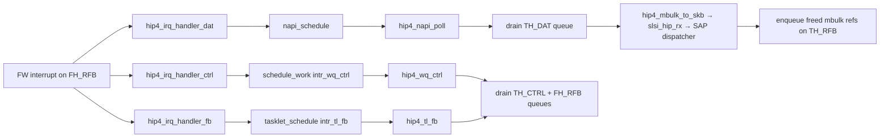

# HIP4 — Host-Integrated Processor v4 Shared-Memory Transport

> HIP4 is the host-side transport layer that exchanges FAPI (Firmware API) messages with the Wi-Fi firmware running on the Samsung Maxwell/Hydra SoC. Communication happens over a **shared-memory ring** mapped into the MIF (Modem Interface Frame) address space, with interrupt-based notification on both sides. HIP4 is selected by the `CONFIG_SCSC_WLAN_HIP5` Kconfig toggle — when HIP5 is disabled, `hip.h` defaults to including `hip4.h`.

## Purpose

The HIP (Host-Integrated Processor) module implements the bidirectional host↔firmware message transport for the SCSC Wi-Fi driver stack. Concretely, it:

1. **Allocates and manages a shared-memory region** (`~2.5 MB` total) containing configuration blocks, TX data/control pools, RX pool, MIB area, and optional DPD buffer.
2. **Maintains 6 ring queues** — 3 from-host (FH), 3 to-host (TH) — to carry FAPI signals and data frames.
3. **Registers interrupt handlers** (TOHOST/FROMHOST) on the MIF interrupt line and dispatches received firmware messages to the [[raw/pcie_scsc/sap|SAP]] dispatcher via `slsi_hip_rx()`.
4. **Wraps outgoing `sk_buff` frames into [[raw/pcie_scsc/mbulk|mbulk]] descriptors**, queues them in shared memory, and signals the firmware via MIF interrupt bits.
5. **Drains firmware TX feedback** (RFB queue) and calls `slsi_hip_tx_done()` for completed TX completions.
6. **Runs a watchdog timer** to detect stuck interrupt processing and auto-unmask when needed.

## Shared-Memory Layout

The shared-memory region (addressed via `hip->hip_ref`) is laid out as a flat 4096-byte-aligned pool:

```
+-----------------------+  offset     size
| CONFIG                |  0x00000    8 KB
| MIB                   |  0x02000    32 KB
+-----------------------+
| TX DAT (data pool)    |  0x04000    1 MB   (HIP4_WLAN_TX_DAT_SIZE = 0x100000)
| TX CTL (ctrl pool)    |  +          64 KB  (HIP4_WLAN_TX_CTL_SIZE = 0x10000)
+-----------------------+
| RX                    |  +          1 MB   (HIP4_WLAN_RX_SIZE = 0x100000)
| DPD buffer (optional) |  +          512 KB (CONFIG_SCSC_WLAN_HOST_DPD)
+-----------------------+
```

Total: ~2 MB + 104 KB (without DPD), +512 KB with DPD.

Each TX pool is divided into 2 KB slots: `HIP4_DAT_SLOTS` (512 for data) and `HIP4_CTL_SLOTS` (32 for control).

## Key Data Structures

### Shared-Memory Control Block (`struct hip4_hip_control`)

```c
struct hip4_hip_control {
    struct hip4_hip_init             init;        /* handshake header    */
    struct hip4_hip_config_version_5 config_v5;   /* FW config v5       */
    struct hip4_hip_config_version_4 config_v4;   /* FW config v4       */
    u32                              scoreboard[256];
    struct hip4_hip_q                q[MIF_HIP_CFG_Q_NUM];  /* 6 queues */
} __aligned(4096);
```

- `init.magic_number` = `0xcaaa0400`; `version_a_ref` / `version_b_ref` point to v4/v4 config structs.
- `config_v4`/`config_v5` carry FW-reported version info, buffer locations, interrupt bit assignments, and queue parameters (`q_num` = 6, `q_len` = 256, `q_idx_sz` = 1 byte).

### Init Handshake (`struct hip4_hip_init`)

```c
struct hip4_hip_init {
    u32 magic_number;    /* 0xcaaa0400 */
    u32 conf_hip4_ver;   /* FW-set: 4 or 5 */
    u32 version_a_ref;   /* MIF address of config_v4 */
    u32 version_b_ref;   /* MIF address of config_v5 */
} __packed;
```

### Ring Queue (`struct hip4_hip_q`)

```c
struct hip4_hip_q {
    u32 array[MAX_NUM];  /* MAX_NUM = 256 */
    u8  idx_read;
    u8  idx_write;
    u8  total;
} __aligned(64);
```

### Six Queues (`enum hip4_hip_q_conf`)

| Index | Symbol | Direction | Purpose |
|---|---|---|---|
| 0 | `HIP4_MIF_Q_FH_CTRL` | Host → FW | Control FAPI signals |
| 1 | `HIP4_MIF_Q_FH_DAT`  | Host → FW | Data FAPI signals |
| 2 | `HIP4_MIF_Q_FH_RFB`  | FW → Host | TX feedback (mbulk freed) |
| 3 | `HIP4_MIF_Q_TH_CTRL` | FW → Host | Control FAPI signals |
| 4 | `HIP4_MIF_Q_TH_DAT`  | FW → Host | Data FAPI signals |
| 5 | `HIP4_MIF_Q_TH_RFB`  | Host → FW | RX feedback (mbulk freed) |

### Scoreboard Index Layout (v4)

Queue read/write indices are packed into the 256-entry scoreboard. Host-owned indices live at offset 0; FW-owned at offset `FW_OWN_OFS` (64):

```
+-----+------+-------+-------+
| +0  | Q3R  | Q2R   | Q1W   | Q0W |  (host-owned)
| +4  | —    | —     | Q5W   | Q4R |  (host-owned)
+-----+------+-------+-------+
| +64 | Q3W  | Q2W   | Q1R   | Q0R |  (FW-owned)
| +68 | —    | —     | Q5R   | Q4W |  (FW-owned)
+-----+------+-------+-------+
```

The `q_idx_layout[6][2]` array maps `(queue, read_or_write)` to the correct scoreboard byte offset.

### Host-Side Private State (`struct hip_priv`)

Key members of the private state include:

- **NAPI/workqueue scheduling**: `intr_wq_ctrl`, `intr_tl_fb`, `napi` (NAPI mode) or `intr_wq` (legacy).
- **Interrupt caching**: `intr_tohost`, `intr_tohost_mul[6]`, `intr_fromhost`.
- **Pool IDs**: `host_pool_id_dat` (`MBULK_POOL_ID_DATA`), `host_pool_id_ctl` (`MBULK_POOL_ID_CTRL`).
- **Locks**: `rx_lock`, `tx_lock` (spinlocks); `rw_scoreboard` (rwlock for scoreboard access).
- **Watchdog**: `watchdog` timer, `watchdog_lock`, `watchdog_timer_active` atomic.
- **Power management**: `hip4_wake_lock_tx/ctrl/data` wakelocks; `pm_qos_*` members.
- **Statistics**: `stats.irqs`, `stats.spurious_irqs`, `stats.q_num_frames[6]`, `stats.start`, `stats.procfs_dir`.
- **Global domain Q**: `gactive`, `gmod`, `gbot_lock` for back-pressure control.
- **Collection mutex**: `in_collection` protects HCF file collection during teardown.

### Outer HIP Wrapper (`struct slsi_hip`)

Defined in `hip.h`:
```c
struct slsi_hip {
    struct slsi_dev         *sdev;
    struct slsi_card_info   card_info;
    struct mutex            hip_mutex;
    atomic_t                hip_state;  /* SLSI_HIP_STATE_* */
    struct hip_priv        *hip_priv;
    scsc_mifram_ref         hip_ref;
    atomic_t                is_hip_priv_invalid;
    struct hip4_hip_control *hip_control;  /* vs hip5_hip_control for HIP5 */
};
```

## Key Entry Points

### Initialization and Teardown

| Function | Signature | Role |
|---|---|---|
| `slsi_hip_init` | `int slsi_hip_init(struct slsi_hip *hip)` | Allocate mbulk pools, reset `hip4_hip_control`, register MIF interrupt handlers, initialize watchdog, NAPI, workqueues, SMAPPER, PM QoS, traffic monitor. |
| `slsi_hip_setup` | `int slsi_hip_setup(struct slsi_hip *hip)` | Read FW-reported version, unmask TOHOST interrupts, enable NAPI. |
| `slsi_hip_deinit` | `void slsi_hip_deinit(struct slsi_hip *hip)` | Unregister traffic monitor, SMAPPER, mask/unregister all interrupts, destroy workqueues, remove mbulk pools, nuke `hip_priv`. |
| `slsi_hip_suspend` | `void slsi_hip_suspend(struct slsi_hip *hip)` | Unmask all TH interrupts, capture RTC time, set `in_suspend`. |
| `slsi_hip_resume` | `void slsi_hip_resume(struct slsi_hip *hip)` | Unmask TH interrupts, send resume UDI message, clear `in_suspend`. |
| `slsi_hip_freeze` | `void slsi_hip_freeze(struct slsi_hip *hip)` | Mask all TH interrupts, cancel workqueues/tasklets, stop NAPI, disable watchdog, set `closing`. |

### TX Path

| Function | Signature | Role |
|---|---|---|
| `slsi_hip_transmit_frame` | `int slsi_hip_transmit_frame(struct slsi_hip *hip, struct sk_buff *skb, bool ctrl_packet, u8 vif_index, u8 peer_index, u8 priority)` | Acquire TX lock, take wakelock, convert skb to mbulk via `hip4_skb_to_mbulk()`, enqueue on FH_CTRL or FH_DAT queue, set FROMHOST interrupt bit, log to [[raw/pcie_scsc/log_clients|log_clients]], consume skb. Returns `-ENOSPC` on queue full. |
| `slsi_hip_free_control_slots_count` | `int slsi_hip_free_control_slots_count(struct slsi_hip *hip)` | Returns free mbulk slots in control pool. |
| `slsi_hip_from_host_intr_set` | `void slsi_hip_from_host_intr_set(struct scsc_service *service, struct slsi_hip *hip)` | Set FROMHOST interrupt bit to signal firmware. |

### RX Path (NAPI Mode — default)



| Function | Signature | Role |
|---|---|---|
| `hip4_napi_poll` | `static int hip4_napi_poll(struct napi_struct *napi, int budget)` | Drain TH_DAT queue: read mbulk references, convert to skb via `hip4_mbulk_to_skb()`, dispatch to `slsi_hip_rx()`, enqueue freed refs on TH_RFB. Detects RX saturation and auto-switches to performance mode. |
| `hip4_wq_ctrl` | `static void hip4_wq_ctrl(struct work_struct *data)` | Drain TH_CTRL queue (convert mbulk → skb → `slsi_hip_rx()`) and FH_RFB queue (TX feedback → `slsi_hip_tx_done()`). |
| `hip4_tl_fb` | `static void hip4_tl_fb(unsigned long data)` | Tasklet for FH_RFB drain (TX completion). Calls `slsi_hip_tx_done()` per freed mbulk. |
| `hip4_irq_handler_dat` | `static void hip4_irq_handler_dat(int irq, void *data)` | TH_DAT ISR: mask interrupt, take data wakelock, schedule NAPI. |
| `hip4_irq_handler_ctrl` | `static void hip4_irq_handler_ctrl(int irq, void *data)` | TH_CTRL ISR: mask interrupt, take ctrl wakelock, schedule `intr_wq_ctrl` work. |
| `hip4_irq_handler_fb` | `static void hip4_irq_handler_fb(int irq, void *data)` | FH_RFB ISR: mask interrupt, schedule `intr_tl_fb` tasklet. |

### RX Path (Legacy Non-NAPI Mode)

| Function | Role |
|---|---|
| `hip4_wq` | Single workqueue handler that drains TH_CTRL, FH_RFB, TH_DAT, and TH_RFB queues. |
| `hip4_irq_handler` | Single ISR for all TOHOST queues: masks interrupt, takes wakelock, schedules `hip4_wq`. |

### Internal Helpers

| Function | Role |
|---|---|
| `hip4_skb_to_mbulk` | Transforms an `sk_buff` (fapi_signal + payload) into a `struct mbulk` with proper headroom/tailroom. Supports scatter/gather via `CONFIG_SCSC_WLAN_SG`. Sets `MBULK_F_OBOUND` flag. |
| `hip4_mbulk_to_skb` | Inverse: converts mbulk (possibly chained) back into an `sk_buff`. Tracks freed mbulk references. |
| `hip4_q_add_signal` | Appends a physical mbulk reference to a queue's circular array and updates the scoreboard write index. Returns `-ENOSPC` if queue full. |
| `hip4_update_index` | Writes a scoreboard byte under `rw_scoreboard` write lock, followed by `wmb()`. |
| `hip4_read_index` | Reads a scoreboard byte under `rw_scoreboard` read lock, preceded by `smp_rmb()`. |
| `hip4_watchdog` | Timer callback: checks if interrupts were delivered within the last tick. If not, unmask pending interrupts and dump debug state. Fires every `HZ/2` (500ms). |

### DPD Interrupt

| Function | Role |
|---|---|
| `hip4_irq_handler_dpd` | TOHOST ISR for DPD (Direct Path Data) buffer events. Sends user-space notification via `slsi_wlan_dpd_mmap_user_space_event()`. |
| `slsi_hip_from_host_dpd_intr_set` | Sets FROMHOST interrupt bit for DPD events. |

## Module Parameters

| Parameter | Type | Default | Description |
|---|---|---|---|
| `hip4_system_wq` | bool | N | Use system workqueue instead of dedicated one. |
| `napi_select_cpu` | int | platform-dependent | Preferred CPU for NAPI poll. |
| `hip4_napi_rx_saturation_detection` | bool | Y | Auto-switch to performance mode on RX saturation. |
| `hip4_napi_num_rx_pkts` | uint | 80 | Packet count threshold for "queue full". |
| `hip4_napi_num_rx_full` | uint | 3 | Consecutive "full" count before switching. |
| `max_buffered_frames` | int | 10000 | Maximum frames buffered in driver. |
| `hip4_dynamic_logging` | bool | Y | Disable logring above throughput threshold. |
| `hip4_dynamic_logging_tput_in_mbps` | int | 150 | Throughput threshold for dynamic logging. |
| `hip4_qos_enable` | bool | Y | Enable PM QoS. |
| `hip4_qos_max_tput_in_mbps` | int | 250 | Max PM QoS threshold (platform-dependent). |
| `hip4_qos_med_tput_in_mbps` | int | 150 | Medium PM QoS threshold (platform-dependent). |
| `hip4_smapper_enable` | bool | Y | Enable [[raw/pcie_scsc/hip4_smapper|SMAPPER]] shared memory addressing. |

## ProcFS Debug Interface

Under `CONFIG_SCSC_WLAN_DEBUG`, creates `/proc/driver/hip4/`:

- **`info`** — HIP4 config dump, scoreboard indices, IRQ counts, spurious IRQ counts, per-queue frame counts.
- **`history`** — Circular buffer of recent signal direction/ID/count/timestamp.
- **`jitter`** — Interrupt latency histogram (1μs, 10μs, 100μs, 1ms, 10ms buckets) + per-packet TH_DATA histogram. Writable to reset counters.

## Module Connections

- **[[raw/pcie_scsc/mbulk|mbulk]]** — HIP4 allocates two mbulk pools (DATA, CTRL) in shared memory at init; `hip4_skb_to_mbulk()` and `hip4_mbulk_to_skb()` are the key conversion functions.
- **[[raw/pcie_scsc/hip|hip (abstract)]]** — `hip.h` conditionally includes `hip4.h` or `hip5.h`. The common `slsi_hip` struct bridges the two implementations.
- **[[raw/pcie_scsc/sap|SAP]]** — `slsi_hip_rx()` is the SAP dispatcher; HIP4 calls it for every inbound message.
- **[[raw/pcie_scsc/dev|dev]]** — `struct slsi_dev` embeds `struct slsi_hip`. `slsi_hip_start()` (in `hip.c`) calls `slsi_hip_init()`; `slsi_hip_stop()` calls `slsi_hip_deinit()`.
- **[[raw/pcie_scsc/txbp|txbp]]** — TX completion via `slsi_hip_tx_done()` feeds the TX back-pressure module.
- **[[raw/pcie_scsc/load_manager|load_manager]]** — NAPI/workqueue registration through `slsi_lbm_register_*()` when load-balancing is enabled.
- **[[raw/pcie_scsc/hip4_smapper|hip4_smapper]]** — Optional shared-memory scatter/gather accelerator.
- **[[raw/pcie_scsc/log_clients|log_clients]]** — `slsi_log_clients_log_signal_fast()` is called on every TX frame.
- **[[raw/pcie_scsc/hip4_sampler|hip4_sampler]]** — Profiling hooks (`SCSC_HIP4_SAMPLER_*`) embedded throughout for hardware counters.

## Recent changes

- Initial seed page with full documentation of HIP4 shared-memory transport layer.
