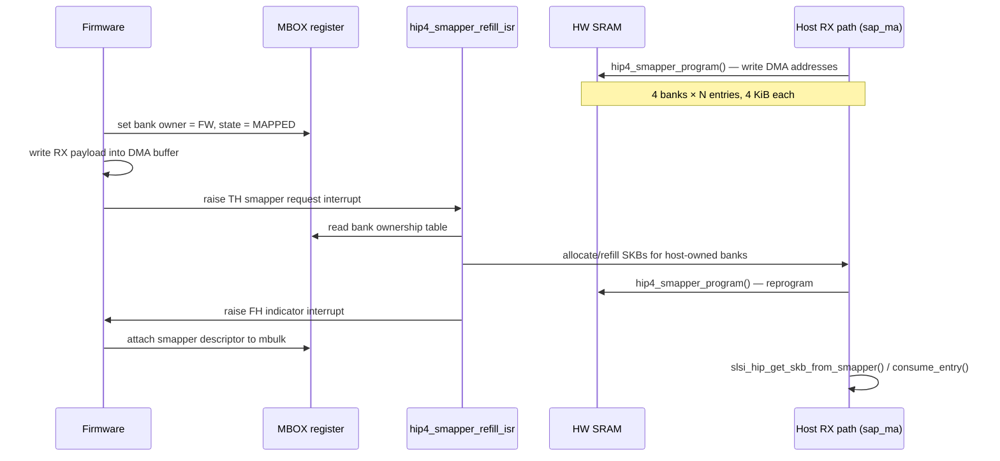

# hip4_smapper — HIP4 Shared-Memory Mapper (SMAPPER)

> **Compile-time gate:** `CONFIG_SCSC_SMAPPER`. Object `hip4_smapper.o` is conditionally linked into `scsc_wlan` (`pcie_scsc/Makefile` line 63). Runtime-enable flag `hip4_smapper_enable` (external module param).

The **SMAPPER** (Shared Memory Mapper) module manages a pool of pre-allocated DMA buffers shared between the host driver and on-device firmware for receive (RX) traffic on Samsung Leman (SCSC) Wi-Fi chipsets using the HIP4 protocol. Instead of allocating a new SKB per packet, the firmware writes directly into pre-mapped host memory, and the host consumes completed buffers via the smapper API — reducing allocation overhead and improving RX throughput.

## Architecture overview



## Key data structures

### `struct hip4_smapper_descriptor`

Written by firmware into each smapper SRAM entry to describe the RX payload:

```c
struct hip4_smapper_descriptor {
    u8  bank_num;      // Physical bank index (0..9)
    u8  entry_num;     // Entry index within bank
    u16 entry_size;    // Actual payload length
    u16 headroom;      // Bytes to skip before payload
};
```

### `struct hip4_smapper_bank`

Per-bank runtime state maintained by the driver:

```c
struct hip4_smapper_bank {
    enum smapper_type       type;   // TX_5G, TX_2G, or RX
    u16                     entries;
    bool                    in_use;
    u8                      bank;       // Physical HW bank number
    u8                      cur;
    u32                     entry_size;
    struct sk_buff         **skbuff;    // Per-entry SKB pointers
    dma_addr_t            *skbuff_dma;  // Per-entry DMA addresses
    struct hip4_smapper_control_entry *entry;
    u16                     align;
};
```

### `struct hip4_smapper_control`

Per-HIP smapper control block (embedded in `struct hip_priv` at `hip4.h:371`):

```c
struct hip4_smapper_control {
    u32       emul_loc;       // Emulator location in MIF address space
    u32       emul_sz;        // Emulator size
    u8        th_req;         // TH (to-host) smapper request interrupt bit
    u8        fh_ind;         // FH (from-host) smapper indicator interrupt bit
    u32       mbox_scb;       // SMAPPER mailbox scoreboard index
    u32      *mbox_ptr;       // Direct mailbox pointer (32-bit register)
    spinlock_t smapper_lock;  // Protects bank state during ISR
    u8        lookuptable[HIP4_SMAPPER_TOTAL_BANKS]; // PHY bank → logical bank map
};
```

`lookuptable` maps physical HW bank indices (returned by `scsc_service_mifsmapper_alloc_bank`) to logical WLAN bank names (`RX_0`..`RX_3` from `enum smapper_banks`).

### `struct slsi_skb_cb` smapper fields

The SKB control block (`utils.h:24-33`) is extended with three smapper fields under `CONFIG_SCSC_SMAPPER`:

- `smapper_linked` — set by [[raw/pcie_scsc/hip4|hip4]] when the mbulk carries `MBULK_F_SMAPPER` flag
- `free_ma_unitdat` — tracks whether the FAPI wrapper skb has been freed
- `skb_addr` — pointer to the actual data SKB (set by `hip4_smapper_consume_entry`)

## Bank allocation constants

| Macro | Value | Meaning |
|---|---|---|
| `HIP4_SMAPPER_TOTAL_BANKS` | 10 | Maximum physical banks |
| `SMAPPER_GRANULARITY` | 4 KiB | Entry size (line 17 of hip4_smapper.c) |
| `HIP_SMAPPER_OWNER_FW` | 0 | Bank owned by firmware |
| `HIP_SMAPPER_OWNER_HOST` | 1 | Bank owned by host |
| `HIP4_SMAPPER_STATUS_REFILL` | 0 | Bank needs refill |
| `HIP4_SMAPPER_STATUS_MAPPED` | 1 | Bank is mapped |

Four logical RX banks (`RX_0` through `RX_3`) are allocated as **large** banks during `hip4_smapper_init()`.

## Public API

### Lifecycle

| Function | Signature | Description |
|---|---|---|
| `hip4_smapper_init` | `int hip4_smapper_init(struct slsi_dev *sdev, struct slsi_hip *hip)` | Allocates 4 large banks, pre-allocates DMA buffers, registers TH interrupt (`HIP4_SMAPPER_REFILL_TYPE`), allocates mailbox, writes smapper config into `hip->hip_control->config_v4` |
| `hip4_smapper_deinit` | `void hip4_smapper_deinit(struct slsi_dev *sdev, struct slsi_hip *hip)` | Frees all SKB buffers, releases banks, unregisters interrupts, frees mailbox |

### RX data extraction

| Function | Signature | Description |
|---|---|---|
| `hip4_smapper_consume_entry` | `int hip4_smapper_consume_entry(struct slsi_dev *sdev, struct slsi_hip *hip, struct sk_buff *skb_fapi)` | Parses `hip4_smapper_descriptor` from `skb_fapi->data`, extracts payload from bank entry(s), refills the consumed entry, stores result SKB pointer in `cb->skb_addr`. Handles multi-entry payloads (larger than one bank entry) by stitching into a single SKB. |
| `hip4_smapper_get_skb_data` | `void *hip4_smapper_get_skb_data(struct slsi_dev *sdev, struct slsi_hip *hip, struct sk_buff *skb_fapi)` | Returns `skb->data` pointer for the consumed SKB stored in `cb->skb_addr`. |
| `hip4_smapper_get_skb` | `struct sk_buff *hip4_smapper_get_skb(struct slsi_dev *sdev, struct slsi_hip *hip, struct sk_buff *skb_fapi)` | Returns the consumed SKB, sets `cb->free_ma_unitdat = true`, and frees the FAPI wrapper skb. |
| `hip4_smapper_free_mapped_skb` | `void hip4_smapper_free_mapped_skb(struct sk_buff *skb)` | Frees the mapped SKB if `!free_ma_unitdat && skb_addr`. Called from [[raw/pcie_scsc/hip4|hip4]] and [[raw/pcie_scsc/ba|ba]] cleanup paths. |

### TX (declared but not implemented in this file)

`hip4_smapper_send` is declared in `hip4_smapper.h:95` but has **no definition** in `hip4_smapper.c`. The enum `smapper_type` includes `TX_5G` and `TX_2G`, suggesting TX smapper support was planned but not implemented.

## Internal flow

### Initialization (`hip4_smapper_init`)

1. Initializes `control->smapper_lock` spinlock
2. Sets DMA mask to 64-bit via `dma_set_mask_and_coherent`
3. Allocates one mailbox via `scsc_mx_service_alloc_mboxes`
4. Allocates 4 large banks (RX_0–RX_3), each with `SMAPPER_GRANULARITY` (4 KiB) entries
5. Pre-allocates all SKB buffers via `hip4_smapper_allocate_skb_buffers`
6. Registers TH interrupt callback `hip4_smapper_refill_isr` via `scsc_service_mifintrbit_register_tohost`
7. Allocates FH indicator bit via `scsc_service_mifintrbit_alloc_fromhost`
8. Populates `config_v4.smapper_*` fields (interrupt positions, bank addresses, entry counts)

### Bank allocation (`hip4_smapper_alloc_bank`)

Calls `scsc_service_mifsmapper_alloc_bank(service, is_large, entry_size, &entries)` which returns the physical bank number and the number of entries. Allocates `skbuff[]` and `skbuff_dma[]` arrays, then records the reverse mapping in `control->lookuptable`.

### Buffer programming (`hip4_smapper_program`)

Writes the DMA address array (`bank->skbuff_dma`) into hardware SRAM via `scsc_service_mifsmapper_write_sram`.

### Refill ISR (`hip4_smapper_refill_isr`)

Triggered by firmware via the TH smapper request interrupt:

1. Early-exits if QoS-disabled or platform suspended
2. Acquires `control->smapper_lock`
3. Checks if FW requested bank configuration via mailbox register (`HIP4_SMAPPER_BANKS_CHECK_CONFIGURE`)
4. Iterates RX_0..RX_3: for each **host-owned** bank, allocates SKB buffers and programs them into SRAM, then sets bank state to `MAPPED` and owner to `FW`
5. Signals FW via FH indicator interrupt (`control->fh_ind`)
6. Clears the TH request interrupt
7. Releases lock

### Consume entry (`hip4_smapper_consume_entry`)

Called from `sap_ma.c` when a FAPI `MA_UNITDATA_IND` frame arrives with `smapper_linked`:

1. Parses `hip4_smapper_descriptor` from `skb_fapi->data`
2. Translates physical bank number via `control->lookuptable`
3. If payload fits in one entry: unmaps DMA, takes SKB, refills entry, sets headroom and length
4. If payload spans multiple entries: allocates a "big" SKB, copies from each entry, frees individual SKBs
5. Stores result in `cb->skb_addr` for later retrieval

## Service-layer dependencies

All hardware interaction goes through the SCSC service layer:

| Service call | Purpose |
|---|---|
| `scsc_service_mifsmapper_alloc_bank` | Allocate HW smapper bank |
| `scsc_service_mifsmapper_free_bank` | Release HW smapper bank |
| `scsc_service_mifsmapper_write_sram` | Program DMA addresses into SRAM |
| `scsc_service_mifsmapper_configure` | Configure smapper granularity |
| `scsc_service_mifsmapper_get_bank_base_address` | Query bank base address for FW config |
| `scsc_service_mifintrbit_register_tohost` | Register TH interrupt handler |
| `scsc_service_mifintrbit_alloc_fromhost` | Allocate FH interrupt bit |
| `scsc_mx_service_alloc_mboxes` | Allocate mailbox |
| `scsc_mx_service_get_mbox_ptr` | Get direct mailbox pointer |
| `scsc_service_get_alignment` | Query DMA alignment requirement |

## Integration points

- **Initialization/deinitialization**: Called from `hip4.c:2871` (init) and `hip4.c:3319` (deinit), guarded by `hip4_smapper_enable` and `hip4_smapper_is_enabled` flags
- **RX flagging**: `hip4.c:1710` and `hip4.c:2200` set `smapper_linked = true` when `m->flag & MBULK_F_SMAPPER`
- **HIP abstraction layer**: `hip.c` exposes `slsi_hip_consume_smapper_entry`, `slsi_hip_get_skb_from_smapper`, and `slsi_hip_get_skb_data_from_smapper` as thin wrappers
- **sap_ma consumer**: `sap_ma.c:1435` calls `slsi_hip_consume_smapper_entry` for `MA_UNITDATA_IND`; `sap_ma.c:599` calls `slsi_hip_get_skb_from_smapper` to retrieve data SKBs
- **Cleanup**: `hip4_smapper_free_mapped_skb` is called from `hip4.c` (lines 874, 1429, 1717, 2090) and `ba.c` for Block-Ack cleanup paths
- **FW config**: smapper fields written into `hip->hip_control->config_v4` (interrupt positions, bank addresses, entry counts, power-of-two sizes) so firmware discovers the shared buffer layout

## KUnit tests

Full test suite in `kunit/kunit-test-hip4_smapper.c` with mock infrastructure in `kunit/kunit-mock-hip4_smapper.h`:
- `test_hip4_smapper_consume_entry`
- `test_hip4_smapper_get_skb_data`
- `test_hip4_smapper_get_skb`
- `test_hip4_smapper_free_mapped_skb`
- `test_hip4_smapper_init`
- `test_hip4_smapper_deinit`

## Related

- [[raw/pcie_scsc/hip4|hip4]] — HIP4 protocol implementation; owns smapper lifecycle and sets `smapper_linked` flag
- [[raw/pcie_scsc/hip|hip]] — HIP abstraction layer; exposes smapper wrappers to `sap_ma`
- [[raw/pcie_scsc/sap_ma|sap_ma]] — MAC service access point; consumes smapper entries in RX path
- [[raw/pcie_scsc/mbulk_def|mbulk_def]] — Mbulk frame definitions including `MBULK_F_SMAPPER` flag
- [[raw/pcie_scsc/ba|ba]] — Block-Ack handling; calls `hip4_smapper_free_mapped_skb` for cleanup

## Recent changes

- Initial seed: documented SMAPPER buffer pool architecture, all public API functions, internal flow (init → alloc → program → ISR refill → consume), and integration points with hip4, hip, sap_ma, and ba modules.
