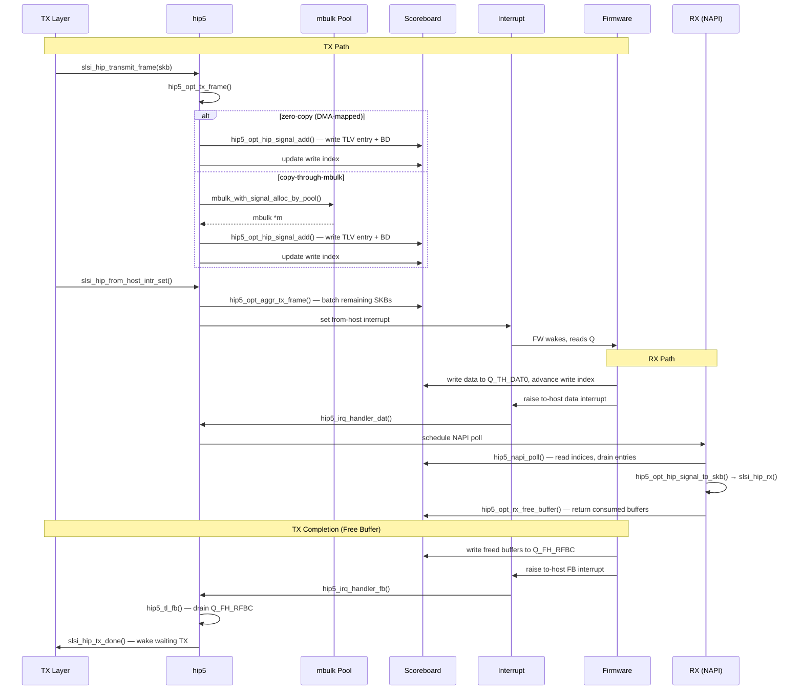

# HIP5 — Host-Integrated Processor v5 Shared-Memory Transport

> HIP5 is the host-side transport layer that exchanges FAPI (Firmware API) messages with the Wi-Fi firmware running on the Samsung Maxwell/Hydra PCIe SoC. Communication happens over a **shared-memory ring** mapped into the MIF (Modem Interface Frame) address space, with interrupt-based notification on both sides and a **scoreboard** coordinating queue indices. HIP5 is selected by the `CONFIG_SCSC_WLAN_HIP5` Kconfig toggle — when disabled, [[raw/pcie_scsc/hip|hip.h]] defaults to including `hip4.h` instead.

## Purpose

HIP5 manages the full lifecycle of the host-firmware communication channel on PCIe-based Samsung Wi-Fi chips:

- **Shared memory layout**: a ~3.8 MB region partitioned into CONFIG (764 KB + 32 KB MIB), TX pool (control + data), RX pool, and an optional DPD (Direct Packet Delivery) buffer. Offsets are 4 KB-aligned.
- **24 MIF queues** (defined in `enum hip5_hip_q_conf`): From-Host (FH) and To-Host (TH) queues for control, priority, data, and free-buffer (RFB) traffic, indexed via a 256-entry `scoreboard` array. Each queue has a host-owned write index and a firmware-owned read index (or vice-versa), separated by an offset of 128 (`FW_OWN_OFS`).
- **Interrupt management**: 3 from-host and 5 to-host interrupt lines, each with set/mask/unmask operations. On `CONFIG_SCSC_PCIE_CHIP`, interrupts are gated behind a PCIe claim/release mechanism (`slsi_pcie_lock`/`slsi_pcie_unlock`).
- **TX path**: either zero-copy (DMA-map the SKB directly, record in `tx_skb_table` lookup) or copy-through-mbulk (allocate from the shared TX data pool via [[raw/pcie_scsc/mbulk|mbulk]]).
- **RX path**: NAPI poll loop (`hip5_napi_poll`) reads `Q_TH_DAT0`, reconstructs SKBs from FAPI signals and bulk descriptors, and delivers them via `slsi_hip_rx()`. Optional RX zero-copy reuses pre-allocated SKB buffers (`rx_skb_table`).
- **Free-buffer (FB) handling**: firmware returns consumed TX buffers via `Q_FH_RFBC`; the BH handler `hip5_tl_fb` calls `slsi_hip_tx_done()` to wake waiters.
- **Traffic monitoring / PM QoS**: throughput thresholds dynamically adjust PM QoS class (`SCSC_QOS_MAX` / `SCSC_QOS_MED` / `SCSC_QOS_DISABLED`).
- **Watchdog**: a timer guards against stuck NAPI polling (configured by `hip5_watchdog_timeout_in_ms`, default 50 ms).

## Key data structures

### Shared memory layout (`hip5_hip_control`)

The central shared-memory structure, 4 KB-aligned, laid out as:

```c
struct hip5_hip_control {
    struct hip5_hip_init             init;       // magic 0xcaaa0400, version, A/B config refs
    struct hip5_hip_config_version_2 config_v5 __aligned(64);  // version 5 config (sub-versions for SAP)
    struct hip5_hip_config_version_1 config_v4 __aligned(64);  // version 4 config
    u32                              scoreboard[256] __aligned(64);  // per-queue read/write indices
    struct hip5_hip_q                q[14] __aligned(64);     // 14 basic queues (FH_CTRL, FH_DAT0-9, TH_CTRL, TH_DAT0-1, etc.)
    struct hip5_hip_q_tlv            q_tlv[5] __aligned(64);  // 5 TLV queues with variable-length signal+BD entries
} __aligned(4096);
```

Each `hip5_hip_q` is a simple ring:

```c
struct hip5_hip_q {
    u32 array[MAX_NUM];   // 2048 entries
    u16 idx_read;
    u16 idx_write;
    u16 total;
} __aligned(64);
```

TLV queues use `hip5_hip_q_tlv` with `hip5_opt_hip_signal` entries (64-byte aligned, carrying signal header + FAPI payload + bulk descriptors).

### Private driver state (`hip_priv`)

```c
struct hip_priv {
    // BH handlers registered via load_balance_manager
    struct bh_struct *bh_dat;   // NAPI-based data RX handler
    struct bh_struct *bh_ctl;   // Workqueue-based control handler
    struct bh_struct *bh_rfb;   // Free-buffer handler
    struct bh_struct *bh_lpc;   // Local packet capture (CONFIG_SLSI_WLAN_LPC)

    // Interrupt IDs
    u32 intr_from_host_ctrl, intr_to_host_ctrl, intr_to_host_ctrl_fb;
    u32 intr_from_host_data, intr_to_host_data1, intr_to_host_data2;
    u32 intr_from_host_dpd, intr_to_host_dpd;  // DPD (CONFIG_SCSC_WLAN_HOST_DPD)

    // Locks
    spinlock_t napi_cpu_lock, rx_lock, tx_lock;
    rwlock_t rw_scoreboard;

    // Wake locks
    struct slsi_wake_lock wake_lock_tx, wake_lock_ctrl, wake_lock_data;

    // State flags
    atomic_t closing, in_tx, in_rx, in_suspend;

    // Scoreboard base pointers
    void *scbrd_base;            // DRAM-backed
    __iomem void *scbrd_ramrp_base;  // RAMRP-backed (module param: hip5_scoreboard_in_ramrp)

    // TX queue aggregation (CONFIG_SCSC_WLAN_TX_API)
    struct hip5_opt_tx_q hip5_opt_tx_q[SLSI_HIP_HIP5_OPT_TX_Q_MAX];  // 32 queues

    // Zero-copy SKB tables
    struct hip5_tx_skb_entry tx_skb_table[4096];   // TX lookup (SLSI_HIP_TX_ZERO_COPY_NUM_DATA_SLOTS)
    struct hip5_rx_skb_entry rx_skb_table[2048];   // RX lookup (MAX_NUM)

    // Watchdog
    bool watchdog_active;
    struct timer_list watchdog;

    // PCIe claim (CONFIG_SCSC_PCIE_CHIP)
    struct workqueue_struct *pcie_wq;
    struct pcie_control pcie_ctrl;
    rwlock_t rw_pcie, pcie_ctrl_reason;
};
```

### Queue configuration (`hip5_mif_q`)

Per-queue metadata exchanged with firmware during setup:

```c
struct hip5_mif_q {
    u8  q_type;     // queue type
    u16 q_len;      // queue length
    u16 q_idx_sz;   // index size
    u16 q_entry_sz; // entry size
    u8  int_n;      // interrupt number
    u32 q_loc;      // location in shared memory
    u8  ucpu;       // target CPU
    u8  vif;        // virtual interface
} __packed;
```

### Bulk descriptor (`hip5_opt_bulk_desc`)

8-byte descriptor embedded in TLV queue entries to describe a data buffer:

```c
struct hip5_opt_bulk_desc {
    u32 buf_addr;     // buffer address (LSB encoding: 0 = shared DRAM, 1 = shifted address)
    u16 data_len:12;  // data length
    u16 buf_sz:4;     // buffer size scaling factor (size = 512 * 2^buf_sz)
    u8  offset;       // data start offset
    u8  flag;         // chaining flag, memory type
} __packed;
```

### HIP signal entry (`hip5_opt_hip_signal`)

64-byte TLV entry carrying a FAPI signal and its bulk descriptors:

```c
struct hip5_opt_hip_signal {
    u8 sig_format;    // reserved
    u8 sig_len;       // FAPI signal length (0 = signal omitted)
    u8 num_bd;        // number of bulk descriptors
    u8 wake_up:1;     // firmware wake-up indicator
    u8 reserved:7;
} __packed __aligned(64);
```

### TX/RX zero-copy SKB tables

```c
struct hip5_tx_skb_entry {
    atomic_t in_use;
    u32 colour;
    u32 skb_dma_addr;
    u16 dma_map_len;
    struct sk_buff *skb;
};

struct hip5_rx_skb_entry {
    atomic_t in_use;
    u32 skb_dma_addr;
    struct sk_buff *skb;
};
```

## Key entry points

### Initialization and lifecycle

| Function | Lines | Description |
|---|---|---|
| `slsi_hip_init(struct slsi_hip *hip)` | L2661 | Allocates `hip_priv`, creates mbulk pools (`MBULK_POOL_ID_DATA`, `MBULK_POOL_ID_CTRL`), registers interrupt handlers (`hip5_irq_handler_ctrl`, `hip5_irq_handler_fb`, `hip5_irq_handler_dat`, `hip5_irq_handler_stub`), allocates from-host/to-host interrupt lines, creates PCIE workqueue. Sets `closing = 1` until setup completes. |
| `slsi_hip_setup(struct slsi_hip *hip)` | L3624 | Reads firmware-reported config version (must be 5), extracts `unidat_req_headroom`/`tailroom`, resolves scoreboard base (RAMRP vs DRAM), initializes RX zero-copy SKB buffers, and unmaske s all to-host interrupts. |
| `slsi_hip_suspend(struct slsi_hip *hip)` | L3695 | Records RTC time, notifies log clients (`UDI_DRV_SUSPEND_IND`), sets `in_suspend = 1`. |
| `slsi_hip_resume(struct slsi_hip *hip)` | L3717 | Notifies log clients (`UDI_DRV_RESUME_IND`), clears `in_suspend`. |
| `slsi_hip_freeze(struct slsi_hip *hip)` | L3733 | Sets `closing = 1`, dumps debug info, masks all to-host interrupts. |
| `slsi_hip_deinit(struct slsi_hip *hip)` | L3767 | Tears down everything: unregisters traffic monitors, flushes/destroys workqueues, releases PCIE claim, unregisters/free all interrupts, destroys wake locks, unmaps and frees all zero-copy SKBs, removes mbulk pools. |

### TX path

| Function | Lines | Description |
|---|---|---|
| `slsi_hip_transmit_frame(struct slsi_hip *hip, struct sk_buff *skb, bool ctrl_packet, u8 vif_index, u8 peer_index, u8 priority)` | L3360 | Public transmit entry point. Validates state, measures enqueue latency, logs TCP metadata for slow packets, delegates to `hip5_opt_tx_frame`. |
| `hip5_opt_tx_frame(struct slsi_hip *hip, struct sk_buff *skb, bool ctrl_packet, u8 vif_index, u8 peer_index, u8 priority)` | L3185 | Core TX logic: acquires `tx_lock`, acquires wake lock, computes mbulk colour from vif/peer/priority, then either (a) uses pre-DMA-mapped zero-copy path, (b) DMA-maps large control packets, or (c) allocates via `mbulk`. Calls `hip5_opt_hip_signal_add()` to enqueue the signal+BD into the shared queue. Logs the frame via [[raw/pcie_scsc/log_clients|log_clients]]. |
| `hip5_opt_hip_signal_add(struct slsi_hip *hip, enum hip5_hip_q_conf conf, ...)` | L928 | Builds a `hip5_opt_hip_signal` TLV entry: copies the FAPI signal header, pads to 8-byte alignment, appends a `hip5_opt_bulk_desc`, updates the write index in the scoreboard. |
| `hip5_opt_aggr_tx_frame(struct scsc_service *service, struct slsi_hip *hip)` | L3453 | Iterates 32 per-flow TX queues, batches SKBs into a single HIP signal (up to 64 BDs per signal), updates scoreboard write index. Called by `slsi_hip_from_host_intr_set`. |
| `slsi_hip_from_host_intr_set(struct scsc_service *service, struct slsi_hip *hip)` | L3566 | Aggregates pending TX frames and triggers the from-host control interrupt. |

### RX path

| Function | Lines | Description |
|---|---|---|
| `hip5_irq_handler_dat(int irq, void *data)` | L1947 | Top-half: acquires data wake lock, masks interrupt, schedules NAPI poll via `slsi_lbm_run_bh(bh_dat)`. |
| `hip5_napi_poll(struct napi_struct *napi, int budget)` | L1752 | Bottom-half NAPI poll: reads `Q_TH_DAT0` indices, loops calling `hip5_opt_hip_signal_to_skb()` to reconstruct SKBs, delivers each via `slsi_hip_rx()`, frees consumed buffers back to firmware via `hip5_opt_rx_free_buffer()`, refills zero-copy RX buffers. Detects write-index anomalies (out-of-order) with retry budget. Storm detection (max 128 polls) triggers watchdog. |
| `hip5_opt_rx_free_buffer(...)` | L1649 | Sends consumed buffer references back to firmware via `Q_TH_RFBD0`. |
| `hip5_rx_zero_copy_refill_skb_buffers(...)` | L1083 | Replenishes the FH_SKB0 queue with newly allocated and DMA-mapped SKBs for RX zero-copy operation. |
| `hip5_rx_zero_copy_init_skb_buffers(...)` | L3574 | Called during setup: pre-allocates 2047 SKBs, DMA-maps each, populates `rx_skb_table` and `Q_FH_SKB0`. |

### Free-buffer (TX completion)

| Function | Lines | Description |
|---|---|---|
| `hip5_irq_handler_fb(int irq, void *data)` | L1612 | Top-half: masks interrupt, schedules BH via `slsi_lbm_run_bh(bh_rfb)`. |
| `hip5_tl_fb(unsigned long data)` | L1506 | Bottom-half: drains `Q_FH_RFBC`, for each entry either frees a zero-copy TX buffer (`hip5_opt_zero_copy_free_buffer`) or releases an mbulk. Calls `slsi_hip_tx_done()` to wake TX waiters. |

### Control handler

| Function | Lines | Description |
|---|---|---|
| `hip5_irq_handler_ctrl(int irq, void *data)` | L1384 | Top-half: masks interrupt, schedules workqueue. |
| `hip5_wq_ctrl(struct work_struct *data)` | L1233 | Drains `Q_TH_CTRL`, processes incoming FAPI signals (MLME, MA, TEST), forwards to [[raw/pcie_scsc/hip|hip]] layer. |

### Scoreboard access

| Function | Lines | Description |
|---|---|---|
| `hip5_update_index(struct slsi_hip *hip, u32 q, enum rw r_w, u16 value)` | L257 | Writes a queue index into the scoreboard (DRAM or RAMRP), protected by `rw_scoreboard` lock. Uses `wmb()` memory barrier for DRAM path. |
| `hip5_read_index(struct slsi_hip *hip, u32 q, enum rw r_w)` | L275 | Reads a queue index, validates magic number, uses `dma_rmb()` for DRAM path. |

### PCIE claim/release (CONFIG_SCSC_PCIE_CHIP)

| Function | Lines | Description |
|---|---|---|
| `slsi_pcie_lock(struct slsi_hip *hip, enum slsi_pcie_claim_reason reason)` | L2058 | Claims exclusive PCIe access via workqueue, increments reason-specific counter. |
| `slsi_pcie_unlock(struct slsi_hip *hip, enum slsi_pcie_claim_reason reason)` | L2127 | Releases PCIe access, decrements counter, calls `scsc_mx_service_release()` when last reference drops. |
| `slsi_trigger_pcie_claim(u32 intr_host, struct slsi_hip *hip, enum slsi_pcie_claim_reason reason)` | L181 | Interrupt-context helper: if PCIE already claimed, directly sets/masks/unmasks the interrupt bit; otherwise queues deferred work. |

### Traffic monitoring

| Function | Lines | Description |
|---|---|---|
| `hip5_traffic_monitor_cb(void *client_ctx, u32 state, u32 tput_tx, u32 tput_rx)` | L2009 | PM QoS callback: maps traffic state to `SCSC_QOS_MAX`/`SCSC_QOS_MED`/`SCSC_QOS_DISABLED`, schedules `hip5_pm_qos_work`. |
| `pcie_traffic_monitor_cb(void *client_ctx, u32 state, u32 tput_tx, u32 tput_rx)` | L2289 | PCIe claim/release callback based on throughput thresholds. |
| `hip5_traffic_monitor_logring_cb(...)` | L2336 | Dynamically enables/disables logring based on throughput. |

## Module parameters

| Parameter | Type | Default | Description |
|---|---|---|---|
| `hip5_scoreboard_in_ramrp` | bool | false | Place scoreboard in RAMRP (vs DRAM) |
| `hip5_tx_zero_copy` | bool | true (REDWOOD) / false | Enable TX zero-copy DMA |
| `hip5_tx_zero_copy_tx_slots` | int | 4096 | Max TX zero-copy buffer slots |
| `hip4_dynamic_logging` | bool | true | Disable logring when throughput exceeds threshold |
| `hip4_dynamic_logging_mid_tput_in_mbps` | int | 50 | Mbps threshold for MID dynamic logging |
| `hip4_dynamic_logging_tput_in_mbps` | int | 350 | Mbps threshold to disable logging |
| `hip4_qos_enable` | bool | true | Enable PM QoS control |
| `hip4_qos_max_tput_in_mbps` | int | 750 | Mbps threshold for MAX PM QoS |
| `hip4_qos_med_tput_in_mbps` | int | 700 | Mbps threshold for MED PM QoS |
| `hip5_rx_skb_len_max` | int | 2048 | Max SKBs in netdev queue |
| `hip5_watchdog_timeout_in_ms` | int | 50 | NAPI watchdog timeout |
| `hip5_pcie_claim_delay` | int | 50 | PCIE claim delay (ms) |

## Internal flow



## Shared memory layout

```
Offset          Size        Region
──────────────  ──────────  ────────────────────────────
0x00000         764 KB      CONFIG + Queues (Q arrays)
0xBF000         32 KB       MIB
0xC7000         64 KB       TX CONTROL pool
0xD7000         2-3.25 MB   TX DATA pool (depends on DPD config)
(varies)        128-512 KB  RX pool
(varies)        512-2 MB    DPD buffer (CONFIG_SCSC_WLAN_HOST_DPD)

Total: ~3548 KB out of 3840 KB (non-zero-copy)
```

## Related

- [[raw/pcie_scsc/hip|HIP]] — abstraction layer that dispatches to HIP4 or HIP5 at runtime
- [[raw/pcie_scsc/hip4|HIP4]] — predecessor protocol (selected when `CONFIG_SCSC_WLAN_HIP5` is off)
- [[raw/pcie_scsc/mbulk|mbulk]] — shared-memory buffer allocator for TX data/control pools
- [[raw/pcie_scsc/dev|dev]] — owns `struct slsi_dev` lifecycle; contains the `struct slsi_hip hip` member
- [[raw/pcie_scsc/load_manager|load_manager]] — provides `slsi_lbm_register_napi()` / `slsi_lbm_register_workqueue()` for BH handler registration
- [[raw/pcie_scsc/hip4_sampler|hip4_sampler]] — diagnostic sampling macros (`SCSC_HIP4_SAMPLER_*`) embedded throughout HIP5
- [[raw/pcie_scsc/log_clients|log_clients]] — signal logging infrastructure called from TX/RX paths
- [[raw/pcie_scsc/fapi|fapi]] — Firmware API signal definitions (MA-UNITDATA, MLME, etc.)

## Recent changes

- Initial seed page.
