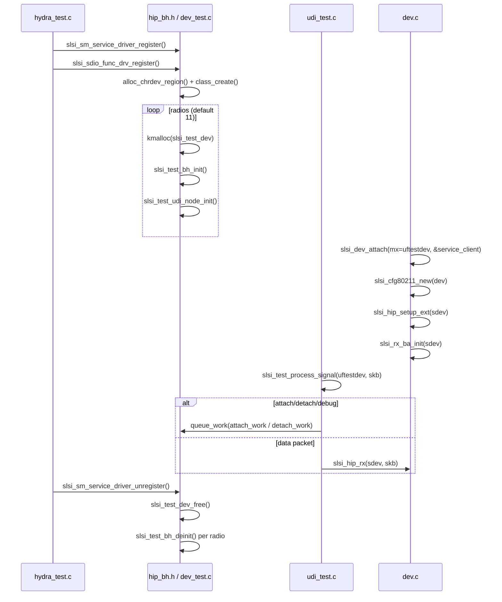

# hip_bh

`hip_bh.h` exposes the registration and unregistration entry points for the **pretend SDIO function driver** used in the SCSC unit-test build (`SLSI_TEST_DEV`). The name "BH" (Bottom Half) refers to the workqueue-based deferred processing that each simulated radio device carries — a `struct slsi_test_bh_work` instance inside every `struct slsi_test_dev`.

In production (non-test) builds the driver interacts with a real PCIe/SDIO Maxwell chip. In the test build the driver creates purely virtual character devices named `s5n2560_test_dev<N>`, each emulating one radio.

## Public API

Two functions are declared in `hip_bh.h` and implemented in `test/dev_test.c`:

```c
// hip_bh.h
CsrResult slsi_sdio_func_drv_register(void);
void      slsi_sdio_func_drv_unregister(void);
```

| Function | Description |
|---|---|
| `slsi_sdio_func_drv_register()` | Allocates a major number, creates `SLSI_UDI_MINOR_NODES` character devices, initializes per-radio `slsi_test_dev` structs, sets up bottom-half workqueues, and registers UDI nodes. Returns `0` on success. |
| `slsi_sdio_func_drv_unregister()` | Tears down all test devices via `slsi_test_dev_free()`. Flushes BH workqueues, destroys UDI nodes, unregisters chrdev region, and destroys the device class. |

The registration function creates `radios` (default 11) simulated devices. Each device gets:
- An ordered workqueue (`"Test Work"`) for attach/detach scheduling
- A BH workqueue (`"slsi_wlan_unittest_bh"`) initialized by `slsi_test_bh_init()` — see `test/unittest.h#L70-L81`
- A deterministic MAC address using the Samsung OUI `00:12:FB:00:00:<index>`
- A UDI (User-space Driver Interface) node via `slsi_test_udi_node_init()`

## Key data structures

### `struct slsi_test_bh_work` (test/unittest.h)

Core BH bookkeeping per radio:

```c
struct slsi_test_bh_work {
    bool                    available;
    struct slsi_test_dev    *uftestdev;
    struct workqueue_struct *workqueue;
    struct work_struct      work;
    struct slsi_spinlock    spinlock;
};
```

Lifecycle helpers (all inline in `test/unittest.h`):

| Function | Purpose |
|---|---|
| `slsi_test_bh_init(uftestdev)` | Creates spinlock, work, and ordered workqueue |
| `slsi_test_bh_run(uftestdev)` | Queues `bh_work.work` if `available` |
| `slsi_test_bh_stop(uftestdev)` | Sets `available = false`, flushes workqueue |
| `slsi_test_bh_start(uftestdev)` | Re-sets `available = true` |
| `slsi_test_bh_deinit(uftestdev)` | Flushes and destroys workqueue |

The BH work callback `slsi_test_bh_work_f` (declared `test/unittest.h:69`, implemented `test/hip_test.c:160`) is currently an empty stub.

### `struct slsi_test_dev` (test/unittest.h)

The per-radio container that doubles as the Maxwell core pointer (`struct scsc_mx *`) in test mode:

```c
struct slsi_test_dev {
    int                         device_minor_number;
    void                        *uf_cdev;
    struct device               *dev;
    struct slsi_dev             *sdev;
    struct workqueue_struct     *attach_detach_work_queue;
    struct mutex                attach_detach_mutex;
    struct work_struct          attach_work;
    struct work_struct          detach_work;
    bool                        attached;
    u8                          hw_addr[ETH_ALEN];
    struct slsi_test_bh_work    bh_work;
    spinlock_t                  route_spinlock;
    struct slsi_test_data_route route[SLSI_AP_PEER_CONNECTIONS_MAX];
};
```

### `struct slsi_test_data_route` (test/unittest.h)

Per-peer routing table used by the test driver to intercept and redirect FAPI signals between virtual radios:

```c
struct slsi_test_data_route {
    bool    configured;
    u16     test_device_minor_number;
    u8      mac[ETH_ALEN];
    u16     vif;
    u8      ipsubnet;
    u16     sequence_number;
};
```

## Internal flow



## Callers and integration

- **`test/hydra_test.c`**: Wraps registration/unregistration as `slsi_sm_service_driver_register()` / `slsi_sm_service_driver_unregister()`. This is the service-module shim that the main driver calls during initialization.
- **`test/udi_test.c`**: UDI write handlers call `slsi_test_process_signal()` to intercept incoming FAPI messages before passing them to `slsi_hip_rx()`.
- **`test/dev_test.c`**: Implements the full signal-processing pipeline — route management (`slsi_test_process_signal_set_route`, `slsi_test_process_signal_clear_route`), IP remapping, and attach/detach work callbacks.
- **`dev.c`**: Includes `hip_bh.h` (line 13) in the test build, where `SLSI_TEST_DEV` guards alter MAC address initialization (`slsi_init_netdev_mac_addr` at line 628) and skip ini config cleanup (line 823).

## Return type

`CsrResult` is a `u16` typedef defined in `wl_result.h`. Success is `CSR_RESULT_SUCCESS` (0); the register function returns standard `-ENOMEM` / `-EPERM` / `-EAGAIN` Linux error codes instead of CSR codes on failure.

## Related

- `test/unittest.h` — full test-dev header with BH lifecycle helpers
- `test/dev_test.c` — implementation of register/unregister and signal processing
- `test/hydra_test.c` — service-module shim
- `test/udi_test.c` — UDI character device write handler
- `test/hip_test.c` — HIP test stubs including `slsi_test_bh_work_f`

## Recent changes

- Initial seed page.
