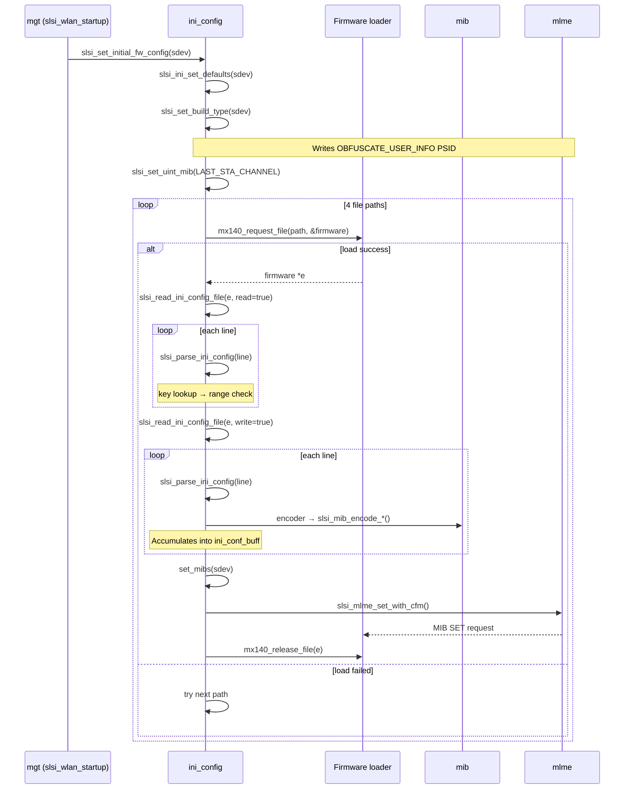

# ini_config

> INI-based firmware configuration loader: parses `wlan-connection-roaming.ini` files from the firmware directory and applies roaming-related MIB (Management Information Base) parameters to the SCSC WLAN firmware at driver initialization time.

## Purpose

`ini_config.c` is the entry point for firmware-side roaming configuration. During driver init ([[raw/pcie_scsc/mgt|mgt]]) calls `slsi_set_initial_fw_config()`, which:

1. Sets the firmware build type via `slsi_set_build_type()` — writes `SLSI_PSID_UNIFI_OBFUSCATE_USER_INFO` (0x13BC) based on `CONFIG_SCSC_USER_IMAGE`.
2. Records the last-connected STA channel via `slsi_set_uint_mib()` on `SLSI_PSID_UNIFI_LAST_STA_CONNECTED_CHANNEL` (0x0A3F).
3. Loads and parses the roaming INI file via `slsi_process_ini_config_file()`.

The INI loader tries four file paths in priority order:

| Priority | Path constant | File |
|---|---|---|
| 1 | `INI_CONFIG_FILE_PATH` | `wlan-connection-roaming.ini` |
| 2 | `INI_CONFIG_FILE_PATH_LEGACY` | `../firmware/wlan-connection-roaming.ini` |
| 3 | `INI_CONFIG_FILE_BACKUP_PATH` | `wlan-connection-roaming-backup.ini` |
| 4 | `INI_CONFIG_FILE_BACKUP_PATH_LEGACY` | `../firmware/wlan-connection-roaming-backup.ini` |

Files are loaded through `mx140_request_file()` ([[raw/pcie_scsc/mgt|mgt]] firmware loader) and released with `mx140_release_file()`. If the primary parse fails, the loader falls back to the backup file.

## Key data structures

### `struct ini_lookup`

The core lookup-table entry type. Each row maps an INI key to an encoder function, a PSID, and validation metadata:

```c
struct ini_lookup {
    const char *key;            // INI file key string (e.g. "RoamRSSI_Trigger")
    int (*func_p)(struct slsi_dev *sdev, u8 *buf, u16 *pos, u8 *value,
                  struct ini_lookup *lookup_entry); // encoder callback
    u16 psid;                  // MIB PSID to write
    u16 index;                 // MIB index (0 = no index)
    int unit_con_factor;        // value multiplier before encoding
    int min_value;             // inclusive lower bound
    int max_value;             // inclusive upper bound
};
```

### `slsi_ini_config_lookup_table[]`

A ~100-entry static array covering roaming parameters across categories:

| Category | Example keys | PSIDs | Encoder |
|---|---|---|---|
| RSSI trigger / delta | `RoamRSSI_Trigger`, `RoamCommon_Delta` | 2050, 2302 | `encode_sint_mib`, `encode_uint_mib` |
| Scan timers | `RoamScan_FirstTimer`, `RoamScan_InactiveTimer` | 2058, 2059 | `encode_uint_mib` |
| Channel utilization | `RoamCU_Trigger`, `RoamCU_24DefaultCU` | 2308, 10035 | `encode_mib_roamcu_trig`, `encode_uint_mib` |
| Beacon loss / emergency | `RoamBeaconLoss_TargetMinRSSI`, `RoamEmergency_TargetMinRSSI` | 2299, 2301 | `encode_sint_mib` |
| AP scoring | `RoamAPScore_RSSIWeight`, `RoamAPScore_CUWeight` | 2305, 2303 | `encode_uint_mib` |
| RSSI/CU factors (band N) | `RoamAPScore_Band{1,2,3}_RSSIFactor{Value,Score}{1..5}` | 2306 | `encode_mib_band*_rssi_factor_*` |
| CU factors (band N) | `RoamAPScore_Band{1,2,3}_CUFactor{Value,Score}{1,2}` | 2295 | `encode_mib_band_cu_factor_*` |
| WTC (WiFi-to-Cellular) | `RoamWTC_ScanMode`, `RoamWTC_HandlingRSSIThreshold` | -100 (no MIB) | `save_roam_wtc_*` |
| Connection hints | `ConNonHint_TargetMinRSSI` | -100 (no MIB) | `save_conn_non_hint_target_min_rssi` |
| BT coexistence | `RoamBTCoex_*` | 2648–2657 | `encode_uint_mib`, `encode_sint_mib` |
| MLO preference | `RoamCommon_Mlo_TpPrefer` | 2634 | `encode_sint_mib` |

PSID value **-100** indicates the key is stored as a runtime field rather than written to firmware.

### `struct ini_conf` (in `dev.h`)

Per-device INI configuration state embedded in `struct slsi_dev`:

```c
struct ini_conf {
    u8   *ini_conf_buff;                        // main MIB write buffer (1024 bytes)
    u16   ini_conf_buff_pos;                     // write cursor in main buffer
    struct ini_doubleindex_multioctet_mib doubleindexmib[2]; // per-PSID double-index buffers
    u16   wtc_roam_scan_mode;
    s16   wtc_rssi_threshold;
    s16   wtc_candidate24g_rssi_threshold;
    s16   wtc_candidate5g_rssi_threshold;
    s16   wtc_candidate6g_rssi_threshold;
    bool  is_wtc_set;
    s16   conn_non_hint_target_min_rssi;
};
```

### `struct ini_doubleindex_multioctet_mib`

Tracks per-PSID accumulation for MIBs that require two index values and multi-octet payloads (PSIDs 2295 and 2306):

```c
struct ini_doubleindex_multioctet_mib {
    u8   *ini_conf_buff;  // dedicated buffer
    u16   pos;            // write cursor
    int   miblen;         // frame length (12 for PSID 2295, 10 for PSID 2306)
    int   psid;           // owning PSID
};
```

## Public API

### `void slsi_set_initial_fw_config(struct slsi_dev *sdev)`

Top-level entry point, declared in `dev.h`. Orchestrates: build-type MIB write, last-STA-channel MIB write, and full INI file processing. Called once from `slsi_wlan_startup()` in [[raw/pcie_scsc/mgt|mgt]].

## Internal flow



### Parse phase (read-operation)

`slsi_read_ini_config_file(sdev, e, true)` iterates over every non-blank, non-section, non-comment line in the INI file. Each line is parsed by `slsi_parse_ini_config()`:

1. **`slsi_ini_trim_white_space()`** — skip leading whitespace
2. **Key extraction** — read until `=`, ` `, or `\t`
3. **`slsi_ini_config_fn_lookup()`** — linear search through `slsi_ini_config_lookup_table[]` via `strncasecmp()`
4. **Delimiter check** — verify `=` separator
5. **Value extraction** — read until `\n` or `\0`
6. **`slsi_ini_validate_parameter_range()`** — clamp against `min_value`/`max_value`
7. On any failure, the entire file is rejected and `SLSI_INI_TRY_FALLBACK` triggers the next path.

### Write phase (non-read-operation)

After the parse phase succeeds, `slsi_read_ini_config_file(sdev, e, false)` re-iterates the same file. This time `slsi_parse_ini_config()` invokes each key's encoder callback:

- **`encode_uint_mib` / `encode_sint_mib`** — call `slsi_mib_encode_uint()` or `slsi_mib_encode_int()` from [[raw/pcie_scsc/mib|mib]], multiply by `unit_con_factor`, append to `ini_conf_buff`
- **`encode_mib_with_ms_to_TU_convert`** — converts milliseconds to time units via `(value * 1000) / 1024`
- **`encode_mib_roamcu_trig`** — writes the same value to two PSID indices (1 and 2) via `encode_mib_gen_with_two_psids()`
- **`encode_mib_octet_with_2indices`** — for RSSI/CU factor MIBs (PSIDs 2295, 2306): reads the current octet value from firmware via `slsi_read_mibs()`, modifies a specific byte position, re-encodes with `slsi_mib_encode()`, appends to the double-index buffer
- **`save_roam_wtc_*` / `save_conn_non_hint_target_min_rssi`** — stores value directly into `sdev->ini_conf_struct` fields (no MIB write)

When `ini_conf_buff` fills (1024 bytes), `set_mibs()` flushes it to firmware via `slsi_mlme_set_with_cfm()`. On error, `log_failed_psids()` decodes and logs each failed PSID.

### WTC and connection-hint consumption

- **WTC thresholds** (`wtc_roam_scan_mode`, `wtc_rssi_threshold`, etc.) are consumed in [[raw/pcie_scsc/dev|dev]]: when `is_wtc_set` is true, `slsi_mlme_wtc_mode_req()` is called with these values during MLME operations.
- **`conn_non_hint_target_min_rssi`** is consumed in [[raw/pcie_scsc/rx|rx]] by `slsi_check_bssid_rssi()` to validate BSSID RSSI against a minimum threshold.

## Related

- [[raw/pcie_scsc/dev|dev]] — `struct slsi_dev` and `struct ini_conf` definitions
- [[raw/pcie_scsc/mib|mib]] — MIB encode/decode functions (`slsi_mib_encode_uint`, `slsi_mib_encode_int`, `slsi_mib_encode_bool`, `slsi_mib_decode`)
- [[raw/pcie_scsc/mlme|mlme]] — `slsi_mlme_set_with_cfm()` for sending MIB SET requests, `slsi_read_mibs()` for reading current firmware values
- [[raw/pcie_scsc/mgt|mgt]] — `slsi_wlan_startup()` calls `slsi_set_initial_fw_config()`
- [[raw/pcie_scsc/rx|rx]] — `slsi_check_bssid_rssi()` consumes `conn_non_hint_target_min_rssi`
- [[raw/pcie_scsc/utils|utils]] — `slsi_str2int()` for string-to-integer conversion

## Recent changes

- Initial seed page.
