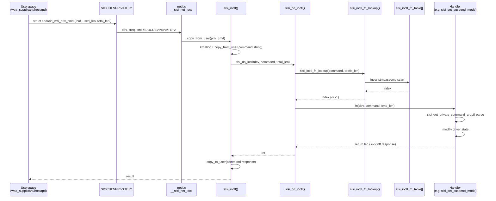

# ioctl

> The SLSI Wi-Fi driver's **user-space command interface**, handling all `SIOCDEVPRIVATE + 2` ioctl requests from Android's `wpa_supplicant` and `hostapd`. Every command is a plain-text string dispatched through a central lookup table of 120+ handlers.

## Purpose

Userspace sends a private ioctl (`SIOCDEVPRIVATE + 2`) carrying a `struct android_wifi_priv_cmd`. The driver copies the user buffer, performs a **case-insensitive prefix match** of the command string against a static dispatch table (`slsi_ioctl_fn_table[]`), and invokes the matched handler. Each handler parses its own space-separated arguments, modifies driver state (roaming, power management, AP, antenna, regulatory, etc.), and writes a text response back into the same buffer — which is then copied back to userspace.

This is the legacy control-plane path, parallel to the cfg80211/nl80211 interface ([[raw/pcie_scsc/cfg80211_ops|cfg80211_ops]]). Commands prefixed with `_LEGACY` are backward-compatible shims for older Android framework versions.

## Command dispatch architecture



### Entry point

```c
int slsi_ioctl(struct net_device *dev, struct ifreq *rq, int cmd)
```

Defined in `ioctl.c:10142`, declared in `ioctl.h:20`.

**Call chain**: `__slsi_net_ioctl()` (in [[raw/pcie_scsc/netif|netif.c]]) checks `cmd == SIOCDEVPRIVATE + 2` and forwards here. On newer kernels (5.15+), `slsi_net_pr_ioctl()` bridges to the same path.

**Steps**:
1. Copies `struct android_wifi_priv_cmd` from userspace via `rq->ifr_data`.
2. Validates `total_len` (must be ≤ 4096, the wpa_supplicant reply-size limit).
3. Allocates a kernel buffer and copies the command string into it.
4. Calls `slsi_do_ioctl()` for dispatch.
5. Copies the response buffer back to userspace (skipped for band-set commands where the reply is already in the firmware).

### Internal dispatch

```c
static int slsi_do_ioctl(struct net_device *dev, char *command, int cmd_len)
static int slsi_ioctl_fn_lookup(char *command, int len)
```

`slsi_do_ioctl` extracts the command name (text before the first space), calls `slsi_ioctl_fn_lookup` to find its index in the table, and invokes the handler. If no match or no handler is registered, returns `-ENOTSUPP`.

## Key data structures

### `struct android_wifi_priv_cmd`

```c
struct android_wifi_priv_cmd {
    char *buf;       // user pointer to command/response buffer
    int   used_len;  // bytes used in response
    int   total_len; // total buffer size
};
```

Defined in `ioctl.h:14-18`. Standard Android Wi-Fi private ioctl envelope.

### `struct slsi_ioctl_fn`

```c
struct slsi_ioctl_fn {
    char *name;                    // command string (e.g. "SETROAMTRIGGER")
    int (*fn)(struct net_device *dev, char *command, int cmd_len);
};
```

Defined in `ioctl.c:6992-6995`. The function table at line 9854 has ~120 entries mapping command strings to handler functions.

### `struct slsi_ioctl_args`

```c
struct slsi_ioctl_args {
    int arg_count;
    u8  *args[];  // flexible array of pointers to space-delimited tokens
};
```

Defined in `dev.h:1561-1564`. Parsed by `slsi_get_private_command_args()`.

### `struct slsi_sub_band`

```c
struct slsi_sub_band {
    int start_chan_num;
    int channel_count;
    int increment;
    int band;
};
```

Defined in `ioctl.h:25-30`. Used for roaming scan channel configuration (e.g., `SETROAMSCANCHANNELS`).

### `struct slsi_roam_scan_channels`

Defined in `dev.h:1576-1579`. Holds up to `SLSI_MAX_CHANNEL_LIST` channel entries for both WES and legacy roam scan lists, embedded in `struct slsi_dev_config`.

## Handler categories

The ~120 handlers in `slsi_ioctl_fn_table[]` fall into these groups:

| Category | Example commands | Purpose |
|---|---|---|
| **Roaming** | `SETROAMTRIGGER`, `SETROAMDELTA`, `SETROAMSCANPERIOD`, `SETROAMMODE`, `SETROAMSCANFREQUENCIES`, `REASSOC`, `SETROAMOFFLAPLIST` | RSSI/NCHO triggers, scan periods, band selection, AP blacklist |
| **Power management** | `SETSUSPENDMODE`, `SET_DTIM_IN_SUSPEND`, `TWT_SETUP`, `TWT_TEARDOWN`, `SCHED_PM_SETUP`, `SET_AP_SUSPEND`, `SET_AP_RPS` | Host suspend, Target Wake Time, scheduled power management, AP RPS |
| **AP / hostapd** | `HAPD_GET_CHANNEL`, `SET_SAP_CHANNEL_LIST`, `HAPD_MAX_NUM_STA`, `HAPD_SET_AX_MODE`, `SET_HOSTAPD_TX_POWER` | Soft-AP channel, AX mode, max STA count, TX power |
| **Bandwidth / channel** | `SETBANDWIDTH`, `SETBAND`, `SET_FCC_CHANNEL`, `SETBSS_CHANNEL_WIDTH`, `SET_MAX_BANDWIDTH`, `ENABLE_24G_HE40` | Regulatory band, channel width, max BW |
| **TX power** | `SET_TX_POWER_CALLING`, `SET_TX_POWER_SAR`, `SET_CUSTOM_TX_POWER_CALLING`, `GET_MAX_TX_POWER`, `SET_TX_POWER_SUB6_BAND` | SAR limits, custom per-band TX power |
| **RX filter** | `RXFILTER-ADD`, `RXFILTER-REMOVE`, `RXFILTER-START`, `RXFILTER-STOP` | Packet filtering for suspend mode |
| **Regulatory** | `SETCOUNTRYREV`, `GETCOUNTRYREV`, `COUNTRY`, `GETREGULATORY` | Country code, regulatory domain |
| **P2P** | `P2P_SET_PS`, `P2P_SET_NOA`, `P2P_ECSA`, `P2P_LO_START` | P2P power save, NOA, ECSA, listen owner |
| **TDLS** | `GET_TDLS_MAX_SESSION`, `SET_TDLS_ENABLED`, `GET_TDLS_AVAILABLE` | TDLS session management |
| **Spatial reuse** | `OBSSPD_ENABLE`, `GET_SR_STATISTICS`, `GET_SR_PARAMETER_SET`, `ADPS_ENABLE` | 802.11ax spatial reuse settings |
| **Antenna** | `SET_NUM_ANTENNAS`, `SET_TX_ANT_CONFIG`, `SET_HOTSPOT_ANTENNA_MODE` | ELNA bypass, MIMO/SISO config |
| **WIFI 7 (EHT)** | `SET_WIFI7_ENABLE`, `SET_NUM_ALLOWED_MLO_LINK`, `GET_ML_LINK_STATE`, `ML_TID_MAPPING_REQUEST`, `MEASURE_ML_CHANNEL_CONDITION` | MLO link management, TID mapping |
| **Info queries** | `GET_BSS_RSSI`, `GETBSSINFO`, `GETSTAINFO`, `GETASSOCREJECTINFO`, `GET_STA_DUMP` | Station/BSS statistics dump |
| **Debug / test** | `DEBUG_DUMP`, `SLSI_TEST_FORCE_HANG`, `POWER_MEASUREMENT_START`, `STARTCAPTURE`, `ISCAPTURERUNNING` | Force hang, power measurement, packet capture |
| **No-op passthrough** | `AMPDU_MPDU`, `BTCOEXMODE`, `BTCOEXSCAN-START`, `MIRACAST`, `CHANGE_RL` | Commands the framework sends but driver ignores (returns 0) |

## Public API

Functions declared in `ioctl.h` and callable from other driver modules:

| Function | Location | Purpose |
|---|---|---|
| `slsi_ioctl()` | `ioctl.h:20`, impl `ioctl.c:10142` | Top-level entry; called from `__slsi_net_ioctl()` in [[raw/pcie_scsc/netif|netif.c]] |
| `slsi_get_sta_info()` | `ioctl.h:21`, impl `ioctl.c:5894` | `GETSTAINFO` handler; also callable from [[raw/pcie_scsc/mgt|mgt.c]] for AP STA statistics |
| `slsi_get_private_command_args()` | `ioctl.h:22`, impl `ioctl.c:347` | Parse space-delimited args from command buffer into `struct slsi_ioctl_args` |
| `slsi_verify_ioctl_args()` | `ioctl.h:23`, impl `ioctl.c:375` | Validate that args were successfully allocated and non-empty |

## Helper utilities

- `slsi_parse_hex()` — single-character hex digit to integer (used by `slsi_machexstring_to_macarray()`).
- `slsi_convert_space_seperation()` — replaces commas and `=` with spaces to normalize argument delimiters.
- `slsi_is_sta_connected()` — guards: checks that VIF is activated, in STA mode, and `SLSI_VIF_STATUS_CONNECTED`.
- `slsi_machexstring_to_macarray()` — converts `"AABBCCDDEEFF"` hex string to `u8[6]` MAC array.
- `slsi_ioctl_cmd_success()` — no-op handler that unconditionally returns 0; used for passthrough commands.
- `slsi_get_rcl_freq_list()` / `slsi_get_rcl_channel_list()` — parse Restricted Channel List IE from SKB data.

## Connections to neighboring modules

- **[[raw/pcie_scsc/netif|netif]]**: `__slsi_net_ioctl()` is the sole caller of `slsi_ioctl()`, gated on `cmd == SIOCDEVPRIVATE + 2`.
- **[[raw/pcie_scsc/dev|dev]]**: `struct slsi_dev` and `struct slsi_dev_config` (in `dev.h`) hold the state that handlers read/modify (roam scan lists, country code, host state, TX power settings, antenna config).
- **[[raw/pcie_scsc/mlme|mlme]]**: Handlers call `slsi_mlme_set_host_state()`, `slsi_mlme_set_multicast_ip()`, `slsi_mlme_set_ctwindow()`, etc.
- **[[raw/pcie_scsc/fapi|fapi]]**: Firmware ABI for sending commands (`fapi_*` SKB-based calls) and reading firmware responses.
- **[[raw/pcie_scsc/mgt|mgt]]**: Calls `slsi_get_private_command_args()` for its own internal argument parsing.
- **[[raw/pcie_scsc/hip|hip]]**: Some handlers (e.g. TWT, roam) interact with HIP ring buffers for firmware communication.
- **[[raw/pcie_scsc/cfg80211_ops|cfg80211_ops]]**: Parallel control plane; ioctl is the legacy Android-specific path.
- **[[raw/pcie_scsc/cac|cac]]**: Country code and regulatory domain handling referenced by several ioctl handlers.

## Recent changes

- Initial seed page creation.
