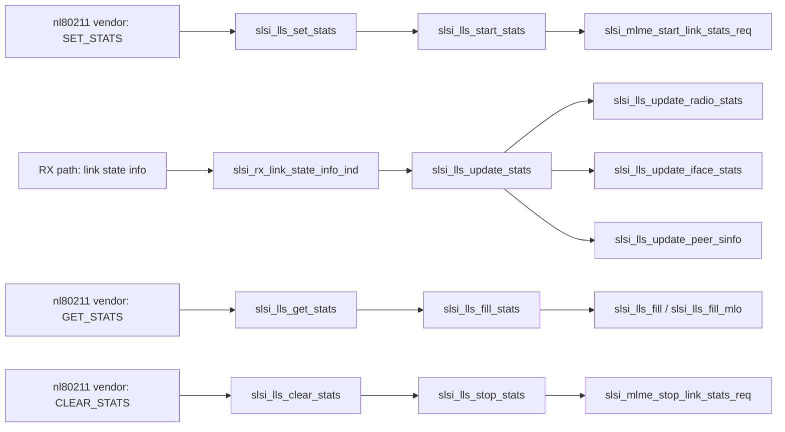

# lls — Link Layer Statistics

> Link Layer Statistics (LLS) module exposing per-radio, per-channel, per-interface, and per-peer Wi-Fi metrics to the Android framework via `nl80211` vendor commands. Gathers MIB data from firmware on the RX path, accumulates it in driver cache, and serializes it on demand.

## Purpose

The LLS module implements the Android Link Layer Statistics HAL interface on the driver side. It:

1. **Starts** firmware-side statistics collection (`slsi_lls_start_stats`).
2. **Accumulates** MIB values pushed by the firmware on each RX event (`slsi_lls_update_stats`).
3. **Serializes** a snapshot into a user-space buffer (`slsi_lls_fill_stats`) when the framework queries via the `nl80211` vendor command.
4. **Stops** collection and clears counters (`slsi_lls_stop_stats`).

LLS covers three granularity levels:

| Level | Struct | Content |
|---|---|---|
| Radio | `struct slsi_lls_radio_stat` | on-time, TX/RX time, scan-time breakdowns, per-channel CCA busy time |
| Interface | `struct slsi_lls_iface_stat` | link-layer state, RSSI, beacon stats, per-AC WMM counters, per-peer info |
| Link (MLO) | `struct slsi_lls_link_stat` | per-link subset of the above for Multi-Link Operation (802.11be/EHT) |

The MLO path (`slsi_lls_fill_mlo`, `slsi_lls_iface_ml_stat_fill`) is behind `CONFIG_SCSC_WLAN_EHT`.

## Key data structures

### Channel & rate

```c
struct slsi_lls_channel_info {
    enum slsi_lls_channel_width width;   // 20 / 40 / 80 / 160 / 80+80 MHz
    int center_freq;                    // primary 20 MHz channel (MHz)
    int center_freq0;                   // segment-0 center frequency
    int center_freq1;                   // segment-1 center frequency
};

struct slsi_lls_channel_stat {
    struct slsi_lls_channel_info channel;
    u32 on_time;                        // radio awake (ms, cumulative)
    u32 cca_busy_time;                  // CCA register busy (ms)
};

struct slsi_lls_rate {
    u32 preamble   :3;  // OFDM, CCK, HT, VHT, HE, EHT
    u32 nss        :2;  // 1x1, 2x2, 3x3, 4x4
    u32 bw         :3;  // 20-320 MHz
    u32 rate_mcs_idx :8;
    u32 reserved  :16;
    u32 bitrate;          // 100 Kbps units
};

struct slsi_lls_rate_stat {
    struct slsi_lls_rate rate;
    u32 tx_mpdu;    // successfully transmitted data pkts (ACK received)
    u32 rx_mpdu;    // received data pkts
    u32 mpdu_lost;  // data pkt losses (no ACK)
    u32 retries;
    u32 retries_short;
    u32 retries_long;
};
```

### Radio

```c
struct slsi_lls_radio_stat {
    int radio;
    u32 on_time;              // radio awake
    u32 tx_time;              // transmitting
    u32 rx_time;              // active receive
    u32 on_time_scan;         // awake due to all scans
    u32 on_time_nbd;          // awake due to NAN
    u32 on_time_gscan;        // awake due to G-Scan
    u32 on_time_roam_scan;    // awake due to roam scan
    u32 on_time_pno_scan;     // awake due to PNO scan
    u32 on_time_hs20;         // awake due to HS2.0 scans / GAS
    u32 num_channels;
    struct slsi_lls_channel_stat channels[];  // flexible array
};
```

Cached in `struct slsi_dev` as `radio_stat[SLSI_MAX_RADIO_SUPPORTED]`.

### Interface

```c
struct slsi_lls_interface_link_layer_info {
    enum slsi_lls_interface_mode mode;      // STA, SoftAP, P2P-Client, P2P-GO, etc.
    u8   mac_addr[6];
    enum slsi_lls_connection_state state;   // DISCONNECTED, AUTHENTICATING, ASSOCIATING, ASSOCIATED, ...
    enum slsi_lls_roam_state roaming;       // IDLE, ACTIVE
    u32 capabilities;                       // SLSI_LLS_CAPABILITY_* bitmask
    u8 ssid[33];
    u8 bssid[6];
    u8 ap_country_str[3];
    u8 country_str[3];
    u8 time_slicing_duty_cycle_percent;
};

struct slsi_lls_iface_stat {
    void *iface;
    struct slsi_lls_interface_link_layer_info info;
    u32 beacon_rx;
    u64 average_tsf_offset;            // beacon_TSF - TBTT
    u32 leaky_ap_detected;
    u32 leaky_ap_avg_num_frames_leaked;
    u32 leaky_ap_guard_time;
    u32 mgmt_rx, mgmt_action_rx, mgmt_action_tx;
    int rssi_mgmt, rssi_data, rssi_ack;
    struct slsi_lls_wmm_ac_stat ac[SLSI_LLS_AC_MAX]; // VO, VI, BE, BK
    u32 num_peers;
    struct slsi_lls_peer_info peer_info[];  // flexible array
};
```

### MLO link (EHT)

```c
struct slsi_lls_link_stat {
    u8 link_id;
    enum slsi_lls_link_state state; // UNKNOWN, NOT_IN_USE, IN_USE
    int radio;
    u32 frequency;
    // ... same beacon/RSSI/AC/per-peer fields as iface_stat, per-link ...
};

struct slsi_lls_iface_ml_stat {
    void *iface;
    struct slsi_lls_interface_link_layer_info info;
    int num_links;
    struct slsi_lls_link_stat links[];
};
```

### Peer & WMM AC

```c
struct slsi_lls_peer_info {
    enum slsi_lls_peer_type type;       // STA, AP, P2P-GO, P2P-CLIENT, NAN, TDLS
    u8 peer_mac_address[6];
    u32 capabilities;
    bssload_info_t bssload;            // station count + channel utilization
    u32 num_rate;
    struct slsi_lls_rate_stat rate_stats[];
};

struct slsi_lls_wmm_ac_stat {
    enum slsi_lls_traffic_ac ac;  // VO(0), VI(1), BE(2), BK(3)
    u32 tx_mpdu, rx_mpdu;
    u32 tx_mcast, rx_mcast;
    u32 rx_ampdu, tx_ampdu;
    u32 mpdu_lost, retries, retries_short, retries_long;
    u32 contention_time_min, contention_time_max, contention_time_avg;
    u32 contention_num_samples;
};
```

### Internal cache struct

`struct slsi_lls_iface_data` (lls.h L218-234) is a flat per-interface cache populated on each firmware update — later copied into either the legacy `iface_stat` or the MLO `link_stat` during serialization via `slsi_lls_copy_iface_stat()`.

## Public API

All four functions are declared in `lls.h` (L236-239).

```c
void slsi_lls_start_stats(struct slsi_dev *sdev,
                          u32 mpdu_size_threshold,
                          u32 aggr_stat_gathering);

int  slsi_lls_fill_stats(struct slsi_dev *sdev, u8 **src_buf, bool is_mlo);

void slsi_lls_stop_stats(struct slsi_dev *sdev, u32 stats_clear_req_mask);

int  slsi_lls_update_stats(struct slsi_dev *sdev,
                           struct net_device *dev,
                           struct sk_buff *skb);
```

### `slsi_lls_start_stats`

- Locks `sdev->device_config_mutex`.
- Calls `slsi_mlme_start_link_stats_req()` to arm firmware-side collection.
- Resets `ndev_vif->rx_packets[i]`, `tx_packets[i]`, `tx_no_ack[i]` to zero for all four ACs.

### `slsi_lls_stop_stats`

- Calls `slsi_mlme_stop_link_stats_req()` to tell firmware to halt.
- Zeros the same per-AC counters as `start_stats`.

### `slsi_lls_fill_stats` (serialization)

The single public dispatcher. When `is_mlo` is true (and `CONFIG_SCSC_WLAN_EHT`), calls `slsi_lls_fill_mlo()`; otherwise calls `slsi_lls_fill()`. Both:

1. Allocate a contiguous buffer sized to hold radio stats + interface stats + peer info + channel stats.
2. Fill interface/link info via `slsi_lls_iface_stat_fill()` or `slsi_lls_iface_ml_stat_fill()`.
3. Copy per-radio stats from `sdev->radio_stat[i]`.
4. Return the buffer length (caller frees).
5. Under `CONFIG_SCSC_WLAN_DEBUG`, dump via `slsi_lls_debug_dump_stats()`.

### `slsi_lls_update_stats` (accumulation)

Invoked from the RX path (`slsi_rx_link_state_info_ind` in `rx.c`). Steps:

1. Locks `sdev->start_stop_mutex` and `ndev_vif->vif_mutex`.
2. If `fapi_get_vif(skb) == 0`: updates **radio stats** via `slsi_lls_update_radio_stats()` for each radio.
   - On `CONFIG_SCSC_BB_REDWOOD`, merges same-band radios with `SLSI_RADIO_STATS_REASSIGN()`.
3. Otherwise: updates **interface stats** via `slsi_lls_update_iface_stats()`:
   - Queries MIB values (AC success, retries, no-ACKs, contention time, beacon received, leaky AP, RSSI).
   - Maps firmware traffic queues to Android ACs via the inline `slsi_fapi_to_android_traffic_q()`.
   - Updates per-channel `on_time` / `cca_busy_time` on the matching radio.
4. Updates **peer station info** via `slsi_lls_update_peer_sinfo()`:
   - Decodes TX/RX data rates (`slsi_decode_fw_rate`), RSSI, FCS errors, tx/rx counters.
   - Populates `peer->sinfo` (the `station_info` structure exposed to cfg80211).

## Internal helpers

| Function | Purpose |
|---|---|
| `slsi_lls_ie_to_cap()` | Parses IEEE 802.11 IEs (Extended Capabilities, WFA vendor) into `SLSI_LLS_CAPABILITY_*` bits |
| `slsi_lls_iface_sta_stats()` | Fills interface stats for STA/P2P-Client mode (reads SSID, BSSID, country from BSS record; iterates peer table for AP + TDLS peers) |
| `slsi_lls_iface_ap_stats()` | Fills interface stats for AP/GO mode (iterates connected STAs) |
| `slsi_lls_iface_ml_*()` (EHT) | MLO equivalents — per-link versions of the above |
| `slsi_lls_copy_iface_stat()` | Copies flat `slsi_lls_iface_data` cache into the target struct (legacy or MLO) |
| `slsi_lls_update_radio_stats()` | Queries MIB for scan/RX/TX/on-time per radio; populates channel list from firmware channel map |
| `slsi_lls_debug_dump_stats()` | `SLSI_INFO` logging dump of the filled buffer (debug build only) |

## Call graph



## Connections to neighboring modules

- **`mlme.c` / `mlme.h`**: `slsi_mlme_start_link_stats_req()`, `slsi_mlme_stop_link_stats_req()`, `slsi_mlme_get_mlo_link_state()` — firmware command dispatch for start/stop/MLO state.
- **`nl80211_vendor.c` / `nl80211_vendor.h`**: `slsi_lls_set_stats`, `slsi_lls_get_stats`, `slsi_lls_clear_stats` — user-space entry points; enum definitions (`slsi_lls_interface_mode`, `slsi_lls_traffic_ac`, `slsi_lls_peer_type`, etc.) and `SLSI_LLS_CAPABILITY_*` macros live here.
- **`rx.c`**: `slsi_rx_link_state_info_ind()` — RX-path hook that feeds MIB data into `slsi_lls_update_stats()`.
- **`dev.h` / `dev.c`**: `struct slsi_dev` holds `lls_num_radio`, `num_of_radios_supported`, `radio_stat[]`; `slsi_dev_llslogs_supported()` gates debug logging.
- **`netif.c` / `netif.h`**: `slsi_get_netdev()`, `netdev_priv()` — resolve `struct netdev_vif` for the WLAN interface.
- **`mib.h`**: MIB PSID constants (`SLSI_PSID_UNIFI_AC_SUCCESS`, `SLSI_PSID_UNIFI_RSSI`, etc.) used throughout the update functions.
- **`channels.h`**: `SLSI_MAX_SUPPORTED_CHANNELS_NUM` — upper bound for the channel stat array.

## Related

- [[raw/pcie_scsc/mlme|MLME]] — firmware command dispatch, MLO link state
- [[raw/pcie_scsc/nl80211_vendor|nl80211_vendor]] — vendor command infrastructure, LLS enums
- [[raw/pcie_scsc/rx|RX]] — receive path, firmware event dispatch
- [[raw/pcie_scsc/dev|dev]] — device struct, radio state cache
- [[raw/pcie_scsc/mib|MIB]] — management information base constants and helpers

## Recent changes

- Initial seed: documented full LLS module structure, public API, internal helpers, call graph, and neighbor connections.
