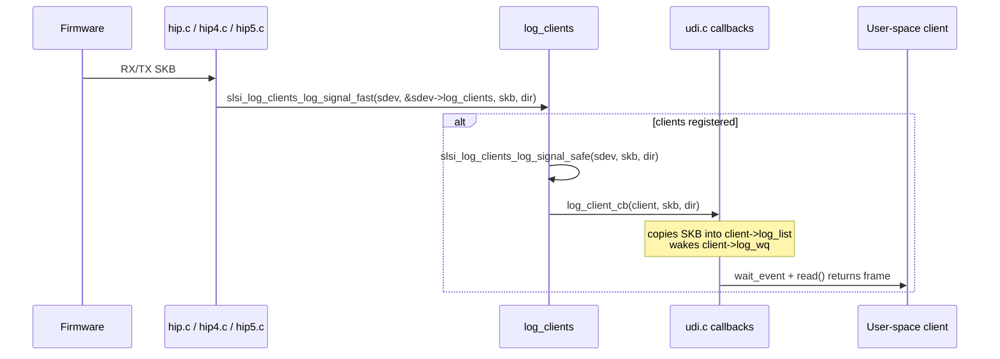

# log_clients

> Observer-registry module that distributes copies of in-flight SKBs to registered user-space logging clients (UDI applications) for packet capture and driver event notification.

## Purpose

The `log_clients` subsystem implements a publish-subscribe pattern for network traffic visibility. User-space UDI applications register as log clients; the driver invokes their callbacks with copies of every SKB passing through the HIP RX/TX paths. This enables:

- **Packet sniffing**: user-space tools receive real-time copies of all wireless frames
- **Selective filtering**: clients can subscribe to a range of signal IDs via a bitmask
- **Driver event notification**: kernel sends `UDI_DRV_UNLOAD_IND`, `UDI_DRV_DROPPED_FRAMES`, and `UDI_DRV_DROPPED_DATA_FRAMES` events to client processes
- **Graceful teardown**: on driver unload, notifies clients and polls until all UDI references are released

All list mutations and broadcast iterations are protected by a BH-disabled spinlock (`spin_lock_bh`), making the module safe from both interrupt context and process context callers.

## Key data structures

### `struct slsi_log_client` (log_clients.h)

A single subscriber entry on the client list:

```c
struct slsi_log_client {
    struct list_head  q;                   // list node in log_client_list
    void             *log_client_ctx;      // opaque pointer → struct slsi_cdev_client
    int              (*log_client_cb)(struct slsi_log_client *, struct sk_buff *, int);
    int              min_signal_id;        // inclusive lower bound of signal ID range
    int              max_signal_id;        // inclusive upper bound of signal ID range
    char             *signal_filter;        // per-signal bitmask (NULL = no filtering)
};
```

The `log_client_ctx` always points to a `struct slsi_cdev_client` (defined in `udi.c`), bridging the log_clients layer to the UDI character-device infrastructure.

### `struct slsi_log_clients` (log_clients.h)

The per-device registry container, embedded inside `struct slsi_dev` (see `dev.h`):

```c
struct slsi_log_clients {
    spinlock_t       log_client_spinlock;
    struct list_head log_client_list;
};
```

### Direction constants

| Macro | Value | Meaning |
|---|---|---|
| `SLSI_LOG_DIRECTION_FROM_HOST` | 0 | Downlink: host → firmware |
| `SLSI_LOG_DIRECTION_TO_HOST` | 1 | Uplink: firmware → host |

## Key entry points

### Lifecycle

| Function | File | Called from | Description |
|---|---|---|---|
| `slsi_log_clients_init(sdev)` | log_clients.c | `dev.c` (probe path) | Initializes the list head and spinlock |
| `slsi_log_clients_terminate(sdev)` | log_clients.c | `dev.c` (remove path) | Sends `UDI_DRV_UNLOAD_IND` to all clients, then polls `slsi_check_cdev_refs()` (up to 50 × 4 ms) to wait for UDI user-space detachment |

### Client registration

| Function | File | Called from | Description |
|---|---|---|---|
| `slsi_log_client_register(sdev, ctx, cb, filter, min, max)` | log_clients.c | `udi.c` (ioctl handlers) | Allocates a `slsi_log_client` under `GFP_KERNEL`, sets callback + filter, appends to tail of list under spinlock. Returns 0 on success, `-ENOMEM` on allocation failure |
| `slsi_log_client_unregister(sdev, ctx)` | log_clients.c | `udi.c` (ioctl disconnect / filter update) | Iterates list under lock, matches `log_client_ctx`, frees filter string, removes node, kfree's client |

### Traffic distribution

| Function | File | Called from | Description |
|---|---|---|---|
| `slsi_log_clients_log_signal_safe(sdev, skb, direction)` | log_clients.c | `slsi_log_clients_log_signal_fast()` | Acquires BH spinlock, iterates all clients via `list_for_each_entry_safe`, invokes each `log_client_cb`. If callback returns `-ERESTARTSYS`, retries up to `SLSI_RETRY_ACQUIRE_LOCK_COUNT` (3) times. Maps `SLSI_LOG_DIRECTION_*` to `UDI_FROM_HOST` / `UDI_TO_HOST` |
| `slsi_log_clients_log_signal_fast(sdev, log_clients, skb, direction)` | log_clients.h (inline) | `hip.c`, `hip4.c`, `hip5.c` | Lockless `list_empty()` check; if list is non-empty, delegates to `slsi_log_clients_log_signal_safe()`. Provides a fast path when no clients are registered |
| `slsi_log_clients_has_any_client(sdev, log_clients)` | log_clients.h (inline) | `hip5.c` | Same lockless emptiness check, exposed as a predicate for conditional logging |

### Kernel-to-user events

| Function | File | Description |
|---|---|---|
| `slsi_log_client_msg(sdev, event, length, data)` | log_clients.c | Iterates all clients (reacquiring lock between each to avoid nested locks), calls `slsi_kernel_to_user_space_event()` to send a control event. Used for `UDI_DRV_UNLOAD_IND`, `UDI_DRV_DROPPED_FRAMES`, `UDI_DRV_DROPPED_DATA_FRAMES` |

## Internal flow



### Filter callbacks

When `slsi_log_client_register` is invoked via ioctl with a filter list, two callback variants are used (both defined in `udi.c`):

- **`send_signal_to_log_filter`**: forwards the SKB to `udi_log_event()` only when the signal ID is **outside** the filter range or **not** set in the bitmask (default — log everything except the listed IDs)
- **`send_signal_to_inverse_log_filter`**: forwards only when the signal ID is **inside** the range **and** the bitmask bit is set (allow-list mode, selected by `filter.log_listed_flag`)

Both callbacks ultimately call `udi_log_event()`, which:
1. Validates client and SKB
2. Applies `MA_UNITDATA_REQ` / `MA_UNITDATA_IND` drop logic when queue is full
3. Copies the SKB into `client->log_list`
4. Wakes `client->log_wq` so the user-space reader unblocks

### Termination sequence

On driver removal (`dev.c` → `slsi_log_clients_terminate`):
1. If `term_udi_users` module param is true, broadcasts `UDI_DRV_UNLOAD_IND` via `slsi_log_client_msg()`
2. Polls `slsi_check_cdev_refs()` up to 50 times (200 ms total) until all `slsi_cdev_client` references disappear
3. This gates the rest of the removal path, preventing use-after-free of UDI client state

## Related

- [[raw/pcie_scsc/udi|udi]] — UDI character device; defines `slsi_cdev_client`, `slsi_kernel_to_user_space_event()`, and the actual SKB copy-to-user-space path
- [[raw/pcie_scsc/dev|dev]] — device lifecycle; embeds `struct slsi_log_clients` and calls init/terminate
- [[raw/pcie_scsc/hip|hip]] — HIP RX path; calls `slsi_log_clients_log_signal_fast()` on each received SKB
- [[raw/pcie_scsc/hip4|hip4]] — HIP4 TX path; logs outgoing SKBs via the same fast path
- [[raw/pcie_scsc/hip5|hip5]] — HIP5 TX path; logs outgoing SKBs, guards with `slsi_log_clients_has_any_client()`

## Recent changes

- Initial seed page: documented observer-registry pattern, spinlock-protected list, fast-path optimization, filter callback routing, and termination sequence.
