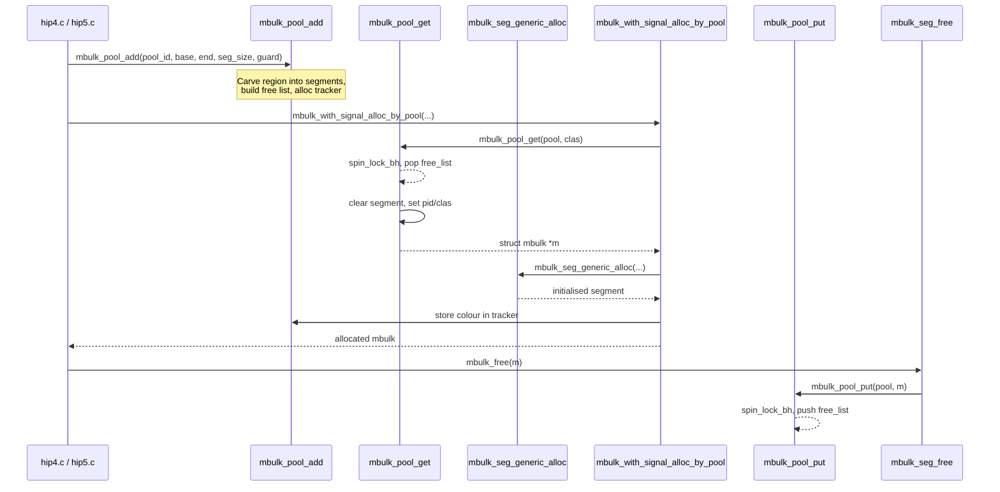
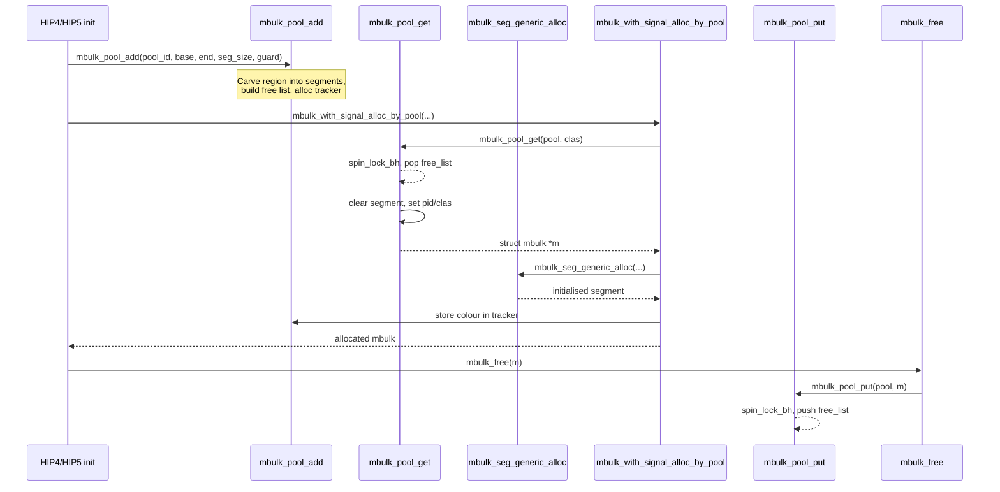

# mbulk — Bulk Memory Allocator

> Bulk-memory (mbulk) allocator providing reference-counted, segmented packet buffers for the SCSC WLAN driver's host↔firmware data path. Each mbulk is a fixed-size block carved from a static pool, carrying an optional in-lined signal buffer alongside the data payload.

The mbulk allocator manages a contiguous memory region pre-allocated in the HIP4/HIP5 shared memory space. Each region is subdivided into fixed-size segments, each preceded by a `struct mbulk` descriptor. Segments are drawn from a free list protected by `mbulk_pool_lock`. The allocator supports two pools — `MBULK_POOL_ID_DATA` (0) for data queues and `MBULK_POOL_ID_CTRL` (1) for control queues.

The memory layout of a single mbulk segment is:

```
+--------+-------------+-------------------------------+--------+
| mbulk  |  signal     |         bulk data              |unused |
| desc   | (optional)  |  (headroom | valid | tailroom)  |      |
+--------+-------------+-------------------------------+--------+
```

## Key data structures

### `struct mbulk` (`mbulk_def.h`)

The core descriptor, shared across the host↔firmware boundary (hence `__packed`):

```c
struct mbulk {
    scsc_mifram_ref  next_offset;        // offset of next free segment (free-list link)
    u8               flag;               // per-segment flags
    enum mbulk_class clas;               // classification
    u8               pid;                // owning pool id
    u8               refcnt;             // data buffer reference count
    mbulk_len_t      dat_bufsz;          // total data capacity (bytes)
    mbulk_len_t      sig_bufsz;          // signal buffer size (bytes)
    mbulk_len_t      len;                // valid data length
    mbulk_len_t      head;               // data start offset (from end of struct mbulk)
    scsc_mifram_ref  chain_next_offset;  // scatter-gather chain link
} __packed;
```

`mbulk_len_t` is `u16`, capping individual segment data at 64 KB.

#### Flags (`MBULK_F_*`)

| Flag | Bit | Meaning |
|---|---|---|
| `MBULK_F_SIG` | 0 | Has an in-lined signal buffer |
| `MBULK_F_READONLY` | 1 | Buffer is read-only |
| `MBULK_F_OBOUND` | 2 | Other CPU (host) owns the buffer |
| `MBULK_F_WAKEUP` | 3 | Frame waking up the host |
| `MBULK_F_SMAPPER` | 4 | Uses SMAPPER buffer |
| `MBULK_F_FREE` | 5 | Segment is already freed |
| `MBULK_F_CHAIN_HEAD` | 6 | Head of scatter-gather chain |
| `MBULK_F_CHAIN` | 7 | Part of scatter-gather chain |

### `struct mbulk_pool` (`mbulk.c`)

Per-pool bookkeeping:

```c
struct mbulk_pool {
    bool         valid;
    u8           pid;
    struct mbulk *free_list;
    int          free_cnt;
    int          usage[MBULK_CLASS_MAX];
    char         *base_addr;
    char         *end_addr;
    mbulk_len_t  seg_size;
    u8           guard;
    int          tot_seg_num;
    struct mbulk_tracker *mbulk_tracker;
    char         shift;
};
```

Two global pools exist: `static struct mbulk_pool mbulk_pools[MBULK_POOL_ID_MAX]`.

### `struct mbulk_tracker` (`mbulk.c`)

Tracks per-segment metadata (colour tags) for memory-pollution detection:

```c
struct mbulk_tracker {
    mbulk_colour colour;
};
```

### `enum mbulk_class` (`mbulk.h`)

Classification tags for accounting:

| Value | Constant | Use |
|---|---|---|
| 0 | `MBULK_CLASS_CONTROL` | Control frames |
| 1 | `MBULK_CLASS_HOSTIO` | Host I/O |
| 2–3 | `MBULK_CLASS_DEBUG`, `MBULK_CLASS_DEBUG_CRIT` | Debug traffic |
| 4–5 | `MBULK_CLASS_FROM_HOST_DAT/CTL` | Downstream from host |
| 6 | `MBULK_CLASS_FROM_RADIO` | Upstream from radio |
| 7 | `MBULK_CLASS_DPLP` | DPLP frames |
| 8 | `MBULK_CLASS_OTHERS` | Catch-all |
| 9 | `MBULK_CLASS_FROM_RADIO_FORWARDED` | Forwarded radio frames |

### `mbulk_colour` (`mbulk.h`)

A 32-bit tag encoding per-segment provenance:

```
[31:24] reserved
[23:16] AC queue
[15:8]  peer_index (omitted under CONFIG_SCSC_WLAN_TX_API)
[7:0]   vif
```

Set via `SLSI_MBULK_COLOUR_SET()` and extracted with `SLSI_MBULK_COLOUR_GET_IFNUM/PEER_IDX/AC()`.

### `track_free_list` (`mbulk.c`)

`static struct mbulk *track_free_list[MBULK_POOL_ID_MAX][2]` — tracks the two most recent free-list entries per pool to enable memory-pollution recovery when `mbulk_pool_get` encounters a corrupted top-of-list entry.

## Key entry points

### Pool lifecycle

| Function | Signature | Description |
|---|---|---|
| `mbulk_pool_add` | `int mbulk_pool_add(u8 pool_id, char *base, char *end, size_t seg_size, u8 guard [, int minor])` | Carves `[base, end)` into fixed-size segments, initialises the free list, allocates `mbulk_tracker`. Called from [[raw/pcie_scsc/hip4|HIP4]] and [[raw/pcie_scsc/hip5|HIP5]] initialisation during MIF setup. |
| `mbulk_pool_remove` | `void mbulk_pool_remove(u8 pool_id)` | Tears down `mbulk_tracker` via `vfree`. |
| `mbulk_pool_get_free_count` | `int mbulk_pool_get_free_count(u8 pool_id)` | Returns current free-segment count (behind `mbulk_pool_lock`). |
| `mbulk_pool_get_count` | `int mbulk_pool_get_count(u8 pool_id, enum mbulk_class, int *free, int *inuse)` | Per-class usage stats (behind `CONFIG_SCSC_WLAN_TPUT_MONITOR`). |
| `mbulk_pool_dump` | `void mbulk_pool_dump(u8 pool_id, int max_cnt)` | Walks the free list for debugging. |
| `mbulk_pool_seg_size` | `u16 mbulk_pool_seg_size(u8 pool_id)` | Returns the pool's segment size. |

### Allocation and free

| Function | Signature | Description |
|---|---|---|
| `mbulk_alloc` | `struct mbulk *mbulk_alloc(enum mbulk_class, size_t dat_bufsz)` | Convenience: calls `mbulk_with_signal_alloc(clas, 0, dat_bufsz)`. |
| `mbulk_with_signal_alloc` | `struct mbulk *mbulk_with_signal_alloc(enum mbulk_class, size_t sig_bufsz, size_t dat_bufsz)` | Allocates from the smallest pool that fits. No chaining — returns `NULL` on underflow. |
| `mbulk_with_signal_alloc_by_pool` | `struct mbulk *mbulk_with_signal_alloc_by_pool(u8 pool_id, mbulk_colour, enum mbulk_class, size_t sig_bufsz, size_t dat_bufsz)` | Same as above but targets a specific pool and stores `colour` in the tracker. |
| `mbulk_free` | `void mbulk_free(struct mbulk *m)` | Wraps `mbulk_seg_free`: decrements `refcnt`; puts segment back to pool at zero. |
| `mbulk_free_virt_host` | `void mbulk_free_virt_host(struct mbulk *m)` | Returns a segment to DATA then CTRL pool (probes DATA first). |
| `msignal_alloc` | `void *msignal_alloc(size_t sig_sz)` | Allocates a signal buffer independently from the pool. |
| `msignal_free` | `void msignal_free(void *sig)` | Frees a previously allocated signal buffer. |
| `msignal_to_mbulk` | `struct mbulk *msignal_to_mbulk(void *sig)` | Reverses: given a signal pointer, finds the enclosing `struct mbulk`. |

### Data manipulation (inline wrappers in `mbulk.h`)

All delegate to `mbulk_seg_*` helpers defined in `mbulk_def.h`:

| Getter | Setter/Manipulator |
|---|---|
| `mbulk_refcnt` → ref count | `mbulk_set_readonly` → set read-only flag |
| `mbulk_buffer_size` → data capacity | `mbulk_reserve_head` → create headroom |
| `mbulk_has_signal` → has signal? | `mbulk_adjust_range` → set headroom + len |
| `mbulk_is_readonly` → read-only? | `mbulk_prepend_head` → extend data leftward |
| `mbulk_is_sg` → chain head? | `mbulk_append_tail` → extend data rightward |
| `mbulk_is_chained` → in chain? | `mbulk_trim_head` → shrink data from head |
| `mbulk_get_signal` → signal ptr | `mbulk_trim_tail` → shrink data from tail |
| `mbulk_dat_r` / `mbulk_dat_rw` → data ptr | `mbulk_duplicate` → bump ref count (no copy) |
| `mbulk_dat_at_r` / `mbulk_dat_at_rw` → ptr + offset | `mbulk_clone` → allocate new segment and copy |
| `mbulk_tlen` → valid data length | |
| `mbulk_headroom` → spare head bytes | |
| `mbulk_tailroom` → spare tail bytes | |

### Pool internals (static helpers in `mbulk.c`)

- **`mbulk_pool_get(struct mbulk_pool *, enum mbulk_class)`** — Pops a segment from the pool's free list under `spin_lock_bh(&mbulk_pool_lock)`. If the top-of-list address is out of bounds, it discards the corrupted entry and falls back to `track_free_list[SECOND]`. Returns `NULL` when `free_cnt <= guard`. Emits `SCSC_HIP4_SAMPLER_MBULK` profiling samples.

- **`mbulk_pool_put(struct mbulk_pool *, struct mbulk *)`** — Pushes a segment back onto the free list under the same lock. Skips if already freed (`MBULK_F_FREE`) or if `clas > MBULK_CLASS_FROM_RADIO_FORWARDED`. On out-of-bounds address, triggers `sablelog_logging_work` via `slsi_get_sdev()`.

- **`mbulk_seg_generic_alloc(struct mbulk_pool *, enum mbulk_class, size_t, size_t)`** — Internal allocator shared by `mbulk_with_signal_alloc_by_pool` and the chained variant. Rounds signal size to 4-byte alignment.

### Scatter/gather chain (`MBULK_SUPPORT_SG_CHAIN`)

| Function | Signature | Description |
|---|---|---|
| `mbulk_chain_with_signal_alloc_by_pool` | `struct mbulk *…` | Allocates a chain of segments to fill a large `dat_bufsz`. |
| `mbulk_chain_free` | `void mbulk_chain_free(struct mbulk *sg)` | Walks chain, strips `CHAIN` flags, frees each segment. |
| `mbulk_chain_tail` | `struct mbulk *mbulk_chain_tail(struct mbulk *m)` | Walks to last segment. |
| `mbulk_chain_bufsz` | `size_t mbulk_chain_bufsz(struct mbulk *m)` | Sum of `dat_bufsz` across chain. |
| `mbulk_chain_tlen` | `size_t mbulk_chain_tlen(struct mbulk *m)` | Sum of `len` across chain. |
| `mbulk_chain_num` | `int mbulk_chain_num(const struct mbulk *m)` | Segment count (1 if not chained). |

Chain accessors (`mbulk_chain_access`, `mbulk_chain_writeback`, `mbulk_chain_copy_from`, `mbulk_chain_copy_to`) are declared but marked `NOT IMPLEMENTED YET`.

## Internal flow



`mbulk_seg_free`, `mbulk_seg_duplicate`, and `mbulk_seg_clone` are declared in `mbulk_def.h` but their implementations live outside this sub-tree (in the shared MIF/firmware layer). The same applies to `init_mbulk`, `msignal_alloc/free`, `msignal_to_mbulk`, and `mbulk_set_handler_return_host_mbulk`.

## Related

- [[raw/pcie_scsc/hip4_smapper|HIP4 SMAPPER]] — Uses `MBULK_F_SMAPPER` flag to mark mbulks backed by shared-memory mapped buffers.
- [[raw/pcie_scsc/hip4|HIP4]] and [[raw/pcie_scsc/hip5|HIP5]] — Call `mbulk_pool_add` to establish DATA and CTRL pools inside the MIF shared memory region.
- `hip4_sampler.h` — `SCSC_HIP4_SAMPLER_MBULK` emits per-pool free-count samples during allocation/free.

## Recent changes

- Initial seed page created from `mbulk.h`, `mbulk.c`, `mbulk_def.h`, and cross-references in `hip4.c`/`hip5.c`.
```

Wait, I need to verify whether `raw/pcie_scsc/hip4.md` and `raw/pcie_scsc/hip5.md` wiki pages exist. Let me check:```markdown
---
title: mbulk — Bulk Memory Allocator
kind: entity
covers:
  - pcie_scsc/mbulk.c
  - pcie_scsc/mbulk.h
last_synced_sha: de8720511fda4cd10d6d358ad754412658bf9024
last_synced: "2026-05-17T00:00:00Z"
sources:
  - pcie_scsc/mbulk.h
  - pcie_scsc/mbulk.c
  - pcie_scsc/mbulk_def.h
  - pcie_scsc/hip4.c#L2555-L2588
  - pcie_scsc/hip5.c#L2756-L2794
  - pcie_scsc/hip4_sampler.h#L41-L42
  - pcie_scsc/hip4_sampler.h#L104-L106
---

# mbulk — Bulk Memory Allocator

> Bulk-memory (mbulk) allocator providing reference-counted, segmented packet buffers for the SCSC WLAN driver's host↔firmware data path. Each mbulk is a fixed-size block carved from a static pool, carrying an optional in-lined signal buffer alongside the data payload.

The mbulk allocator manages a contiguous memory region pre-allocated in the HIP4/HIP5 shared memory space. Each region is subdivided into fixed-size segments, each preceded by a `struct mbulk` descriptor. Segments are drawn from a free list protected by `mbulk_pool_lock`. The allocator supports two pools — `MBULK_POOL_ID_DATA` (0) for data queues and `MBULK_POOL_ID_CTRL` (1) for control queues.

The memory layout of a single mbulk segment is:

```
+--------+-------------+-------------------------------+--------+
| mbulk  |  signal     |         bulk data              |unused |
| desc   | (optional)  |  (headroom | valid | tailroom)  |      |
+--------+-------------+-------------------------------+--------+
```

## Key data structures

### `struct mbulk` (`mbulk_def.h`)

The core descriptor, shared across the host↔firmware boundary (hence `__packed`):

```c
struct mbulk {
    scsc_mifram_ref  next_offset;        // offset of next free segment (free-list link)
    u8               flag;               // per-segment flags
    enum mbulk_class clas;               // classification
    u8               pid;                // owning pool id
    u8               refcnt;             // data buffer reference count
    mbulk_len_t      dat_bufsz;          // total data capacity (bytes)
    mbulk_len_t      sig_bufsz;          // signal buffer size (bytes)
    mbulk_len_t      len;                // valid data length
    mbulk_len_t      head;               // data start offset (from end of struct mbulk)
    scsc_mifram_ref  chain_next_offset;  // scatter-gather chain link
} __packed;
```

`mbulk_len_t` is `u16`, capping individual segment data at 64 KB.

#### Flags (`MBULK_F_*`)

| Flag | Bit | Meaning |
|---|---|---|
| `MBULK_F_SIG` | 0 | Has an in-lined signal buffer |
| `MBULK_F_READONLY` | 1 | Buffer is read-only |
| `MBULK_F_OBOUND` | 2 | Other CPU (host) owns the buffer |
| `MBULK_F_WAKEUP` | 3 | Frame waking up the host |
| `MBULK_F_SMAPPER` | 4 | Uses SMAPPER buffer |
| `MBULK_F_FREE` | 5 | Segment is already freed |
| `MBULK_F_CHAIN_HEAD` | 6 | Head of scatter-gather chain |
| `MBULK_F_CHAIN` | 7 | Part of scatter-gather chain |

### `struct mbulk_pool` (`mbulk.c`)

Per-pool bookkeeping:

```c
struct mbulk_pool {
    bool         valid;
    u8           pid;
    struct mbulk *free_list;
    int          free_cnt;
    int          usage[MBULK_CLASS_MAX];
    char         *base_addr;
    char         *end_addr;
    mbulk_len_t  seg_size;
    u8           guard;
    int          tot_seg_num;
    struct mbulk_tracker *mbulk_tracker;
    char         shift;
};
```

Two global pools exist: `static struct mbulk_pool mbulk_pools[MBULK_POOL_ID_MAX]`.

### `struct mbulk_tracker` (`mbulk.c`)

Tracks per-segment metadata (colour tags) for memory-pollution detection:

```c
struct mbulk_tracker {
    mbulk_colour colour;
};
```

### `enum mbulk_class` (`mbulk.h`)

Classification tags for accounting:

| Value | Constant | Use |
|---|---|---|
| 0 | `MBULK_CLASS_CONTROL` | Control frames |
| 1 | `MBULK_CLASS_HOSTIO` | Host I/O |
| 2–3 | `MBULK_CLASS_DEBUG`, `MBULK_CLASS_DEBUG_CRIT` | Debug traffic |
| 4–5 | `MBULK_CLASS_FROM_HOST_DAT/CTL` | Downstream from host |
| 6 | `MBULK_CLASS_FROM_RADIO` | Upstream from radio |
| 7 | `MBULK_CLASS_DPLP` | DPLP frames |
| 8 | `MBULK_CLASS_OTHERS` | Catch-all |
| 9 | `MBULK_CLASS_FROM_RADIO_FORWARDED` | Forwarded radio frames |

### `mbulk_colour` (`mbulk.h`)

A 32-bit tag encoding per-segment provenance:

```
[31:24] reserved
[23:16] AC queue
[15:8]  peer_index (omitted under CONFIG_SCSC_WLAN_TX_API)
[7:0]   vif
```

Set via `SLSI_MBULK_COLOUR_SET()` and extracted with `SLSI_MBULK_COLOUR_GET_IFNUM/PEER_IDX/AC()`.

### `track_free_list` (`mbulk.c`)

`static struct mbulk *track_free_list[MBULK_POOL_ID_MAX][2]` — tracks the two most recent free-list entries per pool to enable memory-pollution recovery when `mbulk_pool_get` encounters a corrupted top-of-list entry.

## Key entry points

### Pool lifecycle

| Function | Signature | Description |
|---|---|---|
| `mbulk_pool_add` | `int mbulk_pool_add(u8 pool_id, char *base, char *end, size_t seg_size, u8 guard [, int minor])` | Carves `[base, end)` into fixed-size segments, initialises the free list, allocates `mbulk_tracker`. Called from HIP4/HIP5 initialisation during MIF setup. |
| `mbulk_pool_remove` | `void mbulk_pool_remove(u8 pool_id)` | Tears down `mbulk_tracker` via `vfree`. |
| `mbulk_pool_get_free_count` | `int mbulk_pool_get_free_count(u8 pool_id)` | Returns current free-segment count (behind `mbulk_pool_lock`). |
| `mbulk_pool_get_count` | `int mbulk_pool_get_count(u8 pool_id, enum mbulk_class, int *free, int *inuse)` | Per-class usage stats (behind `CONFIG_SCSC_WLAN_TPUT_MONITOR`). |
| `mbulk_pool_dump` | `void mbulk_pool_dump(u8 pool_id, int max_cnt)` | Walks the free list for debugging. |
| `mbulk_pool_seg_size` | `u16 mbulk_pool_seg_size(u8 pool_id)` | Returns the pool's segment size. |

### Allocation and free

| Function | Signature | Description |
|---|---|---|
| `mbulk_alloc` | `struct mbulk *mbulk_alloc(enum mbulk_class, size_t dat_bufsz)` | Convenience: calls `mbulk_with_signal_alloc(clas, 0, dat_bufsz)`. |
| `mbulk_with_signal_alloc` | `struct mbulk *mbulk_with_signal_alloc(enum mbulk_class, size_t sig_bufsz, size_t dat_bufsz)` | Allocates from the smallest pool that fits. No chaining — returns `NULL` on underflow. |
| `mbulk_with_signal_alloc_by_pool` | `struct mbulk *mbulk_with_signal_alloc_by_pool(u8 pool_id, mbulk_colour, enum mbulk_class, size_t sig_bufsz, size_t dat_bufsz)` | Same as above but targets a specific pool and stores `colour` in the tracker. |
| `mbulk_free` | `void mbulk_free(struct mbulk *m)` | Wraps `mbulk_seg_free`: decrements `refcnt`; puts segment back to pool at zero. |
| `mbulk_free_virt_host` | `void mbulk_free_virt_host(struct mbulk *m)` | Returns a segment to DATA pool (falls back to CTRL pool). |
| `msignal_alloc` | `void *msignal_alloc(size_t sig_sz)` | Allocates a signal buffer independently from the pool. |
| `msignal_free` | `void msignal_free(void *sig)` | Frees a previously allocated signal buffer. |
| `msignal_to_mbulk` | `struct mbulk *msignal_to_mbulk(void *sig)` | Reverses: given a signal pointer, finds the enclosing `struct mbulk`. |

### Data manipulation (inline wrappers in `mbulk.h`)

All delegate to `mbulk_seg_*` helpers defined in `mbulk_def.h`:

| Getter | Setter/Manipulator |
|---|---|
| `mbulk_refcnt` → ref count | `mbulk_set_readonly` → set read-only flag |
| `mbulk_buffer_size` → data capacity | `mbulk_reserve_head` → create headroom |
| `mbulk_has_signal` → has signal? | `mbulk_adjust_range` → set headroom + len |
| `mbulk_is_readonly` → read-only? | `mbulk_prepend_head` → extend data leftward |
| `mbulk_is_sg` → chain head? | `mbulk_append_tail` → extend data rightward |
| `mbulk_is_chained` → in chain? | `mbulk_trim_head` → shrink data from head |
| `mbulk_get_signal` → signal ptr | `mbulk_trim_tail` → shrink data from tail |
| `mbulk_dat_r` / `mbulk_dat_rw` → data ptr | `mbulk_duplicate` → bump ref count (no copy) |
| `mbulk_dat_at_r` / `mbulk_dat_at_rw` → ptr + offset | `mbulk_clone` → allocate new segment and copy |
| `mbulk_tlen` → valid data length | |
| `mbulk_headroom` → spare head bytes | |
| `mbulk_tailroom` → spare tail bytes | |

### Pool internals (static helpers in `mbulk.c`)

- **`mbulk_pool_get(struct mbulk_pool *, enum mbulk_class)`** — Pops a segment from the pool's free list under `spin_lock_bh(&mbulk_pool_lock)`. If the top-of-list address is out of bounds, it discards the corrupted entry and falls back to `track_free_list[SECOND]`. Returns `NULL` when `free_cnt <= guard`. Emits `SCSC_HIP4_SAMPLER_MBULK` profiling samples.

- **`mbulk_pool_put(struct mbulk_pool *, struct mbulk *)`** — Pushes a segment back onto the free list under the same lock. Skips if already freed (`MBULK_F_FREE`) or if `clas > MBULK_CLASS_FROM_RADIO_FORWARDED`. On out-of-bounds address, triggers `sablelog_logging_work` via `slsi_get_sdev()`.

- **`mbulk_seg_generic_alloc(struct mbulk_pool *, enum mbulk_class, size_t, size_t)`** — Internal allocator shared by `mbulk_with_signal_alloc_by_pool` and the chained variant. Rounds signal size to 4-byte alignment via `MBULK_SIG_BUFSZ_ROUNDUP`.

### Scatter/gather chain (`MBULK_SUPPORT_SG_CHAIN`)

| Function | Signature | Description |
|---|---|---|
| `mbulk_chain_with_signal_alloc_by_pool` | `struct mbulk *…` | Allocates a chain of segments to fill a large `dat_bufsz`. |
| `mbulk_chain_free` | `void mbulk_chain_free(struct mbulk *sg)` | Walks chain, strips `CHAIN` flags, frees each segment. |
| `mbulk_chain_tail` | `struct mbulk *mbulk_chain_tail(struct mbulk *m)` | Walks to last segment. |
| `mbulk_chain_bufsz` | `size_t mbulk_chain_bufsz(struct mbulk *m)` | Sum of `dat_bufsz` across chain. |
| `mbulk_chain_tlen` | `size_t mbulk_chain_tlen(struct mbulk *m)` | Sum of `len` across chain. |
| `mbulk_chain_num` | `int mbulk_chain_num(const struct mbulk *m)` | Segment count (1 if not chained). |

Chain accessors (`mbulk_chain_access`, `mbulk_chain_writeback`, `mbulk_chain_copy_from`, `mbulk_chain_copy_to`) are declared but marked `NOT IMPLEMENTED YET`.

## Internal flow



`mbulk_seg_free`, `mbulk_seg_duplicate`, and `mbulk_seg_clone` are declared in `mbulk_def.h` but their implementations live outside this sub-tree (in the shared MIF/firmware layer). The same applies to `init_mbulk`, `msignal_alloc/free`, `msignal_to_mbulk`, and `mbulk_set_handler_return_host_mbulk`.

`MBULK_DAT_BUFSZ_REQ_BEST_MAGIC` (`(u32)(-2)`) is a sentinel passed as `dat_bufsz` to tell the allocator to use the full remaining segment capacity rather than a fixed size.

## Related

- [[raw/pcie_scsc/hip4_smapper|HIP4 SMAPPER]] — Uses `MBULK_F_SMAPPER` flag to mark mbulks backed by shared-memory mapped buffers.
- `hip4.c` / `hip5.c` — Call `mbulk_pool_add` to establish DATA and CTRL pools inside the MIF shared memory region.
- `hip4_sampler.h` — `SCSC_HIP4_SAMPLER_MBULK` emits per-pool free-count samples during every allocation and free operation.
- `kunit/kunit-mock-mbulk.h` — Test doubles for all public mbulk APIs, used by the KUnit test harness.

## Recent changes

- Initial seed page created from `mbulk.h`, `mbulk.c`, `mbulk_def.h`, and cross-references in `hip4.c`/`hip5.c`.
