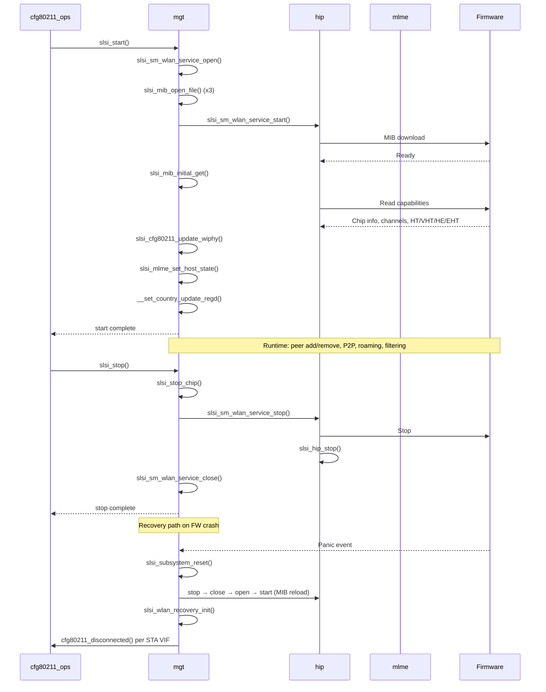

# mgt — SLSI Management Layer

> Management (mgt) module for the Samsung Linux Soft-ISAC (SLSI) Wi-Fi PCIe driver. Provides the **device lifecycle** (start/stop/recovery), **MIB configuration**, **peer management**, **P2P and roaming support**, **packet filtering**, **regulatory domain handling**, **TWT**, **sysfs interfaces**, and **vendor-event dispatch**. ~165 public functions across `mgt.c`/`mgt.h`.

## Purpose

`mgt` is the central management orchestrator sitting between `[[raw/pcie_scsc/cfg80211_ops|cfg80211_ops]]` (mac80211 callbacks), the MLME/firmware control path (`[[raw/pcie_scsc/mlme|mlme]]`), and the `[[raw/pcie_scsc/hip|HIP]]` data-path abstraction. Its responsibilities include:

1. **Device start/stop lifecycle** — opening/closing the WLAN service, downloading MIB firmware files, reading firmware capabilities.
2. **Firmware recovery** — state-machine-driven recovery (`recovery_work`, `recovery_work_on_stop`, `recovery_work_on_start`) via the `cm_if` interface.
3. **MIB (Management Information Base)** — loading, parsing, and distributing firmware configuration from `.hcf` files.
4. **Peer (station) management** — add/remove/update peer records used by both the TX and RX data paths.
5. **VIF lifecycle** — cleanup, activation/deactivation tracking, unsynced VIF (P2P off-channel, HS2 preconnect).
6. **P2P helpers** — GO negotiation frame tracking, public-action-frame subtype resolution, Probe Response IE handling.
7. **Roaming** — roam channel cache, RCL (Recommended Channel List) events, AP selection for reconnection.
8. **Packet filters** — multicast, ARP, DHCP, DNS, mDNS, TCP-SYN detection and filter configuration.
9. **Regulatory domain** — reading/writing regulatory rules, updating supported channel flags.
10. **TWT (Target Wake Time)** — vendor-event dispatch for setup/teardown/notification.
11. **Sysfs** — runtime-tunable knobs (`mac_addr`, `wifiver`, `softap`, `pm`, `ant`, `max_chipset_log_size`, `dump_in_progress`).
12. **Band/MLO** — bandwidth update, MLO link ID lookup, multi-link connection selection.

## Key data structures

### `struct slsi_wpa_eapol_key` (`mgt.h`)

802.1X/EAPOL Key frame layout used to parse incoming key messages (MIC, nonce, RSC, etc.):

```c
struct slsi_wpa_eapol_key {
    u8 version;
    u8 type;
    u16 length;
    u8 key_desc_type;
    u8 key_info[2];
    u8 key_length[2];
    u8 replay_counter[SLSI_WPA_REPLAY_COUNTER_LEN];   // 8 bytes
    u8 key_nonce[SLSI_WPA_NONCE_LEN];                  // 32 bytes
    u8 key_iv[16];
    u8 key_rsc[SLSI_WPA_KEY_RSC_LEN];                  // 8 bytes
    u8 key_id[8];
} __packed;
```

### `struct slsi_twt_setup_event` (`mgt.h`)

TWT setup event forwarded to user space via vendor NL80211:

```c
struct slsi_twt_setup_event {
    u16 setup_id;
    u8  reason_code;
    u16 negotiation_type;
    u16 flow_type;
    u16 triggered_type;
    u64 wake_time;
    u32 wake_duration;
    u32 wake_interval;
};
```

### `struct mlo_link_measurement` (`mgt.h`, `CONFIG_SCSC_WLAN_EHT`)

Per-link channel measurement for MLO:

```c
struct mlo_link_measurement {
    u16 link_id;
    int rssi;
    u8  subchannel_count;
    u8  cca_busy_time_ratio[MAX_NUM_MLO_SUBCHANNEL];
};
```

### `enum slsi_sta_conn_state` (`mgt.h`)

Station connection-state enumeration used by `slsi_ps_port_control()`:

```c
enum slsi_sta_conn_state {
    SLSI_STA_CONN_STATE_DISCONNECTED = 0,
    SLSI_STA_CONN_STATE_CONNECTING = 1,
    SLSI_STA_CONN_STATE_DOING_KEY_CONFIG = 2,
    SLSI_STA_CONN_STATE_CONNECTED = 3
};
```

### `enum slsi_dhcp_tx` (`mgt.h`)

DHCP packet classification for TX path:

```c
enum slsi_dhcp_tx {
    SLSI_TX_IS_NOT_DHCP,
    SLSI_TX_IS_DHCP_SERVER,
    SLSI_TX_IS_DHCP_CLIENT
};
```

### `enum slsi_fw_regulatory_rule_flags` (`mgt.h`)

Bitmask flags for firmware regulatory rules (DFS, no-IR, no-indoor, 6 GHz VLP/LPI/SP, etc.).

### `enum slsi_vendor_attr_*` (`mgt.h`)

Vendor NL80211 attribute enums for TWT setup/teardown/notify, MLO TID-to-link mapping, MLO channel measurement, and bandwidth-changed events.

## Key entry points

### Lifecycle

| Function | File | Description |
|---|---|---|
| `int slsi_start(struct slsi_dev *, struct net_device *)` | `mgt.c:1110` | Opens WLAN service, loads MIB files, starts firmware, reads capabilities, sets regulatory domain. Called during driver probe / recovery restart. |
| `void slsi_stop(struct slsi_dev *)` | `mgt.c:1824` | Stops all netdevs and triggers `slsi_stop_chip()`. |
| `void slsi_stop_chip(struct slsi_dev *)` | `mgt.c:1434` | Stops WLAN service, stops HIP, emits KIC deinit events, unpauses ARP queue. |
| `int slsi_start_monitor_mode(struct slsi_dev *, struct net_device *)` | `mgt.c:887` | Activates monitor-mode VIF(s). |
| `void slsi_stop_monitor_mode(struct slsi_dev *, struct net_device *)` | `mgt.c:930` | Deactivates monitor-mode VIF(s). |
| `void slsi_wlan_recovery_init(struct slsi_dev *)` | `mgt.c:1023` | Post-recovery re-initialization: re-activates existing VIFs, re-starts APs, re-notifies disconnected STAs. |

### Recovery State Machine

Three work-structured recovery paths, each mapped to a `struct work_struct` in `struct slsi_dev`:

| Work item | Handler | Triggers |
|---|---|---|
| `recovery_work` | `slsi_subsystem_reset()` (`mgt.c:9433`) | Subsystem-level reset — full service stop → close → open → MIB reload → start. |
| `recovery_work_on_stop` | `slsi_failure_reset()` (`mgt.c:9580`) | Service-failure cleanup — stop → close HIP → unblock MLME. |
| `recovery_work_on_start` | `slsi_chip_recovery()` (`mgt.c:9615`) | Chip-level recovery — re-open service, reload MIBs, re-start. |
| `system_error_user_fail_work` | `slsi_system_error_recovery()` (`mgt.c:9741`) | System-error (panic) recovery — highest severity. |

Recovery state is tracked in `sdev->cm_if.recovery_state` using the `SLSI_RECOVERY_SERVICE_*` constants (`STARTED` → `STOPPED` → `CLOSED` → `OPENED` → `STARTED`).

### MIB Management

| Function | File | Description |
|---|---|---|
| `slsi_mib_open_file()` | `mgt.c:2026` | Opens a `.hcf` MIB file via `mx140_request_file()`, places data in shared memory. |
| `slsi_mib_close_file()` | `mgt.c:2143` | Releases MIB firmware handle. |
| `slsi_mib_initial_get()` | `mgt.c:2681` | Reads firmware capabilities after start (chip version, platform, supported channels, HT/VHT/HE/EHT caps, TAS config, MLO caps). |
| `slsi_mib_get_platform()` | `mgt.c:1897` | Extracts platform string from MIB info. |
| `slsi_mib_get_gscan_cap()` | `mgt.c:2939` | Reads GScan capabilities from firmware. |
| `slsi_mib_get_apf_cap()` | `mgt.c:3009` | Reads APF (Access Point Filtering) capabilities. |
| `slsi_mib_get_rtt_cap()` | `mgt.c:3067` | Reads RTT (round-trip time) capabilities. |
| `slsi_mib_get_sta_tdls_activated()` | `mgt.c:3114` | Checks if TDLS is active. |

### Peer Management

| Function | File | Description |
|---|---|---|
| `slsi_peer_add()` | `mgt.c:3301` | Creates a new `struct slsi_peer` record for a station. |
| `slsi_peer_remove()` | `mgt.c:3859` | Removes and frees a peer record. |
| `slsi_peer_update_assoc_req()` | `mgt.c:3740` | Updates peer from association request IE. |
| `slsi_peer_update_assoc_rsp()` | `mgt.c:3807` | Updates peer from association response IE. |
| `slsi_peer_reset_stats()` | `mgt.c:3409` | Resets peer statistics counters. |
| `slsi_get_peer_from_mac()` | `mgt.h:525` | Inline helper to find peer by MAC address (called from TX/RX data path, non-blocking). |
| `slsi_get_peer_from_qs()` | `mgt.h:588` | Inline helper to find peer by queueset ID. |
| `slsi_is_tdls_peer()` | `mgt.h:600` | Checks if a peer is a TDLS peer (by AID). |
| `slsi_dump_stats()` | `mgt.c:3441` | Dumps peer stats via debug logging. |

### Disconnect / Connection Handling

| Function | File | Description |
|---|---|---|
| `slsi_handle_disconnect()` | `mgt.c:4889` | Core disconnect handler: cleans peer, updates connection state, sends deauth/disassoc. |
| `slsi_ps_port_control()` | `mgt.c:5107` | Port authorization control tied to connection state transitions. |
| `slsi_retry_connection()` | `mgt.c:4724` | Retries a failed connection (SEP 11+). |
| `slsi_free_connection_params()` | `mgt.c:4841` | Frees per-connection cached parameters. |
| `slsi_select_ap_for_connection()` | `mgt.h:802` | Selects the best AP from the BSS list for connection/reconnection. |

### P2P

| Function | File | Description |
|---|---|---|
| `slsi_p2p_init()` | `mgt.c:6271` | Initializes P2P state for a VIF. |
| `slsi_p2p_deinit()` | `mgt.c:6398` | Deinitializes P2P state. |
| `slsi_p2p_vif_activate()` | `mgt.c:6416` | Activates a P2P unsync VIF with optional duration. |
| `slsi_p2p_vif_deactivate()` | `mgt.c:6476` | Deactivates P2P unsync VIF. |
| `slsi_get_public_action_subtype()` | `mgt.c:6678` | Extracts public-action-frame subtype from `ieee80211_mgmt`. |
| `slsi_p2p_get_action_frame_status()` | `mgt.c:6711` | Reads P2P action-frame status from the device. |
| `slsi_get_exp_peer_frame_subtype()` | `mgt.c:6752` | Returns the expected peer frame subtype for GO negotiation. |
| `slsi_pa_subtype_text()` | `mgt.h:638` | Returns human-readable text for public-action-frame subtype codes. |

### Roaming / Scan

| Function | File | Description |
|---|---|---|
| `slsi_roam_channel_cache_add_entry()` | `mgt.c:7210` | Adds a channel to the roaming cache for an SSID. |
| `slsi_roam_channel_cache_add()` | `mgt.c:7257` | Extracts and caches channel info from a probe response. |
| `slsi_roam_channel_cache_prune()` | `mgt.c:7314` | Removes stale entries from the roaming cache. |
| `slsi_roam_channel_cache_get_channels()` | `mgt.c:7451` | Retrieves cached channels for an SSID. |
| `slsi_roaming_scan_configure_channels()` | `mgt.c:7463` | Configures scan channels based on roaming cache. |
| `slsi_send_rcl_event()` | `mgt.c:7480` | Sends RCL (Recommended Channel List) vendor event to user space. |
| `slsi_auto_chan_select_scan()` | `mgt.c:6151` | Triggers an auto channel-select scan (ACS). |
| `slsi_send_acs_event()` | `mgt.c:7513` | Sends ACS result vendor event. |
| `slsi_purge_scan_results()` | `mgt.c:549` | Purges cached scan results for a scan ID. |
| `slsi_dequeue_cached_scan_result()` | `mgt.c:579` | Dequeues a cached beacon/probe-response from scan results. |
| `slsi_populate_ssid_info()` | `mgt.h:747` | Populates SSID info from scan results. |
| `slsi_abort_sta_scan()` | `mgt.c:6980` | Aborts an in-progress STA scan. |
| `slsi_scan_ind_timeout_handle()` | `mgt.c:9143` | Work handler for scan indication timeout. |

### Packet Filtering

| Function | File | Description |
|---|---|---|
| `slsi_set_packet_filters()` | `mgt.c:6015` | Sets all packet filters for a device. |
| `slsi_update_packet_filters()` | `mgt.c:5972` | Updates packet filters. |
| `slsi_clear_packet_filters()` | `mgt.c:5879` | Clears all packet filters. |
| `slsi_set_multicast_packet_filters()` | `mgt.c:5761` | Configures multicast filter. |
| `slsi_set_enhanced_pkt_filter()` | `mgt.c:5630` | Sets enhanced packet filter (command-string driven). |
| `slsi_is_dhcp_packet()` | `mgt.c:7026` | Detects DHCP packets. |
| `slsi_is_dns_packet()` | `mgt.c:7071` | Detects DNS packets. |
| `slsi_is_mdns_packet()` | `mgt.c:7089` | Detects mDNS packets. |
| `slsi_is_tcp_sync_packet()` | `mgt.c:7050` | Detects TCP SYN packets. |
| `slsi_set_arp_packet_filter()` | `mgt.c:5411` | Configures ARP-specific filter. |

### Regulatory / Band

| Function | File | Description |
|---|---|---|
| `slsi_read_regulatory_rules()` | `mgt.c:7613` | Reads regulatory rules from firmware. |
| `slsi_set_country_update_regd()` | `mgt.h:877` | Sets country code and updates regulatory domain. |
| `slsi_update_supported_channels_regd_flags()` | `mgt.c:9201` | Updates per-channel regulatory flags. |
| `slsi_band_update()` | `mgt.c:5364` | Updates band configuration (2 GHz / 5 GHz / 6 GHz). |
| `slsi_band_cfg_update()` | `mgt.c:5255` | Pushes band config to firmware. |
| `slsi_reset_channel_flags()` | `mgt.c:7591` | Resets channel capability flags. |
| `slsi_freq_to_band()` | `mgt.h:733` | Converts frequency to band enum. |
| `slsi_find_chan_idx()` | `mgt.c:9230` | Finds channel index from channel number. |

### TWT (Target Wake Time)

| Function | File | Description |
|---|---|---|
| `slsi_send_twt_setup_event()` | `mgt.c:10275` | Sends TWT setup vendor event to user space. |
| `slsi_send_twt_teardown()` | `mgt.c:10312` | Sends TWT teardown vendor event. |
| `slsi_send_twt_notification()` | `mgt.c:10343` | Sends TWT notification vendor event. |
| `slsi_twt_update_ctrl_flags()` | `mgt.c:2799` | Updates TWT responder enable flag. |

### MIB Value Get/Set

| Function | File | Description |
|---|---|---|
| `slsi_set_uint_mib()` | `mgt.c:5152` | Sets a uint32 MIB value on the device. |
| `slsi_set_boolean_mib()` | `mgt.c:10848` | Sets a boolean MIB value. |
| `slsi_read_disconnect_ind_timeout()` | `mgt.c:8226` | Reads disconnect indication timeout. |
| `slsi_get_beacon_cu()` | `mgt.c:8275` | Reads beacon channel utilization. |
| `slsi_get_ps_disabled_duration()` | `mgt.c:8318` | Reads PS-disabled duration MIB. |
| `slsi_get_ps_entry_counter()` | `mgt.c:8361` | Reads PS entry counter MIB. |
| `slsi_get_mib_roam()` | `mgt.c:2884` | Reads roaming MIB value. |
| `slsi_set_mib_roam()` | `mgt.c:2783` | Sets roaming MIB value. |
| `slsi_send_max_transmit_msdu_lifetime()` | `mgt.c:5171` | Sets MSDU lifetime for TxQ. |
| `slsi_read_max_transmit_msdu_lifetime()` | `mgt.c:5190` | Reads MSDU lifetime. |
| `slsi_mib_get_tx_ba_allowed()` | `mgt.c:3184` | Reads TX BA allowed bitmap. |
| `slsi_read_enhanced_arp_rx_count_by_lower_mac()` | `mgt.c:7705` | Reads enhanced ARP RX counter. |
| `slsi_set_mib_rssi_boost()` | `mgt.c:7667` | Sets RSSI boost MIB per band. |
| `slsi_set_boost()` | `mgt.c:6271` | Pushes boost config to firmware. |
| `slsi_set_mib_obss_pd_enable()` | `mgt.c:10374` | Enables/disables OBSS PD. |
| `slsi_set_mib_obss_pd_enable_per_obss()` | `mgt.c:10407` | Per-OBSS OBSS PD configuration. |
| `slsi_set_mib_srp_non_srg_obss_pd_prohibited()` | `mgt.c:10445` | SRP non-SRG OBSS PD prohibition. |
| `slsi_set_mib_6g_safe_mode()` | `mgt.c:10462` | Sets 6 GHz safe mode. |
| `slsi_set_mib_6g_rf_test_mode()` | `mgt.c:10484` | Sets 6 GHz RF test mode. |

### Blacklist

| Function | File | Description |
|---|---|---|
| `slsi_is_bssid_in_blacklist()` | `mgt.c:8949` | Checks if a BSSID is blacklisted (HAL + ioctl + FW). |
| `slsi_is_bssid_in_hal_blacklist()` | `mgt.c:8975` | HAL-specific blacklist check. |
| `slsi_is_bssid_in_ioctl_blacklist()` | `mgt.c:8991` | ioctl-specific blacklist check. |
| `slsi_add_ioctl_blacklist()` | `mgt.c:9004` | Adds a BSSID to ioctl blacklist. |
| `slsi_remove_bssid_blacklist()` | `mgt.c:9026` | Removes a BSSID from blacklist. |
| `slsi_purge_blacklist()` | `mgt.c:556` | Frees all blacklist entries (ACL data). |
| `slsi_blacklist_del_work_handle()` | `mgt.c:9165` | Work handler for deferred blacklist deletion. |

### VIF Cleanup / Activation

| Function | File | Description |
|---|---|---|
| `slsi_vif_cleanup()` | `mgt.c:1527` | Full VIF teardown: releases DP resources, clears scan results, resets peers. |
| `slsi_vif_activated()` | `mgt.c:3920` | Marks VIF as activated; configures firmware resources. |
| `slsi_vif_deactivated()` | `mgt.c:3990` | Marks VIF as deactivated; frees resources. |
| `slsi_ndl_vif_cleanup()` | `mgt.c:1513` | NAN-specific VIF cleanup. |
| `slsi_purge_scan_results_locked()` | `mgt.c:533` | Purges scan results (caller holds lock). |
| `slsi_release_dp_resources()` | `mgt.c:10815` | Releases data-path resources for a VIF. |
| `slsi_mlme_clear_vif()` | `mgt.h:994` | Clears MLME-assigned VIF number. |
| `slsi_mlme_assign_vif()` | `mgt.h:995` | Assigns MLME VIF number. |
| `slsi_is_valid_vifnum()` | `mgt.h:996` | Validates VIF number assignment. |

### AP / STA Info

| Function | File | Description |
|---|---|---|
| `slsi_fill_ap_sta_info()` | `mgt.c:4515` | Fills AP/STA info structure for peer. |
| `slsi_populate_bss_record()` | `mgt.c:4156` | Populates BSS record from firmware. |
| `slsi_sta_ieee80211_mode()` | `mgt.c:4118` | Configures STA IEEE 802.11 mode. |
| `slsi_start_ap()` | `mgt.h:836` | Starts a SoftAP. |
| `slsi_ap_prepare_add_info_ies()` | `mgt.c:7107` | Prepares IEs for AP add operation. |
| `slsi_modify_ies_on_channel_switch()` | `mgt.c:7811` | Modifies IEs during channel switch announcement. |
| `slsi_get_ap_mld_addr()` | `mgt.c:10877` | Extracts AP MLD address from ML IE (EHT). |
| `slsi_fill_current_ap_detail()` | `mgt.c:8564` | Fills current AP details for MLO. |
| `slsi_ml_connection_link_selection()` | `mgt.c:8639` | Multi-link connection link selection. |
| `slsi_dump_ml_bssid_details()` | `mgt.c:4701` | Dumps multi-link BSS details. |
| `slsi_clear_mlo_band_connection_params()` | `mgt.c:4870` | Clears MLO band connection params. |
| `slsi_get_link_id_from_vif()` | `mgt.c:10921` | Maps VIF index to MLO link ID. |

### Vendor Events

| Function | File | Description |
|---|---|---|
| `slsi_send_hanged_vendor_event()` | `mgt.c:3517` | Sends firmware hang vendor event with panic code. |
| `slsi_send_power_measurement_vendor_event()` | `mgt.c:3571` | Sends power measurement vendor event. |
| `slsi_send_forward_beacon_vendor_event()` | `mgt.c:3601` | Sends forward beacon vendor event. |
| `slsi_send_bw_changed_event()` | `mgt.c:10890` | Sends bandwidth-changed vendor event. |
| `slsi_test_send_hanged_vendor_event()` | `mgt.c:3674` | Test-mode hang event trigger. |

### Miscellaneous

| Function | File | Description |
|---|---|---|
| `slsi_get_hw_mac_address()` | `mgt.c:619` | Resolves hardware MAC address (modparam → sysfs → file → EFS → default). |
| `slsi_send_gratuitous_arp()` | `mgt.c:5411` | Sends gratuitous ARP after IP change. |
| `slsi_ip_address_changed()` | `mgt.c:6078` | Handles IP address change notification. |
| `slsi_set_acl()` | `mgt.h:942` | Sets ACL list. |
| `slsi_set_ext_cap()` | `mgt.c:3683` | Sets extended capabilities. |
| `slsi_set_latency_mode()` | `mgt.c:9275` | Sets latency mode. |
| `slsi_set_latency_crt_data()` | `mgt.c:9314` | Sets latency CRT data. |
| `slsi_configure_pmksa()` | `mgt.c:10505` | Configures PMKSA cache entry. |
| `slsi_configure_tx_power_sar_scenario()` | `mgt.c:9408` | Configures TX power for SAR scenario. |
| `slsi_dump_eth_packet()` | `mgt.c:10207` | Dumps Ethernet packet for debugging. |
| `slsi_rx_update_mlme_stats()` | `mgt.c:10027` | Updates MLME stats from RX packet. |
| `slsi_rx_update_wake_stats()` | `mgt.c:10051` | Updates wake stats from RX packet. |
| `slsi_send_txq_params()` | `mgt.h:796` | Sends TxQ parameters to firmware. |
| `slsi_find_scan_channel()` | `mgt.h:780` | Finds a scan channel from management frame. |
| `slsi_set_mac_randomisation_mask()` | `mgt.h:875` | Sets MAC randomization mask. |
| `slsi_set_ito()` / `slsi_enable_ito()` | `mgt.c:9911`/`9940` | Sets/enables ITO (Idle Timeout Override). |
| `slsi_add_probe_ies_request()` | `mgt.c:10174` | Sends probe IEs request. |
| `slsi_wlan_unsync_vif_activate()` | `mgt.c:8438` | Activates WLAN unsynced VIF (HS2 preconnect). |
| `slsi_wlan_unsync_vif_deactivate()` | `mgt.c:9105` | Deactivates WLAN unsynced VIF. |
| `slsi_hs2_unsync_vif_delete_work()` | `mgt.c:8428` | Work handler for HS2 unsync VIF deletion. |
| `slsi_clear_offchannel_data()` | `mgt.c:8404` | Clears off-channel data. |
| `slsi_set_reset_connect_attempted_flag()` | `mgt.c:8920` | Resets connect-attempted flag. |
| `slsi_is_rf_test_mode_enabled()` | `mgt.c:10624` | Checks if RF test mode is active. |
| `slsi_bss_connect_type_get()` | `mgt.c:6825` | Determines BSS connection type from IEs. |
| `slsi_is_wes_action_frame()` | `mgt.c:7557` | Checks for WES action frame. |
| `slsi_wlan_dump_public_action_subtype()` | `mgt.c:6907` | Dumps public action subtype for debugging. |
| `slsi_get_vifnum_by_ifnum()` | `mgt.h:992` | Maps interface number to VIF number. |
| `slsi_get_ifnum_by_vifid()` | `mgt.h:993` | Maps VIF ID to interface number. |
| `slsi_merge_lists()` / `slsi_remove_duplicates()` / `slsi_sort_array()` | `mgt.c:10009`/`9993`/`9970` | Utility functions for channel list merging. |
| `slsi_cache_ies()` / `slsi_clear_cached_ies()` | `mgt.h:617`/`629` | Alloc/free cached IE buffers. |
| `slsi_assign_cookie_id()` | `mgt.h:675` | Atomically assigns a cookie ID for ROC/mgmt_tx. |
| `slsi_is_proxy_arp_supported_on_ap()` | `mgt.h:607` | Checks proxy ARP support from assoc response IE. |
| `slsi_collect_chipset_logs()` | `mgt.c:9780` | Work handler for chipset log collection. |
| `slsi_trigger_service_failure()` | `mgt.c:9571` | Triggers a service failure event. |
| `slsi_wakeup_time_work()` | `mgt.c:9556` | Logs wakeup time after resume. |
| `slsi_arp_q_stuck_work_handle()` | `mgt.c:10107` | Handles stuck ARP queue. |

### Sysfs

| Function Pair | File | Description |
|---|---|---|
| `slsi_create_sysfs_macaddr()` / `slsi_destroy_sysfs_macaddr()` | `mgt.c:304`/`327` | Creates/removes `/sys/wifi/mac_addr`. |
| `slsi_create_sysfs_version_info()` / `slsi_destroy_sysfs_version_info()` | `mgt.c:366`/`389` | Creates/removes `/sys/wifi/wifiver`. |
| `slsi_create_sysfs_softap_info()` / `slsi_destroy_sysfs_softap_info()` | `mgt.c:424`/`447` | Creates/removes `/sys/wifi/softap`. |
| `slsi_create_sysfs_debug_dump()` / `slsi_destroy_sysfs_debug_dump()` | `mgt.c:499`/`521` | Creates/removes `/sys/wifi/dump_in_progress`. |
| `slsi_create_sysfs_pm()` / `slsi_destroy_sysfs_pm()` | `mgt.c:10658`/`10679` | Creates/removes `/sys/wifi/pm`. |
| `slsi_create_sysfs_ant()` / `slsi_destroy_sysfs_ant()` | `mgt.c:10720`/`10741` | Creates/removes `/sys/wifi/ant`. |
| `slsi_create_sysfs_max_log_size()` / `slsi_destroy_sysfs_max_log_size()` | `mgt.c:10782`/`10803` | Creates/removes `/sys/wifi/max_chipset_log_size`. |

## Internal flow



## Related

- [[raw/pcie_scsc/dev|dev]] — `struct slsi_dev` and `struct slsi_peer` definitions
- [[raw/pcie_scsc/mlme|mlme]] — MLME commands to firmware (called extensively by mgt)
- [[raw/pcie_scsc/hip|hip]] — Hardware ISAC Protocol (used by mgt for service start/stop)
- [[raw/pcie_scsc/cfg80211_ops|cfg80211_ops]] — mac80211 callback layer (calls mgt functions)
- [[raw/pcie_scsc/mib|mib]] — MIB text conversion utilities
- [[raw/pcie_scsc/reg_info|reg_info]] — Regulatory domain information
- [[raw/pcie_scsc/cm_if|cm_if]] — Connection management interface (recovery state machine)
- [[raw/pcie_scsc/procfs|procfs]] — ProcFS interface (used alongside sysfs)
- [[raw/pcie_scsc/nl80211_vendor|nl80211_vendor]] — Vendor NL80211 commands/events
- [[raw/pcie_scsc/scsc_wifi_cm_if|scsc_wifi_cm_if]] — Service management infrastructure

## Recent changes

- Initial seed page created with full function inventory and recovery state machine documentation.
